# Memoria del proyecto KelseTS Cars

| Dato | Información |
| --- | --- |
| Proyecto | Catálogo de vehículos y gestión de citas |
| Formación | TFM Rock The Code · The Power Tech School |
| Autora | Araceli Fradejas Muñoz |
| Tecnologías | JavaScript, Node.js, Express, React y MongoDB |
| Despliegue | Web y API publicadas en Vercel |

## 1. Contexto y motivación

KelseTS Cars nace dentro de KelseTS, la marca ficticia que he utilizado en varios proyectos del máster. Me apetecía cerrar Rock The Code con una propuesta que mantuviera esa identidad y me permitiera trabajar todo el recorrido de una aplicación full stack. He elegido el automóvil porque combina una parte visual que me interesa especialmente con necesidades concretas: encontrar un modelo, comparar opciones y organizar una visita.

Me he puesto en el lugar de quien busca su próximo coche. Una portada atractiva puede despertar interés, pero después hacen falta datos, una búsqueda cómoda y un siguiente paso claro. Por eso el catálogo lleva a la ficha de cada vehículo y desde allí a una cita en su concesionario. La relación también continúa en el mantenimiento, con talleres colaboradores y un equipo que coordina las solicitudes.

La música, el deporte y el universo swiftie inspiran la marca. Las personas, instalaciones y operaciones pertenecen a una propuesta ficticia con fines académicos. He cuidado que esa inspiración tenga una identidad propia y que las imágenes de referencia del catálogo conserven sus créditos.

## 2. Objetivos y requisitos

El objetivo es que una persona pueda consultar vehículos, encontrar su sede, acceder a una cuenta y gestionar sus citas. Para el equipo, la web ofrece revisión de talleres, coordinación de visitas y gestión de fotografías. Cada perfil consulta la información que necesita y el backend controla sus permisos.

El recorrido de datos conecta todas las partes del proyecto: Excel → CSV → lectura con `fs` → validación → semilla → MongoDB → API → React. La [revisión del enunciado](docs/REVISION-ENTREGA.md) relaciona los requisitos con el código y las pruebas que los acreditan.

## 3. Tecnologías y organización del código

Node.js y Express reciben las peticiones. Mongoose define los modelos y sus relaciones en Atlas. React compone la web con rutas y componentes; Zod comparte las validaciones entre frontend y backend. Leaflet presenta el mapa y Cloudinary almacena las fotografías que sube la administradora.

He organizado el backend por módulos: usuarios, catálogo, citas, talleres y comunicaciones. En la web, `features` reúne cada funcionalidad y `shared` contiene los componentes, hooks e idiomas que utilizan varias páginas. `packages/contracts` guarda las validaciones comunes y `packages/api-client` centraliza las peticiones, sus errores y su cancelación. Así puedo modificar una pantalla sin copiar las reglas del servidor.

Las páginas coordinan la carga de datos y la navegación. Los filtros, las tarjetas, la paginación, los campos del registro y las filas de citas tienen componentes propios. Las [decisiones de arquitectura](docs/ARQUITECTURA.md) explican esta separación.

## 4. Navegación, diseño y experiencia de usuario

La portada presenta la marca y una selección de modelos. El catálogo consulta Atlas mediante la API y permite pasar de la búsqueda a la ficha. Desde ella se solicita la visita; si no hay sesión, la web lleva al acceso y conserva el destino. En el área personal aparecen las citas y sus comunicaciones.

### Identidad visual

La dirección visual utiliza verde profundo, marfil, acentos cálidos, fotografías grandes y una combinación de tipografía de interfaz y editorial. Las referencias de fabricantes sirven para estudiar jerarquía, navegación y presentación de modelos. KelseTS Cars conserva su propio nombre, composición y textos.

La biblioteca contiene 80 fotografías reales con autor, licencia y enlace de origen. La última ampliación añade 38 imágenes de los doce modelos de gama alta, revisadas visualmente y documentadas en la [galería de vehículos](docs/GALERIA-VEHICULOS.md). La asignación prioriza el modelo y mantiene la misma fotografía en tarjeta y ficha. Son imágenes ilustrativas; no acreditan el acabado, año ni color de las unidades de ejemplo.

### Secciones de la web

La portada incorpora servicios, conducción, movilidad eléctrica, historias de marca, acceso al área personal y preguntas frecuentes. Servicios explica los pasos para solicitar una visita y Nuestra esencia desarrolla la identidad. Se reutilizan los componentes de panel editorial, servicios, historias y preguntas. La sección eléctrica enlaza al filtro de motorización del catálogo.

Las imágenes aportadas sirven como referencias de dirección visual. Las secciones utilizan nuevas escenas conceptuales creadas sin textos incorporados. La [guía de secciones](docs/SECCIONES.md) recoge cómo se han aplicado las referencias a cada página. Los textos y botones pertenecen a la interfaz, de modo que pueden adaptarse sin quedar incorporados a las imágenes.

### Fotografías del entorno

He añadido una fotografía diferente a cada uno de los cuatro concesionarios y los cuatro talleres. Quería que se entendiera mejor el entorno elegido para la red: Salamanca, Pedralbes, Miraconcha y La Caleta. Las imágenes muestran calles, arquitectura y patrimonio de esos barrios; las instalaciones y las direcciones de KelseTS Cars siguen siendo ficticias, y las tarjetas lo indican.

Las ocho fotografías proceden de Wikimedia Commons. He guardado sus autores, fuentes y licencias en `data/media/neighborhoods.json` y he añadido las atribuciones a la página de créditos, accesibles desde cada tarjeta. Se conservan copias locales de 1280 px, con carga diferida y encuadre adaptable. No se repiten entre las ocho tarjetas.

El enlace a Street View utiliza las coordenadas aproximadas del centro, sin enviar la ubicación del visitante. He elegido los [enlaces de Google Maps](https://developers.google.com/maps/documentation/urls/get-started), que no necesitan clave API. La panorámica disponible depende de Google y no representa nuestras instalaciones. Las fotografías tampoco se presentan como imágenes actuales de la calle.

En Safari he comprobado que aparecen las ocho imágenes y sus enlaces, y que el acceso a los créditos llega a la atribución seleccionada. He guardado una captura de las tarjetas en una ventana estrecha. La captura corresponde a Safari de escritorio. Las evidencias están en [Sedes](docs/evidencias/sedes/README.md).

### Hooks y búsqueda

`useResource` combina `useReducer`, cancelación mediante `AbortController` y reintento. Evita que una respuesta anterior actualice una pantalla después de cambiar filtros o ruta. `AuthProvider` comparte el estado de sesión sin copiarlo en cada página.

La búsqueda libre sugiere marcas y modelos del inventario mientras se escribe. Permite seleccionar con las flechas y Enter, cerrar con Escape o mantener el texto libre. El componente reutiliza la carga cancelable y memoriza las coincidencias; no hace una petición por cada tecla. Sigue las pautas del [patrón combobox de W3C](https://www.w3.org/WAI/ARIA/apg/patterns/combobox/), sin considerarlo una auditoría completa de accesibilidad. Las sugerencias ocupan espacio en la página para que no tapen el contador ni las tarjetas.

La interfaz diferencia carga, error y ausencia de resultados. Las variables en `style.css` definen colores y espaciados. Se incluyen enlaces para saltar al contenido, etiquetas de formulario, foco visible y reducción de movimiento. Esto constituye una base de accesibilidad, no una auditoría completa.

### Castellano e inglés

He añadido un contexto de idioma con un hook compartido y un archivo para los textos ingleses. El selector ES/EN conserva la elección al recargar y cambia las etiquetas accesibles, el idioma del documento y el título. Si el navegador bloquea el almacenamiento, la web sigue funcionando y conserva la elección durante esa sesión.

La traducción afecta a la presentación: los valores de motorización, servicios y estados enviados al backend no cambian. He comprobado en Safari que Electric sigue enviando `Eléctrico` y devuelve los diez vehículos Tesla esperados. También he accedido con la cuenta ficticia de despliegue y cambiado a castellano manteniendo la sesión. La captura del área privada corresponde a una revisión intermedia: la interfaz está en inglés y la bienvenida todavía en castellano. La bandeja bilingüe se muestra en el apartado de comunicaciones.

El [informe de idiomas](docs/evidencias/idiomas/README.md) distingue estas revisiones de la prueba completa de dispositivos, permisos y formularios. Los textos están separados de los componentes para mantener las dos versiones desde un mismo lugar.

La portada inglesa también se ha comprobado en el dominio de Vercel después de publicar el commit `6d2f9b3`. La [captura de producción](docs/evidencias/idiomas/04-home-en-vercel-safari.png) se conserva separada de las pruebas locales.

### Móvil, tableta y escritorio

Al revisar la web en mi iPhone 13, la cabecera anterior apilaba navegación, idioma y acceso. He sustituido esa distribución por un menú desplegable en móvil y tablet, conservando el logo aprobado. Los enlaces tienen espacio para pulsarlos; el idioma y el acceso siguen dentro del menú. Escape recupera el foco y navegar lo cierra.

He preparado capturas de todas las rutas públicas en castellano e inglés a 390 px, de los perfiles de cliente, taller y Team a 320, 390, 768 y 1440 px y de formularios y vista previa de fotografías. Safari mostraba los selectores de las citas con una altura reducida; ahora tienen un mínimo de 48 px. El error de fecha también se ha revisado.

<a href="docs/evidencias/movil/02-menu-es-390.png">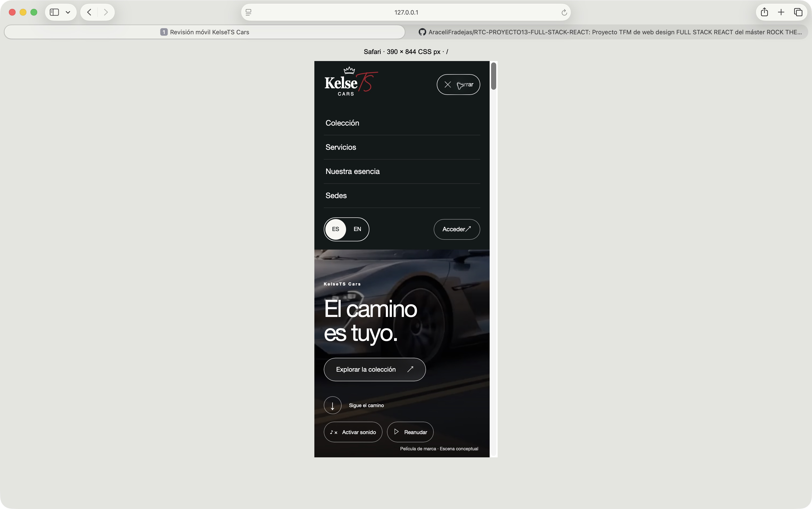</a>

El [informe responsive](docs/evidencias/movil/README.md) incluye las capturas y sus límites. Se han tomado en marcos de Safari de escritorio con el frontend local; los perfiles utilizaron una base temporal eliminada al terminar. La grabación del iPhone real aporta una revisión visual independiente, presentada en el apartado de pruebas.

El footer mantiene la identidad de la marca y permite conocer los otros proyectos de Universo KelseTS: Lifestyle, Store, Business School y Talks. He añadido los cinco enlaces sociales y el aviso académico, con enlace a The Power Tech School. Todo el texto cambia con el idioma seleccionado; en móvil, los enlaces se organizan en dos columnas para facilitar la lectura.

## 5. Datos, modelos y relaciones

`Vehicle.dealership` referencia `Dealership`. `Appointment` referencia a usuario, vehículo y sede. `User.dealership` limita el ámbito de colaboradores. La relación entre vehículos y sedes cumple el planteamiento de dos colecciones de negocio independientes de los usuarios.

Un índice único parcial en las citas impide ocupar una misma sede y hora con dos citas activas. La cancelación mantiene el historial y libera la franja. El diseño presupone un único puesto de atención por sede.

### Del Excel a la semilla

El CSV original contiene 100 registros de ejemplo. La normalización conserva precios y VIN originales como procedencia, sin convertirlos en datos reales verificados. El reparto entre cuatro sedes es una decisión de demostración. Los modelos sin fotografía específica utilizan una referencia local de su marca, identificada como tal.

La semilla valida datos y referencias antes de conectar a MongoDB. Su modo `--check` no escribe en la base de datos. La carga utiliza `seedKey` e inserta los registros que faltan, sin vaciar colecciones ni restablecer contraseñas.

He preparado un Excel con los 100 vehículos iniciales y 48 registros de doce modelos de gama alta, cuatro sedes y cuatro talleres relacionados. He comprobado todos sus datos frente a los CSV, exportado las hojas y repetido la semilla en Atlas. La [guía de datos](docs/DATOS-EXCEL.md) explica sus claves y el proceso de exportación. Los modelos añadidos tienen fuente oficial para carrocería y motorización; los datos de cada unidad quedan pendientes. El libro se ha abierto y revisado en Numbers para macOS; la guía muestra los recuentos calculados 148, 4 y 4. La comparación completa con los CSV pasa y el XLSX original se conserva sin cambios.

### Ampliación del catálogo y relación con la propuesta

El inventario del curso me permite trabajar con los datos y sus relaciones, pero quería que el catálogo también reflejara la temática que he elegido para KelseTS Cars. Por eso he añadido ejemplos de vehículos de gama alta de Porsche, Ferrari, Mercedes-Benz, Audi y Tesla. La intención es que la identidad de la marca tenga continuidad al pasar de la portada a la búsqueda de vehículos, sus fichas y la organización de una visita.

La ampliación incluye doce modelos, con un registro de demostración por modelo en cada una de las cuatro sedes: 48 registros nuevos y 148 en total. Conservo los 100 ejemplos iniciales para mantener su procedencia. Los nuevos registros se preparan en el mismo Excel, se exportan a CSV y se cargan mediante la semilla con lectura de archivos de Node.js. Todos mantienen su referencia al concesionario, de modo que la ampliación forma parte del recorrido de datos exigido en el TFM.

He separado los datos del modelo de los datos de una unidad concreta. El nombre, la carrocería y la motorización se han contrastado con fuentes oficiales; el reparto entre sedes y la disponibilidad pertenecen a la demostración. Año, kilometraje, precio, VIN y fecha de adquisición quedan vacíos cuando no están verificados. La interfaz los identifica como pendientes y no interpreta un kilometraje vacío como cero. Las fotografías locales se presentan como referencias de la marca, sin afirmar que correspondan a esas unidades.

### Revisión del libro en Numbers

He abierto el Excel de entrega en Numbers y revisado Guía, Vehículos, Sedes y Talleres. La guía muestra 148 vehículos, cuatro sedes y cuatro talleres como resultados de sus fórmulas. El inventario conserva los 100 ejemplos del curso y las 48 unidades añadidas. Las claves de sede relacionan vehículos y talleres con los concesionarios.

<a href="docs/evidencias/datos/01-guia-numbers.png">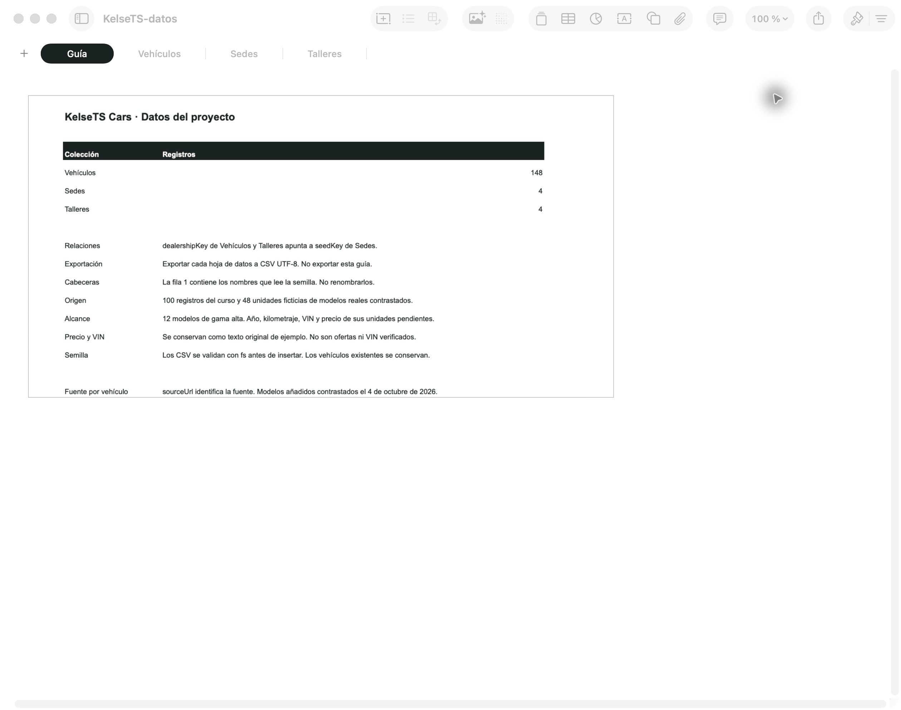</a>

### Vehículos

<a href="docs/evidencias/datos/02-vehiculos-numbers.png">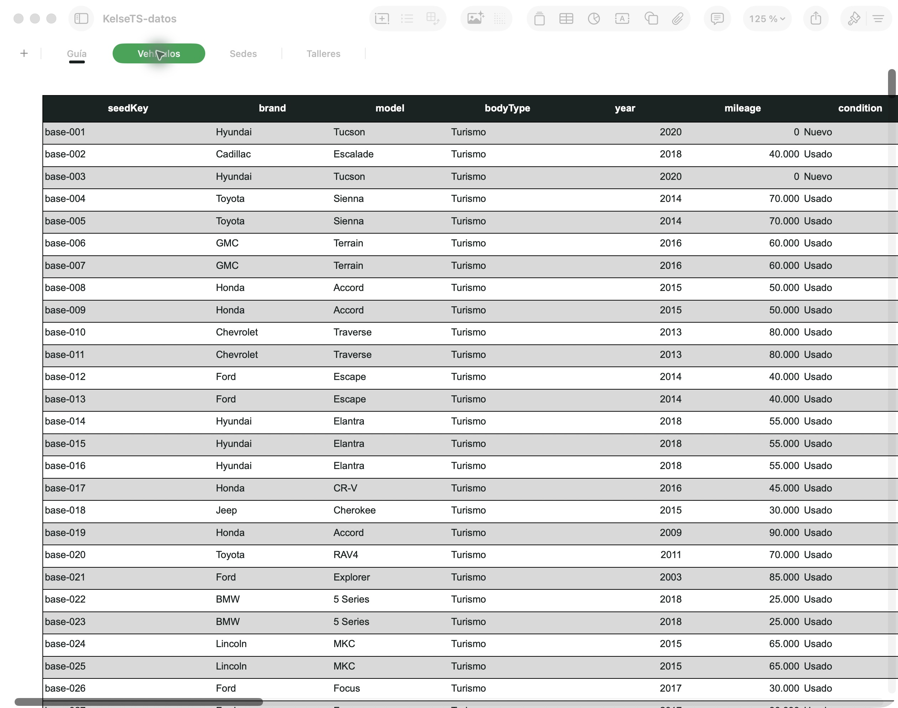</a>

<a href="docs/evidencias/datos/03-ampliacion-lujo-numbers.png">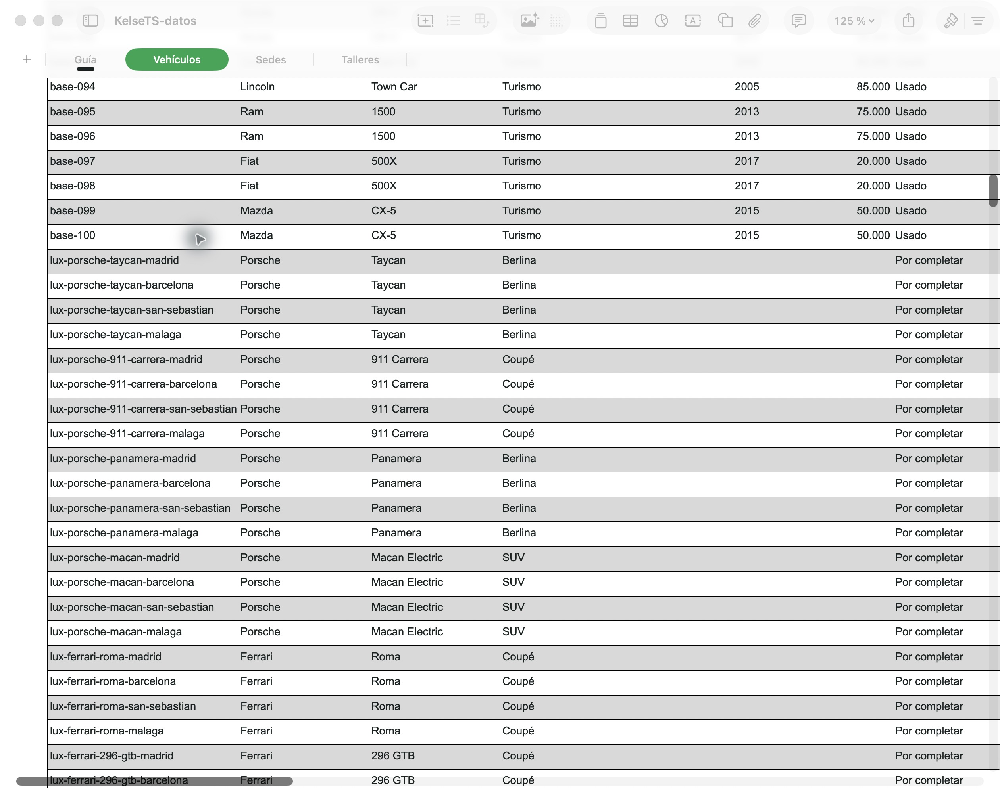</a>

### Sedes

<a href="docs/evidencias/datos/04-sedes-numbers.png">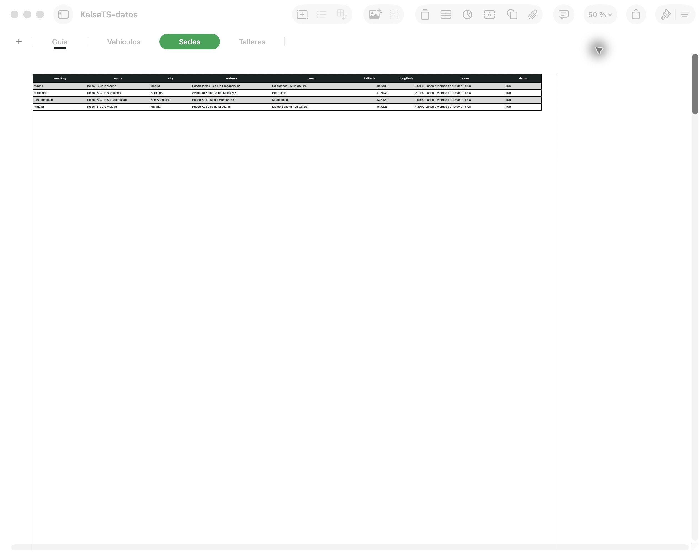</a>

### Talleres

<a href="docs/evidencias/datos/05-talleres-numbers.png">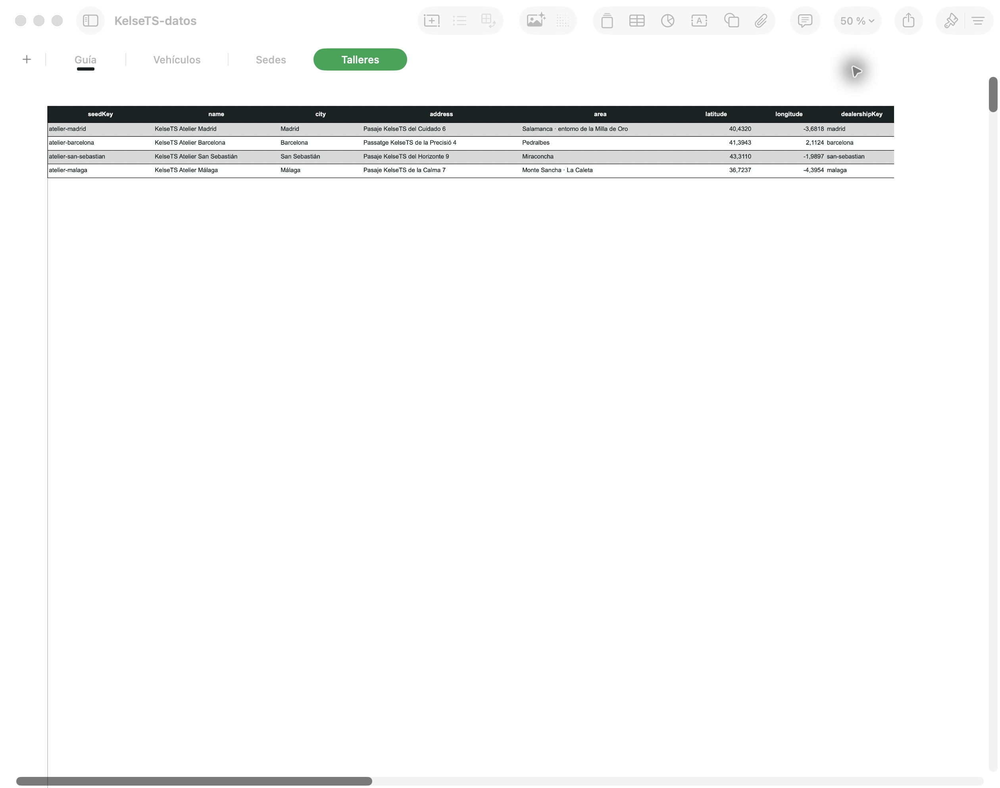</a>

Después de la apertura, `data:check` confirma que todos los datos y relaciones del libro coinciden con los CSV; `seed:check` también pasa. No he cambiado celdas, guardado una conversión ni exportado desde Numbers. El archivo original mantiene su SHA-256. El [informe con las cinco capturas](docs/evidencias/datos/README.md) documenta esta revisión en Numbers; no la presenta como una prueba en Microsoft Excel.

### Comprobación de las relaciones en Atlas

Atlas muestra las seis colecciones de la aplicación. El inventario contiene 148 vehículos y cuatro concesionarios. El filtro de talleres públicos devuelve cuatro; la colección conserva también registros ocultos de demostración. Las referencias de vehículo y taller coinciden con el identificador de su sede. Las citas relacionan cliente, vehículo, concesionario y taller. El [informe de Atlas](docs/evidencias/mongodb/README.md) explica cada captura.

<a href="docs/evidencias/mongodb/01-colecciones-atlas.png">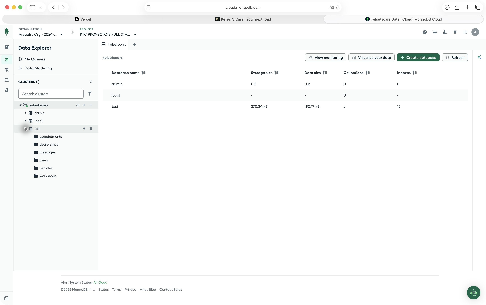</a>

<a href="docs/evidencias/mongodb/02-vehiculos-atlas.png">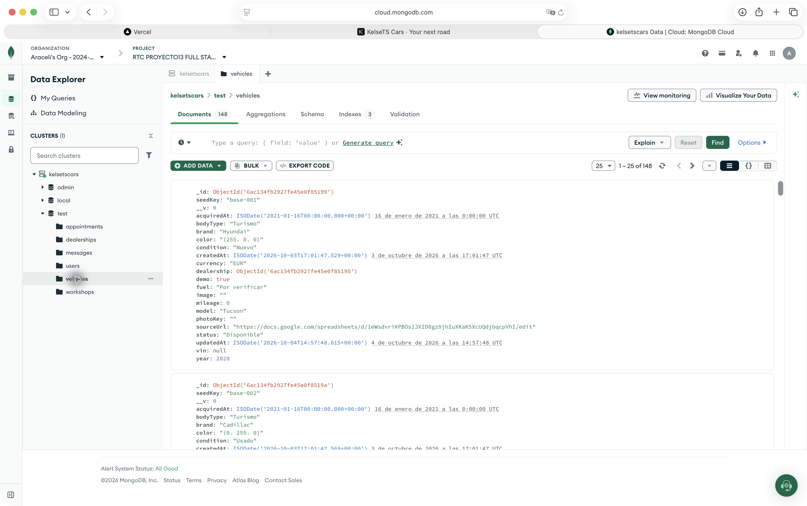</a>

<a href="docs/evidencias/mongodb/03-sedes-atlas.png">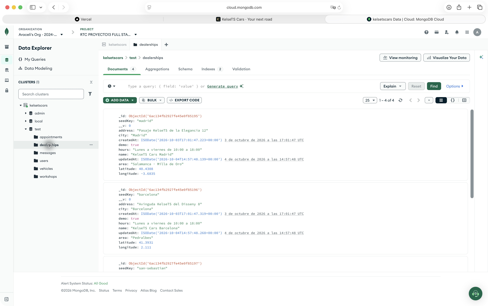</a>

<a href="docs/evidencias/mongodb/04-talleres-atlas.png">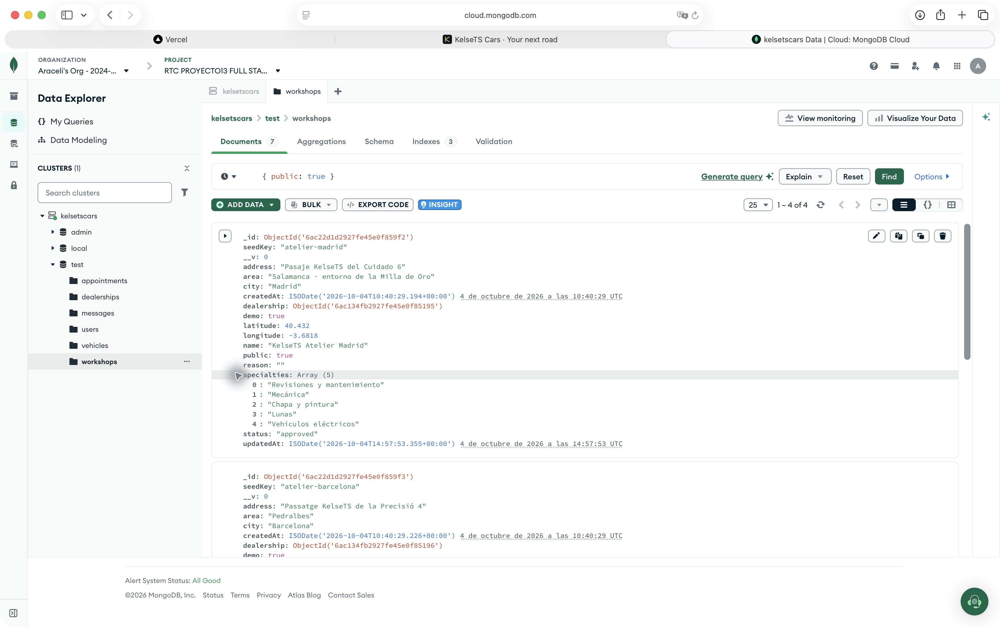</a>

<a href="docs/evidencias/mongodb/05-citas-atlas.png">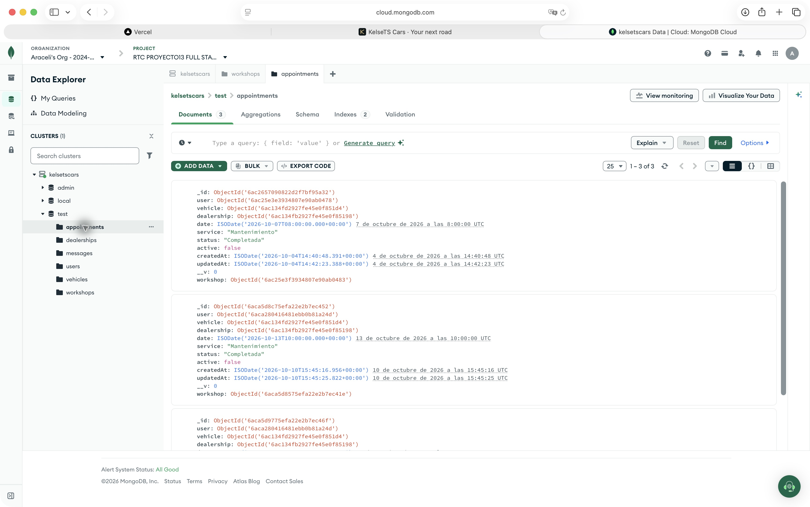</a>

## 6. Acceso y permisos

El registro fuerza el rol `client`; el servidor no acepta un rol arbitrario enviado por la interfaz. Las contraseñas se resumen con bcrypt. La cookie de sesión es `HttpOnly` y las escrituras comprueban el origen permitido.

El cliente solo puede cancelar citas propias. El personal consulta y gestiona su sede; la administradora dispone de acceso global. Los archivos de imagen tienen límite de tamaño y comprobación de cabecera. Los permisos y los casos negativos se han comprobado mediante la API en una base temporal de Atlas. Las pruebas de Cloudinary incluyen archivos incorrectos y accesos sin permiso.

### Clientes y talleres colaboradores

He añadido dos tipos de registro porque la relación con el cliente continúa después de elegir el coche. Un taller puede indicar su ubicación y sus especialidades de revisión, mecánica, chapa y pintura, lunas o eléctricos. La solicitud queda pendiente hasta que una administradora la revise; registrarse no concede acceso a datos de clientes. La aprobación activa el perfil profesional, pero Team puede asignar citas de mantenimiento a talleres aprobados, y el taller consulta únicamente las citas que le corresponden.

Para comunicar cada resultado he adaptado la idea que utilicé en [KelseTS Talks, otro proyecto de mi portfolio](https://github.com/AraceliFradejas/RTC-PROYECTO10-FULL-STACK-JAVASCRIPT/blob/main/docs/CORREO.md). Allí probé correos en Mailtrap Sandbox. En Cars los mensajes se guardan en una bandeja privada de demostración y se pueden generar muestras HTML locales, sin envío real. Hay bienvenida de cliente, recepción y resultado de solicitudes de talleres, y comunicaciones de solicitud, confirmación, cancelación y finalización de citas.

Las referencias de Renault y Línea Directa me han servido para organizar la posventa y las especialidades, manteniendo la identidad propia de KelseTS. La [justificación, los permisos y las pruebas](docs/COMUNICACIONES-Y-TALLERES.md) explican el funcionamiento y el alcance de esta entrega. `Workshop` referencia a su usuario y `Message` a su destinatario. Las altas y los cambios se guardan con sus comunicaciones en una transacción para evitar que aparezca un mensaje de éxito sin haberse completado la operación.

### Coordinación desde KelseTS Cars Team

He añadido KelseTS Cars Team como acceso interno. Las cuentas no se registran públicamente y los permisos se comprueban en el backend. La red parte de cuatro talleres ficticios próximos a las cuatro sedes, cargados desde un nuevo CSV y visibles en el mapa con un color distinto. Cada taller inicial referencia su concesionario, y la cita puede relacionar a cliente, vehículo, sede y taller mediante `Appointment.workshop`. Los talleres registrados solo consultan sus asignaciones, sin acceso a la agenda general. Los talleres de demostración no tienen credenciales ni cuenta de usuario.

## 7. Comunicaciones y Mailtrap

Las comunicaciones acompañan el recorrido del usuario: confirman el alta, explican el resultado de una solicitud y permiten seguir los cambios de una cita. He tomado como referencia el planteamiento de KelseTS Talks, adaptándolo a los perfiles de cliente, taller y Team de este proyecto.

La aplicación guarda los mensajes en la bandeja privada. Las diez muestras recibidas en Mailtrap son una revisión independiente de las plantillas HTML y texto, con datos ficticios y sin entrega a buzones personales.

### Identidad visual de las muestras de correo

He mantenido el mismo logotipo de la web en los correos, exportándolo desde el SVG para conservar la corona y el trazo TS. El footer reúne el lema de KelseTS Cars, las cuatro ciudades y los accesos a la web. He preparado diez imágenes conceptuales exclusivas, una para cada comunicación, sin repetir las fotografías de las secciones. Una confirmación presenta la bienvenida en la sede; una asignación muestra la coordinación del cuidado del vehículo; una cancelación deja una escena tranquila, sin transmitir urgencia. El contenido sigue adaptándose al destinatario y al estado de su solicitud o cita. En Mailtrap las imágenes se adjuntan al mensaje, de forma que la vista previa no depende de mi servidor local. Esta prueba revisa muestras; los eventos de la aplicación siguen registrando comunicaciones en su bandeja privada.

### Comprobación de las comunicaciones en Mailtrap

He enviado las diez muestras al Sandbox y he comprobado su recepción consultando la API. He guardado el HTML y el texto recibidos, la fecha y el identificador de cada mensaje. El texto coincide con la plantilla actual y los cinco enlaces de cada HTML apuntan a la web configurada. La versión de texto incluye también el footer, para conservar la información cuando no se muestran imágenes.

Las [evidencias](docs/evidencias/README.md) distinguen las vistas locales de los mensajes descargados del Sandbox. He revisado en Safari el encabezado, la fotografía, el botón y el footer de los diez tipos en el preset Phone de Mailtrap, con capturas de cada uno. El mensaje largo de asignación al taller tiene también una captura del contenido. La revisión se hizo con el preset móvil de Mailtrap. El análisis de Mailtrap señala estilos que algunos clientes pueden interpretar de otra forma; no lo considero una prueba de compatibilidad universal. Estas muestras no envían correo a buzones personales ni demuestran un envío automático desde un evento de la aplicación.

### Contenido en ambos idiomas

Las diez comunicaciones tienen ahora versión inglesa, incluido el footer. He conservado el logo aprobado y una imagen distinta para cada tipo de mensaje. Al crear una comunicación se guardan los dos idiomas dentro de la misma operación de base de datos: una cita posterior o un cambio de nombre no alteran ese contenido histórico.

La bandeja solicita el idioma seleccionado y sigue mostrando solo los mensajes del usuario conectado. Para el historial anterior, compruebo que se puede reproducir exactamente la plantilla castellana antes de ofrecer su traducción. Si hay información distinta o ambigua, mantengo el original. No traduzco nombres, direcciones ni motivos introducidos por usuarios.

Pasan las pruebas automáticas y la integración de registros, talleres y citas en una base temporal de Atlas, eliminada al terminar. He revisado la bienvenida inglesa y su footer en Safari. Son vistas previas locales, no nuevos envíos a Mailtrap ni una comprobación de todos los clientes de correo.

La bienvenida inglesa también se ha comprobado en la bandeja publicada con la cuenta ficticia de despliegue. El cambio a ES conserva la sesión y recupera el castellano.

## 8. Gestión de fotografías con Cloudinary

He incorporado la subida de imágenes desde el frontend porque permite que el equipo mantenga el catálogo sin editar archivos del proyecto. La gestión parte de la ficha de cada unidad, donde ya se identifican el modelo y la sede. Antes de guardar aparece una vista previa y se puede descartar la selección. He mantenido los colores, los botones redondeados y un título contenido, con una columna en pantallas pequeñas.

La operación usa `FormData`, Multer y el SDK de Cloudinary en Node. Solo una cuenta administradora puede realizarla; ocultar el formulario al resto de perfiles no sustituye al control del backend. También se comprueba el contenido del archivo y se limita su tamaño a 4 MB. La clave privada no llega a React. Esta implementación sigue la [documentación del SDK de Node](https://cloudinary.com/documentation/node_image_and_video_upload).

La prueba de integración utiliza una base temporal y dos imágenes de prueba que se eliminan al terminar. Comprueba sesión, permisos de cliente, taller y personal, archivo ausente, imagen falsa, exceso de tamaño, campo incorrecto, persistencia de la URL y sustitución. Después he completado el recorrido desde Safari con una unidad del catálogo: Porsche 911 Carrera de Barcelona. Se ha conservado su fotografía de referencia y su atribución. La gestión no migra toda la biblioteca ni cambia la semilla del Excel.

Las [evidencias de Cloudinary](docs/evidencias/cloudinary/README.md) distinguen la prueba automática de la revisión en navegador. He revisado el formulario vacío a 320, 390, 768 y 1440 px en un marco de Safari que carga la ficha real. A 320 y 390 px se muestra una columna; a 768 y 1440 px, dos. Las capturas están guardadas. Estas capturas muestran la distribución en Safari de escritorio; no acreditan una subida desde Fotos en un teléfono.

El formulario vacío también se revisó a 390 px dentro de un marco de Safari. Esta captura muestra la distribución, no una subida desde un teléfono.

### Fotografías en la web publicada

También he subido la fotografía del Porsche 911 Carrera de Madrid desde la web de Vercel. La API la guarda en Cloudinary y Atlas. Como la conexión directa al dominio de imágenes fallaba desde este equipo, la ficha y las tarjetas recuperan ahora la imagen mediante nuestra API, con destino fijo, control de tamaño y formato y caché breve. La URL original se conserva. La [verificación](docs/evidencias/cloudinary/verificacion-vercel.json) registra la respuesta JPEG y la comprobación visual en Safari.

<a href="docs/evidencias/cloudinary/09-imagen-publicada-vercel-safari.png">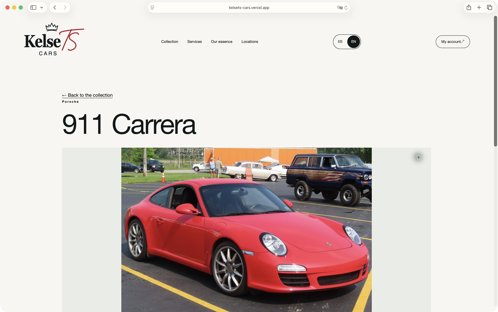</a>

## 9. Despliegue en Vercel

He publicado la [web](https://kelsets-cars.vercel.app) y la [API](https://kelsets-cars-api.vercel.app/api/v1/health) como dos proyectos de Vercel conectados al mismo repositorio. La API utiliza Atlas y la web conserva las peticiones bajo `/api/v1` en su propio dominio. Las variables privadas se guardan como sensibles en el backend.

He comprobado las consultas de los 148 vehículos, cuatro sedes y cuatro talleres, los recursos públicos y la apertura directa de páginas interiores. Con una cuenta ficticia autorizada para esta revisión he probado registro, acceso, sesión y cierre. Safari conserva la sesión al recargar y muestra la comunicación de bienvenida. Las peticiones sin sesión y desde un origen ajeno se rechazan.

El [informe de despliegue](docs/evidencias/despliegue/README.md) recoge la revisión de las páginas y la sesión. Las pruebas de fotografías y del recorrido de citas tienen sus informes propios.

### Configuración del frontend y backend

El límite de las fotografías es 4 MB, compartido entre React y Multer. He dejado margen para el formulario multipart y el límite de petición de Vercel. El formulario y sus mensajes muestran el mismo valor. Las pruebas de integración iniciales utilizan el límite anterior de 5 MB, identificado en su informe.

La API utiliza la detección nativa de Express en Vercel, exportando la aplicación desde `src/app.js`. La web se conecta a través de `/api` en su propio dominio mediante una reescritura hacia el backend. Los proyectos necesitan los paquetes compartidos que están fuera de sus carpetas raíz.

## 10. Pruebas y evidencias

He comprobado la lógica local, los permisos de la API y los recorridos de la web. Cada herramienta aporta una evidencia distinta: las pruebas automáticas verifican condiciones, Insomnia permite leer las respuestas y las capturas muestran el estado visible de la interfaz. Los [resultados de validación](docs/VALIDACION.md) reúnen los informes por entorno.

La compilación y las 44 pruebas locales pasan. Las integraciones con Atlas, Cloudinary y Mailtrap se documentan por separado. Las pruebas utilizan cuentas ficticias y bases temporales; las capturas no incluyen contraseñas, cookies ni tokens.

### Búsqueda del catálogo

La búsqueda predictiva sugiere marcas y modelos sin cubrir el contador ni las tarjetas. Los filtros son una alternativa para quien prefiera acotar por características.

La ficha del catálogo ampliado muestra la propuesta de gama alta y mantiene los datos no comprobados como pendientes.

### Recorrido de mantenimiento

Las capturas muestran la solicitud del cliente, la confirmación desde Team, la asignación al taller y el cierre comunicado al cliente. La cita de demostración se cerró anticipadamente para revisar el flujo; no acredita un mantenimiento real.

### Registro y revisión de talleres desde Safari

He revisado las páginas públicas en castellano e inglés y el catálogo publicado: sugerencias con teclado, cambio entre búsqueda y filtros y paginación conservando la marca elegida. El contador utiliza ahora el singular cuando solo hay un vehículo.

Para el registro de clientes y talleres he preparado una base temporal separada. Desde Safari he aprobado un taller, rechazado otro con motivo y comprobado que no se permite rechazar sin explicarlo. Después he completado una cita de mantenimiento entre cliente, Team y taller, con sus estados y comunicaciones. La base temporal se eliminó al terminar. El [informe de navegación](docs/evidencias/navegacion/README.md) identifica qué pruebas pertenecen a producción y cuáles a este entorno.

<a href="docs/evidencias/navegacion/08-visita-completada-temporal-safari.png">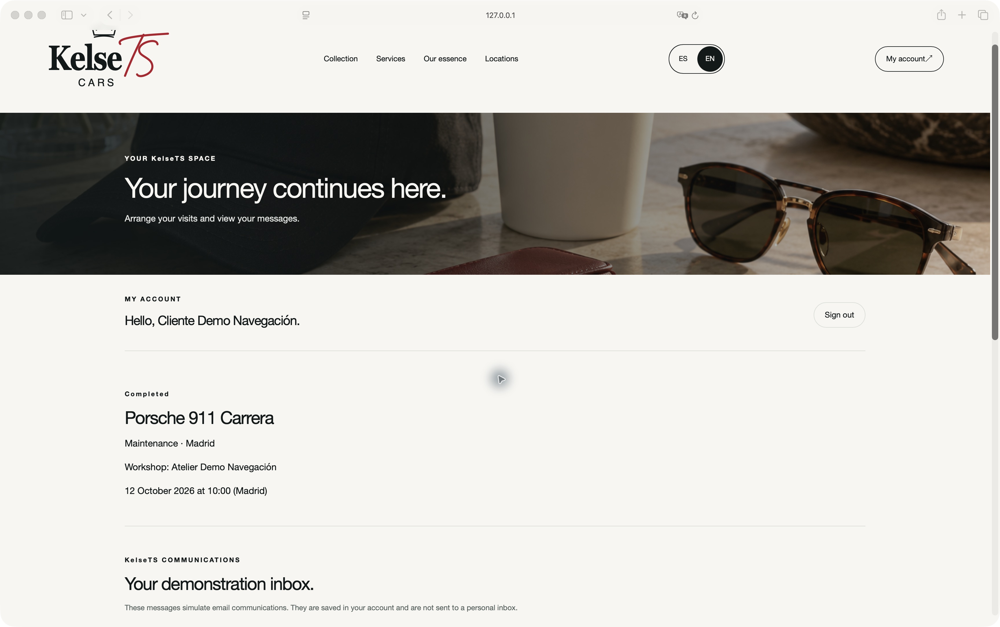</a>

### Recorrido privado en producción

He ejecutado 101 comprobaciones HTTP contra la web y la API de Vercel, todas correctas. La revisión incluye catálogo, sesiones, permisos, privacidad, comunicaciones en ambos idiomas y entrega de imágenes de Cloudinary. Con dos talleres ficticios autorizados y ocultos del directorio público se han probado la aprobación y el rechazo con motivo. Cliente Demo Despliegue ha solicitado una cita de mantenimiento que Team ha asignado, confirmado y completado; una segunda cita se ha cancelado desde el perfil de cliente. También se han comprobado los bloqueos de duplicados y cambios de estado incorrectos.

Los registros ficticios se conservan como demostración. El [informe de producción](docs/evidencias/produccion/README.md) incluye los resultados esperados y obtenidos y explica el alcance: son peticiones HTTP reales, no una ejecución de la interfaz de Insomnia ni pruebas físicas del teléfono. No se han añadido credenciales a la documentación.

### Resultados de Insomnia

He importado la colección en Insomnia 13.2.0 y ejecutado las 76 peticiones principales sobre una base temporal de Atlas con el backend local. Pasan sus 171 comprobaciones. La ronda permite seguir el registro y la separación de perfiles, aprobar y rechazar talleres, asignar un mantenimiento, cancelar una cita propia y completar otra visita. El taller recibe el nombre del cliente sin su correo. La base temporal se eliminó al terminar.

La ejecución encontró dos ajustes necesarios en la colección: usar el código HTTP numérico y conservar en el jar la cookie que devuelve el registro o login. Tras corregirlos, se repitió la ronda completa. No fue necesario modificar los permisos ni la autenticación de la API.

También he ejecutado 15 peticiones públicas contra Vercel, con 36 comprobaciones correctas y sin crear más cuentas o citas. Esta colección se puede repetir sin credenciales. Las dos peticiones de subida manual de imágenes no se incluyen en el runner; su prueba desde Safari está documentada en Cloudinary. El [informe de Insomnia](docs/evidencias/insomnia/README.md) conserva 23 capturas y distingue esta ejecución de las pruebas HTTP anteriores.

### El backend paso a paso

Para seguir la prueba sin ejecutar la colección, las capturas muestran los pasos de cliente, taller y Team. En cada uno explico qué quiero comprobar, qué petición realizo y cómo interpreto la respuesta.

Estas 14 capturas adicionales se han obtenido al abrir las respuestas guardadas de la ronda correcta en Insomnia. No son una segunda ejecución: la base temporal ya estaba eliminada y no se pulsó Send. Se conserva el código HTTP, el contador de comprobaciones y el resultado original. En las respuestas largas he aplicado el filtro JSONPath indicado para que se lea el dato relevante, sin modificar la respuesta. Los identificadores permiten relacionar las etapas; no son credenciales.

#### Caso 15 · Registro de cliente

**Objetivo:** Comprobar el alta de una cuenta de cliente.

**Petición:** `POST /auth/register`, sobre `/api/v1`, con la sesión del perfil que realiza el paso.

**Resultado obtenido:** 201; 3/3 comprobaciones. La respuesta contiene el perfil client y no devuelve la contraseña.

**Interpretación:** El servidor asigna un perfil de cliente y devuelve los datos necesarios para el área privada. No se muestran la cookie ni las credenciales.

#### Caso 17 · Sesión del cliente

**Objetivo:** Comprobar que la sesión creada permite consultar el perfil.

**Petición:** `GET /auth/me`, sobre `/api/v1`, con la sesión del perfil que realiza el paso.

**Resultado obtenido:** 200; 2/2 comprobaciones. Se recupera el mismo identificador del registro.

**Interpretación:** El registro y la consulta de sesión corresponden a la misma cuenta. La cookie se conserva en Insomnia; su valor no se incluye en la evidencia.

#### Caso 22 · Solicitud de mantenimiento

**Objetivo:** Solicitar un mantenimiento como cliente autenticado.

**Petición:** `POST /appointments`, sobre `/api/v1`, con la sesión del perfil que realiza el paso.

**Resultado obtenido:** 201; 3/3 comprobaciones. La cita comienza en Pendiente.

**Interpretación:** Solicitar una visita no implica que esté confirmada. La respuesta crea la relación entre cliente, vehículo y sede. La captura destaca el estado inicial.

**Vista de la captura:** filtro JSONPath `$.data.status`.

#### Caso 23 · Franja ya ocupada

**Objetivo:** Intentar crear otra cita en la sede y hora ya ocupadas.

**Petición:** `POST /appointments`, sobre `/api/v1`, con la sesión del perfil que realiza el paso.

**Resultado obtenido:** 409; 2/2 comprobaciones. La API rechaza la misma franja.

**Interpretación:** El conflicto es el resultado esperado. Evita reservar dos citas activas en la misma sede y franja.

#### Caso 30 · Taller pendiente

**Objetivo:** Consultar la solicitud después del registro del taller.

**Petición:** `GET /workshops/me`, sobre `/api/v1`, con la sesión del perfil que realiza el paso.

**Resultado obtenido:** 200; 3/3 comprobaciones. El perfil muestra status: pending y public: false.

**Interpretación:** La solicitud queda pendiente de revisión. El registro no aprueba al taller automáticamente ni lo publica en el directorio. El nombre y los datos de contacto son ficticios.

#### Caso 42 · Aprobación del taller

**Objetivo:** Aprobar la colaboración desde una sesión de Team.

**Petición:** `PATCH /workshops/:id/review`, sobre `/api/v1`, con la sesión del perfil que realiza el paso.

**Resultado obtenido:** 200; 2/2 comprobaciones. El mismo taller pasa a approved.

**Interpretación:** El identificador coincide con la solicitud pendiente. Se guardan la fecha y la cuenta que revisó el alta. El taller continúa oculto porque esta prueba no cambia public.

#### Caso 45 · Rechazo con motivo

**Objetivo:** Rechazar otra solicitud explicando la decisión.

**Petición:** `PATCH /workshops/:id/review`, sobre `/api/v1`, con la sesión del perfil que realiza el paso.

**Resultado obtenido:** 200; 2/2 comprobaciones. La segunda solicitud pasa a rejected con un motivo.

**Interpretación:** La respuesta conserva el motivo «Faltan datos para revisar la colaboración.». Es una solicitud distinta de la aprobada. El caso 44 comprueba además que no se admite el rechazo sin motivo.

#### Caso 47 · Asignación del mantenimiento

**Objetivo:** Asignar desde Team el mantenimiento al taller revisado.

**Petición:** `POST /appointments/:id/workshop`, sobre `/api/v1`, con la sesión del perfil que realiza el paso.

**Resultado obtenido:** 200; 2/2 comprobaciones. La cita recibe la referencia del taller aprobado.

**Interpretación:** La referencia 6aca65727c495b96f11780ac coincide con el taller de las capturas de solicitud y aprobación. Esta relación enlaza la cita con el profesional que la atenderá; asignar no equivale a confirmar.

**Vista de la captura:** filtro JSONPath `$.data.workshop`.

#### Caso 49 · Confirmación de la cita

**Objetivo:** Confirmar desde Team la cita previamente asignada.

**Petición:** `PATCH /appointments/:id`, sobre `/api/v1`, con la sesión del perfil que realiza el paso.

**Resultado obtenido:** 200; 2/2 comprobaciones. El estado pasa a Confirmada.

**Interpretación:** La ruta conserva el identificador de la solicitud inicial. El cambio de estado se hace con permisos administrativos, después de la asignación.

**Vista de la captura:** filtro JSONPath `$.data.status`.

#### Caso 56 · Comunicaciones del taller

**Objetivo:** Consultar los avisos desde el perfil del taller aprobado.

**Petición:** `GET /messages`, sobre `/api/v1`, con la sesión del perfil que realiza el paso.

**Resultado obtenido:** 200; 3/3 comprobaciones. Aparecen cuatro asuntos de recepción, aprobación, asignación y confirmación.

**Interpretación:** El contenido acompaña las etapas de colaboración y atención. En esta ronda delivery es simulated: acredita mensajes guardados en el área privada, no entrega de correos a Mailtrap ni a buzones personales.

**Vista de la captura:** filtro JSONPath `$.data[*].subject`.

#### Caso 69 · Cancelación de la cita propia

**Objetivo:** Cancelar la primera cita desde el cliente que la solicitó.

**Petición:** `PATCH /appointments/:id`, sobre `/api/v1`, con la sesión del perfil que realiza el paso.

**Resultado obtenido:** 200; 2/2 comprobaciones. La cita pasa a Cancelada.

**Interpretación:** La respuesta completa marca active: false. La captura destaca Cancelada. Se cancela la primera cita; la visita completada de la captura 03 corresponde a la segunda cuenta y a otra cita.

**Vista de la captura:** filtro JSONPath `$.data.status`.

#### Caso 70 · Comunicaciones del cliente

**Objetivo:** Consultar los avisos del cliente después de cancelar.

**Petición:** `GET /messages`, sobre `/api/v1`, con la sesión del perfil que realiza el paso.

**Resultado obtenido:** 200; 3/3 comprobaciones. Se observan cinco asuntos: bienvenida, solicitud, asignación, confirmación y cancelación.

**Interpretación:** La bandeja conserva el recorrido de su cita y utiliza textos dirigidos al cliente. Se diferencia del aviso de nueva asignación que recibe el taller. Los mensajes son simulados.

**Vista de la captura:** filtro JSONPath `$.data[*].subject`.

#### Caso 65 · Bandeja de otro cliente

**Objetivo:** Consultar los mensajes después de registrar a un segundo cliente.

**Petición:** `GET /messages`, sobre `/api/v1`, con la sesión del perfil que realiza el paso.

**Resultado obtenido:** 200; 3/3 comprobaciones. La segunda cuenta recibe solo su bienvenida en ese momento.

**Interpretación:** Esta petición se ejecutó antes de que la segunda cuenta solicitara su visita. No aparecen los avisos de la primera cita. La comparación con las bandejas anteriores documenta el aislamiento de esta prueba; no pretende demostrar todos los escenarios posibles de privacidad.

**Vista de la captura:** filtro JSONPath `$.data[*].subject`.

#### Caso 64 · Cita ajena protegida

**Objetivo:** Intentar cancelar la primera cita desde la segunda cuenta.

**Petición:** `PATCH /appointments/:id`, sobre `/api/v1`, con la sesión del perfil que realiza el paso.

**Resultado obtenido:** 409; 2/2 comprobaciones. La API rechaza el cambio de una cita de otro cliente.

**Interpretación:** El servidor responde «La cita ya tiene ese estado o no puedes modificarla.». El 409 es el código utilizado en esta operación; no debe confundirse con el 403 de las rutas reservadas a Team.

#### Qué permiten comprobar estas evidencias

El recorrido muestra las relaciones cliente–cita–vehículo–sede–taller, las decisiones de Team y la separación de los perfiles. Incluye respuestas de éxito y errores esperados: un 409 de duplicado o de modificación ajena es una prueba correcta si ese era el resultado previsto.

El resumen de las 171 comprobaciones acredita la ronda principal; las imágenes individuales permiten leer sus pasos más importantes. Las otras 36 comprobaciones pertenecen a la colección pública de Vercel. No sumo estas rondas como si fueran casos distintos: algunas peticiones se repiten en ambos entornos.

La [validación detallada](docs/insomnia/VALIDACION-DETALLADA.md) relaciona los 76 casos ejecutados con sus códigos esperados y obtenidos y con las capturas disponibles. La colección importable y los scripts permiten repetirlos con una base de pruebas y credenciales privadas. Las imágenes manuales de Cloudinary, los mensajes revisados en Mailtrap y la revisión responsive tienen informes independientes.

#### Otras capturas de la misma ejecución

El runner no muestra comprobaciones fallidas en la ronda temporal:

La segunda visita se confirma y se completa desde Team. Es otra cita: no se completa la que el primer cliente canceló.

La agenda del taller contiene el trabajo asignado y el nombre del cliente, sin su correo. Esta vista corresponde a la cita aún confirmada, antes de la cancelación posterior.

En la ronda pública de Vercel, el filtro de fallos también queda vacío, el catálogo devuelve 148 unidades y el perfil anónimo se rechaza con 401.

### Grabación en mi iPhone 13

He grabado la navegación por la web publicada en mi iPhone 13. A partir del vídeo se han extraído siete fotogramas, manteniendo la resolución original y las barras del dispositivo. Permiten ver la home, el contenido editorial, el buscador con el contador de 148 vehículos, las tarjetas, la ficha, el menú en inglés y el acceso. En las pantallas revisadas no se aprecian desbordamientos horizontales.

Esta evidencia complementa las capturas de Safari en el Mac. El vídeo muestra esas pantallas de la versión publicada; no lo utilizo como prueba de envío de formularios, inicio de sesión o subida de fotografías. El [informe del iPhone](docs/evidencias/iphone-real/README.md) conserva los instantes de extracción y las siete capturas.

<a href="docs/evidencias/iphone-real/01-home.png">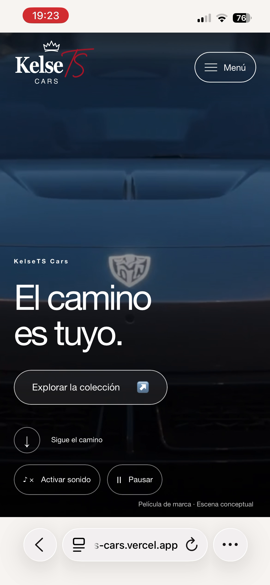</a>

<a href="docs/evidencias/iphone-real/02-editorial.png">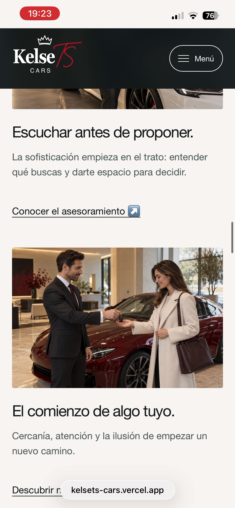</a>

<a href="docs/evidencias/iphone-real/03-buscador.png">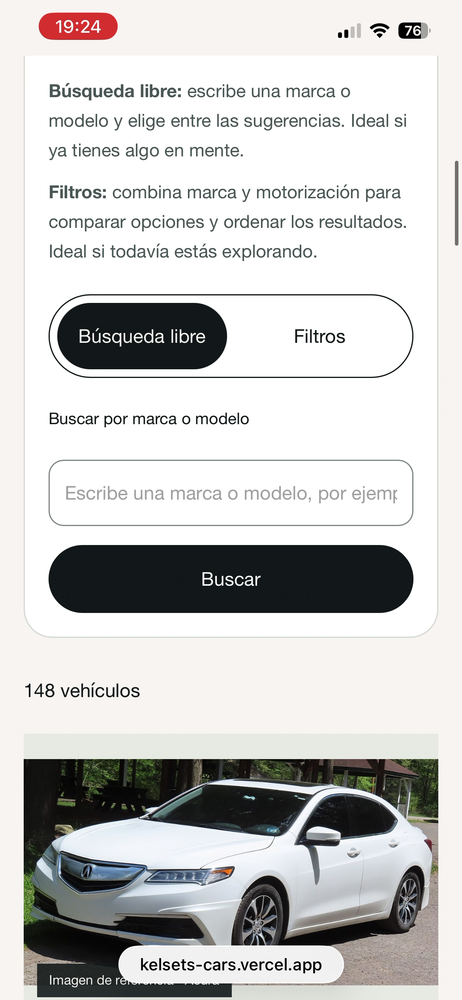</a>

<a href="docs/evidencias/iphone-real/04-catalogo.png">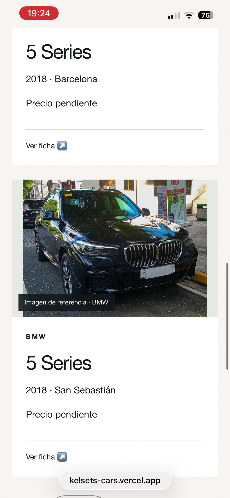</a>

<a href="docs/evidencias/iphone-real/05-ficha.png">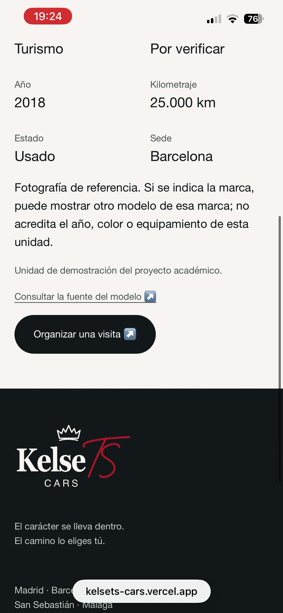</a>

<a href="docs/evidencias/iphone-real/06-menu-ingles.png">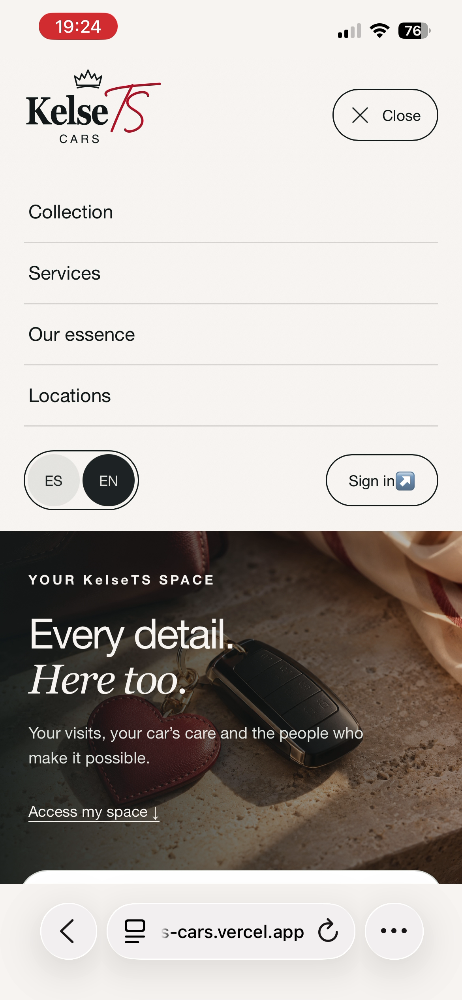</a>

<a href="docs/evidencias/iphone-real/07-acceso-ingles.png">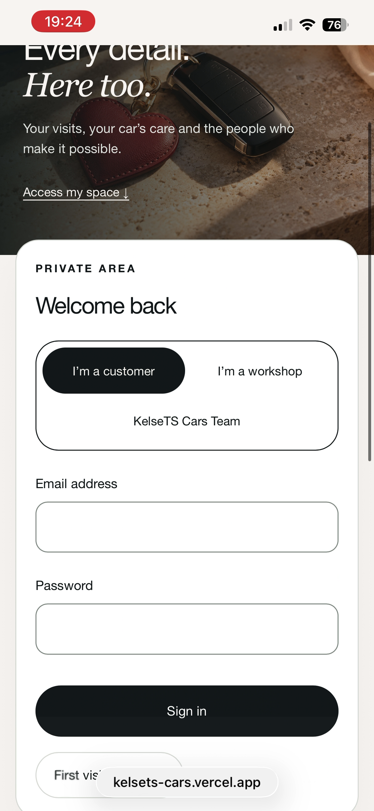</a>

## 11. Aprendizajes y correcciones aplicadas

He separado los filtros, las tarjetas y la paginación del catálogo, las filas de citas, los campos del registro de talleres y las tarjetas de la red. Las páginas coordinan los datos y la navegación, mientras que cada componente presenta una parte concreta de la interfaz. El hook de ubicación reúne la solicitud de permiso, la selección manual y el tratamiento de errores. También he separado los estilos de las vistas privadas y del barrio, conservando el orden de aplicación de las reglas.

La sustitución de fotografías tiene un servicio propio: guarda la nueva referencia antes de retirar la anterior y conserva la imagen previa si falla el guardado. La respuesta de subida incluye los datos de la sede, igual que la ficha del catálogo. He añadido cuatro pruebas de este servicio y tres del renderizado del footer y las acciones de las citas. La suite local pasa 44 comprobaciones: 25 del backend, 14 del frontend y cinco del cliente HTTP; las dos integraciones opcionales se ejecutan por separado. La [revisión técnica](docs/REVISION-TECNICA.md) recoge el alcance y los resultados.

### Aplicar las correcciones de otros proyectos

En entregas anteriores me habían señalado archivos de estilos vacíos o sin utilizar, recursos pesados que no aparecían en la página y archivos que reunían demasiadas responsabilidades. He utilizado esas observaciones para revisar KelseTS Cars. No he tomado el número de líneas como único criterio: he separado las partes que tienen una función clara y he distribuido el JSX para que se pueda leer sin tener que seguir una línea enorme. También he retirado cuatro recursos sustituidos o sin uso, unos 6,7 MB del directorio público.

Otras correcciones trataban sobre helpers duplicados, controladores difíciles de seguir y respuestas que no incluían los datos relacionados. Aquí el escape de expresiones regulares tiene una única implementación, los tiempos de espera tienen constantes con nombre y la sustitución de imágenes se resuelve en un servicio. La respuesta de subida incluye la sede del vehículo. El CSV no contiene filas idénticas salvo su clave: las unidades de un modelo se relacionan con sus respectivas sedes.

También he aplicado la observación sobre mostrar español e inglés a la vez y sobre conservar controles que ya no correspondían al estado de una actividad. El footer muestra solo el idioma seleccionado; una cita completada no conserva botones de modificación. He añadido pruebas de renderizado para comprobarlo. La revisión de metadatos confirma la descripción existente y añade la información para compartir la web.

Las correcciones sobre autores, fechas, visitas y likes pertenecían a una entrega con Unsplash. En este proyecto he aplicado el criterio de mostrar información fiel a la fuente: las fotografías de vehículos conservan sus créditos, licencias y enlaces de origen, y se identifican como referencias. No he trasladado contadores ni campos de otra aplicación que aquí no tienen una función.

### Qué me llevo de este proyecto

Este trabajo me ha permitido conectar decisiones de diseño con el comportamiento de la aplicación. Una búsqueda cómoda necesita datos bien preparados; una cita tiene que mantener sus relaciones y permisos; y un mensaje de confirmación debe corresponder a una operación que realmente se haya guardado.

Las observaciones de mis profesores en entregas anteriores me han ayudado a revisar estas decisiones. He dado más atención a la separación de componentes, a las respuestas del backend y a la lectura del código. También he acompañado las pruebas con evidencias que permitan entender qué se ha comprobado y en qué entorno.

## Aviso legal

KelseTS es una marca ficticia creada por Araceli Fradejas Muñoz con fines educativos, académicos y de portfolio. KelseTS Cars no está afiliado, patrocinado, autorizado ni respaldado por Taylor Swift, Travis Kelce, los Kansas City Chiefs, la National Football League, sus representantes ni los fabricantes de automóviles mostrados. Las personas, concesionarios, talleres, inventario y servicios de la propuesta son ficticios.

Las escenas de marca se han creado para este proyecto. Las fotografías reales de vehículos y barrios conservan sus autores, fuentes y licencias en [Recursos](docs/RECURSOS.md), la [galería](docs/GALERIA-VEHICULOS.md) y la página de créditos.

## Autora

**Araceli Fradejas Muñoz**

Proyecto académico del máster Rock The Code de The Power Tech School.
