# Memoria técnica · KelseTS Cars

## Datos del proyecto

| Dato | Información |
| --- | --- |
| Proyecto | Catálogo de vehículos y gestión de citas |
| Formación | TFM Rock The Code · The Power Tech School |
| Autora | Araceli Fradejas Muñoz |
| Tecnologías | JavaScript, Node.js, Express, React y MongoDB |
| Etapa | Desarrollo y validación · 4 de octubre de 2026 |
| Despliegue | Web y API publicadas en Vercel · 10 de octubre de 2026 |
| Evolución posterior | TFM BigSchool con app y módulos específicos |

Esta memoria sigue la organización de [KelseTS Talks](https://github.com/AraceliFradejas/RTC-PROYECTO10-FULL-STACK-JAVASCRIPT/blob/main/MEMORIA.md). Recoge el estado real del trabajo: las pantallas creadas no equivalen a una integración comprobada, y las funcionalidades futuras se identifican como pendientes.

## 1. Contexto y motivación

He situado este TFM dentro de KelseTS, la marca ficticia con la que he dado identidad a varios proyectos del máster. KelseTS Cars aplica esa continuidad al automóvil, con una propuesta que combina catálogo, sedes y citas.

La idea inicial incluía una web comercial, áreas de clientes y colaboradores, personalización de vehículos y una futura aplicación. He dividido el trabajo en dos etapas para que la primera entrega responda estrictamente al enunciado de Rock The Code y la segunda desarrolle el alcance de BigSchool.

## 2. Objetivos

La primera etapa debe permitir consultar vehículos, acceder a una cuenta y gestionar citas con permisos. Su recorrido de datos será Excel → CSV → lectura con `fs` → validación → semilla → MongoDB → API → React.

Como objetivo de arquitectura, la app debe poder consultar la misma API y reutilizar los contratos y el cliente HTTP. Sus pantallas y las capacidades del dispositivo se desarrollarán en la segunda etapa.

## 3. Requisitos y cumplimiento

La [revisión del enunciado](docs/REVISION-ENTREGA.md) contiene el seguimiento. El catálogo, las cuentas y las citas están conectados a Atlas. Las pruebas de integración y las capturas documentan los recorridos comprobados; siguen pendientes la revisión bilingüe y móvil completa y el recorrido completo en producción.

## 4. Tecnologías

Node.js y Express reciben las peticiones. Mongoose define usuarios, vehículos, sedes y citas. React compone la web con rutas y componentes. Zod expresa validaciones comunes sin depender de la interfaz.

El cliente HTTP se ha extraído a un paquete que recibe su URL base y su función `fetch`. Esta decisión permite probar las peticiones y reutilizarlas desde otra interfaz. Los hooks y contextos de React permanecen dentro de la web.

## 5. Arquitectura

El backend es un monolito modular: comparte despliegue y base de datos, pero agrupa modelos y controladores por dominio. La web utiliza `features` para separar marca, catálogo, acceso y citas. Las [decisiones de arquitectura](docs/ARQUITECTURA.md) explican cómo incorporar nuevos módulos.

`packages/contracts` contiene esquemas y valores comunes. `packages/api-client` centraliza peticiones, errores y cancelación. `apps/mobile` reserva la ubicación de la app y documenta lo que aún debe resolverse.

## 6. Flujo de la aplicación

La portada editorial permite conocer la marca y los modelos seleccionados. El catálogo consulta el inventario mediante la API. Una ficha enlaza con la solicitud de cita; si falta sesión, la navegación pasa por acceso y conserva el destino. El área personal consulta citas y permite solicitar su cancelación.

El recorrido de mantenimiento se ha comprobado con Atlas desde Safari, entre cliente, Team y taller. El registro y la revisión de talleres en navegador siguen pendientes.

## 7. Modelos y relaciones

`Vehicle.dealership` referencia `Dealership`. `Appointment` referencia a usuario, vehículo y sede. `User.dealership` limita el ámbito de colaboradores. La relación entre vehículos y sedes cumple el planteamiento de dos colecciones de negocio independientes de los usuarios.

Un índice único parcial en las citas impide ocupar una misma sede y hora con dos citas activas. La cancelación mantiene el historial y libera la franja. El diseño inicial presupone un único puesto de atención por sede; la capacidad por empleado o taller se abordará como ampliación.

## 8. Datos y semilla

El CSV original contiene 100 registros de ejemplo. La normalización conserva precios y VIN originales como procedencia, sin convertirlos en datos reales verificados. El reparto entre cuatro sedes es una decisión de demostración. Los modelos sin fotografía específica utilizan una referencia local de su marca, identificada como tal.

La semilla valida datos y referencias antes de conectar a MongoDB. Su modo `--check` no escribe en la base de datos. La carga utiliza `seedKey` e inserta los registros que faltan, sin vaciar colecciones ni restablecer contraseñas.

He preparado un Excel con los 100 vehículos iniciales y 48 registros de doce modelos de gama alta, cuatro sedes y cuatro talleres relacionados. He comprobado todos sus datos frente a los CSV, exportado las hojas y repetido la semilla en Atlas. La [guía de datos](docs/DATOS-EXCEL.md) explica sus claves y el proceso de exportación. Los modelos añadidos tienen fuente oficial para carrocería y motorización; los datos de cada unidad quedan pendientes. Falta revisar el libro en Excel de escritorio.

### Ampliación del catálogo y relación con la propuesta

El inventario del curso me permite trabajar con los datos y sus relaciones, pero quería que el catálogo también reflejara la temática que he elegido para KelseTS Cars. Por eso he añadido ejemplos de vehículos de gama alta de Porsche, Ferrari, Mercedes-Benz, Audi y Tesla. La intención es que la identidad de la marca tenga continuidad al pasar de la portada a la búsqueda de vehículos, sus fichas y la organización de una visita.

La ampliación incluye doce modelos, con un registro de demostración por modelo en cada una de las cuatro sedes: 48 registros nuevos y 148 en total. Conservo los 100 ejemplos iniciales para mantener su procedencia. Los nuevos registros se preparan en el mismo Excel, se exportan a CSV y se cargan mediante la semilla con lectura de archivos de Node.js. Todos mantienen su referencia al concesionario, de modo que la ampliación forma parte del recorrido de datos exigido en el TFM.

He separado los datos del modelo de los datos de una unidad concreta. El nombre, la carrocería y la motorización se han contrastado con fuentes oficiales; el reparto entre sedes y la disponibilidad pertenecen a la demostración. Año, kilometraje, precio, VIN y fecha de adquisición quedan vacíos cuando no están verificados. La interfaz los identifica como pendientes y no interpreta un kilometraje vacío como cero. Las fotografías locales se presentan como referencias de la marca, sin afirmar que correspondan a esas unidades.

## 9. Seguridad y permisos

El registro fuerza el rol `client`; el servidor no acepta un rol arbitrario enviado por la interfaz. Las contraseñas se resumen con bcrypt. La cookie de sesión es `HttpOnly` y las escrituras comprueban el origen permitido.

El cliente solo puede cancelar citas propias. El personal consulta y gestiona su sede; la administradora dispone de acceso global. Los archivos de imagen tienen límite de tamaño y comprobación de cabecera. Los permisos y los casos negativos se han comprobado mediante la API en una base temporal de Atlas. Las pruebas de Cloudinary incluyen archivos incorrectos y accesos sin permiso.

## 10. Hooks y experiencia de usuario

### Clientes, talleres colaboradores y comunicaciones

He añadido dos tipos de registro porque la relación con el cliente continúa después de elegir el coche. Un taller puede indicar su ubicación y sus especialidades de revisión, mecánica, chapa y pintura, lunas o eléctricos. La solicitud queda pendiente hasta que una administradora la revise; registrarse no concede acceso a datos de clientes. La aprobación activa el perfil profesional, pero Team puede asignar citas de mantenimiento a talleres aprobados, y el taller consulta únicamente las citas que le corresponden. El seguimiento de reparaciones y siniestros todavía requiere un módulo posterior.

Para comunicar cada resultado he adaptado la idea que utilicé en [KelseTS Talks, otro proyecto de mi portfolio](https://github.com/AraceliFradejas/RTC-PROYECTO10-FULL-STACK-JAVASCRIPT/blob/main/docs/CORREO.md). Allí probé correos en Mailtrap Sandbox. En Cars los mensajes se guardan en una bandeja privada de demostración y se pueden generar muestras HTML locales, sin envío real. Hay bienvenida de cliente, recepción y resultado de solicitudes de talleres, y comunicaciones de solicitud, confirmación, cancelación y finalización de citas.

Las referencias de Renault y Línea Directa me han servido para organizar la posventa y las especialidades, manteniendo la identidad propia de KelseTS. La [justificación, los permisos y las pruebas](docs/COMUNICACIONES-Y-TALLERES.md) explican qué está implementado y qué queda para después. `Workshop` referencia a su usuario y `Message` a su destinatario. Las altas y los cambios se guardan con sus comunicaciones en una transacción para evitar que aparezca un mensaje de éxito sin haberse completado la operación.

`useResource` combina `useReducer`, cancelación mediante `AbortController` y reintento. Evita que una respuesta anterior actualice una pantalla después de cambiar filtros o ruta. `AuthProvider` comparte el estado de sesión sin copiarlo en cada página.

La búsqueda libre sugiere marcas y modelos del inventario mientras se escribe. Permite seleccionar con las flechas y Enter, cerrar con Escape o mantener el texto libre. El componente reutiliza la carga cancelable y memoriza las coincidencias; no hace una petición por cada tecla. Sigue las pautas del [patrón combobox de W3C](https://www.w3.org/WAI/ARIA/apg/patterns/combobox/), sin considerarlo una auditoría completa de accesibilidad. Las sugerencias ocupan espacio en la página para que no tapen el contador ni las tarjetas.

La interfaz diferencia carga, error y ausencia de resultados. Las variables en `style.css` definen colores y espaciados. Se incluyen enlaces para saltar al contenido, etiquetas de formulario, foco visible y reducción de movimiento. Esto constituye una base de accesibilidad, no una auditoría completa.

## 11. Diseño y recursos

La dirección visual utiliza verde profundo, marfil, acentos cálidos, fotografías grandes y una combinación de tipografía de interfaz y editorial. Las referencias de fabricantes sirven para estudiar jerarquía, navegación y presentación de modelos. KelseTS Cars conserva su propio nombre, composición y textos.

La biblioteca contiene 80 fotografías reales con autor, licencia y enlace de origen. La última ampliación añade 38 imágenes de los doce modelos de gama alta, revisadas visualmente y documentadas en la [galería de vehículos](docs/GALERIA-VEHICULOS.md). La asignación prioriza el modelo y mantiene la misma fotografía en tarjeta y ficha. Son imágenes ilustrativas; no acreditan el acabado, año ni color de las unidades de ejemplo.

## 12. Pruebas y evidencias

Las comprobaciones de esta base se registran en [VALIDACION.md](docs/VALIDACION.md). El registro, las citas, la aprobación de talleres y sus permisos se han probado mediante la API en una base temporal de Atlas, eliminada al terminar. El recorrido de mantenimiento entre cliente, Team y taller también se ha revisado desde los formularios en Safari. El registro y la revisión de talleres en navegador, la revisión móvil completa y el recorrido completo de citas y talleres en producción siguen pendientes. La subida a Cloudinary se ha comprobado el 4 de octubre desde Safari y mediante la API.

Las evidencias diferencian las pruebas locales, la integración con servicios y la revisión desde Safari. La primera revisión del despliegue se recoge al final de esta memoria; queda pendiente el recorrido completo de citas y talleres en producción. He incorporado las capturas junto a su explicación, siguiendo la presentación de mis proyectos anteriores.

### Catálogo y búsqueda

La búsqueda predictiva sugiere marcas y modelos sin cubrir el contador ni las tarjetas. Los filtros son una alternativa para quien prefiera acotar por características.

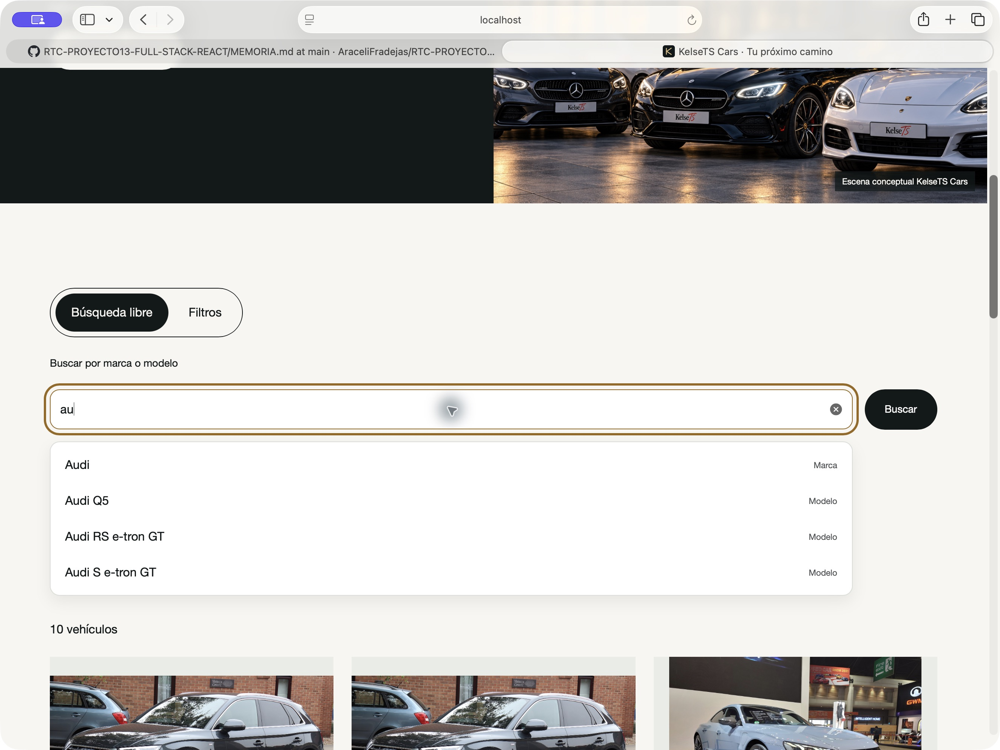

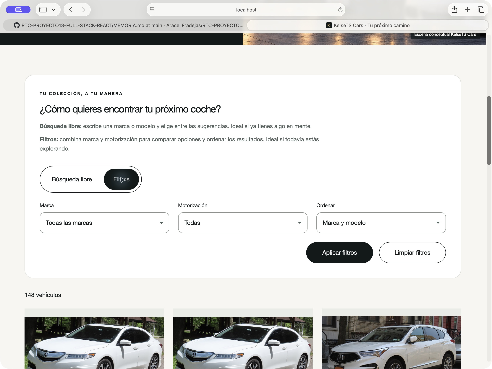

La ficha del catálogo ampliado muestra la propuesta de gama alta y mantiene los datos no comprobados como pendientes.

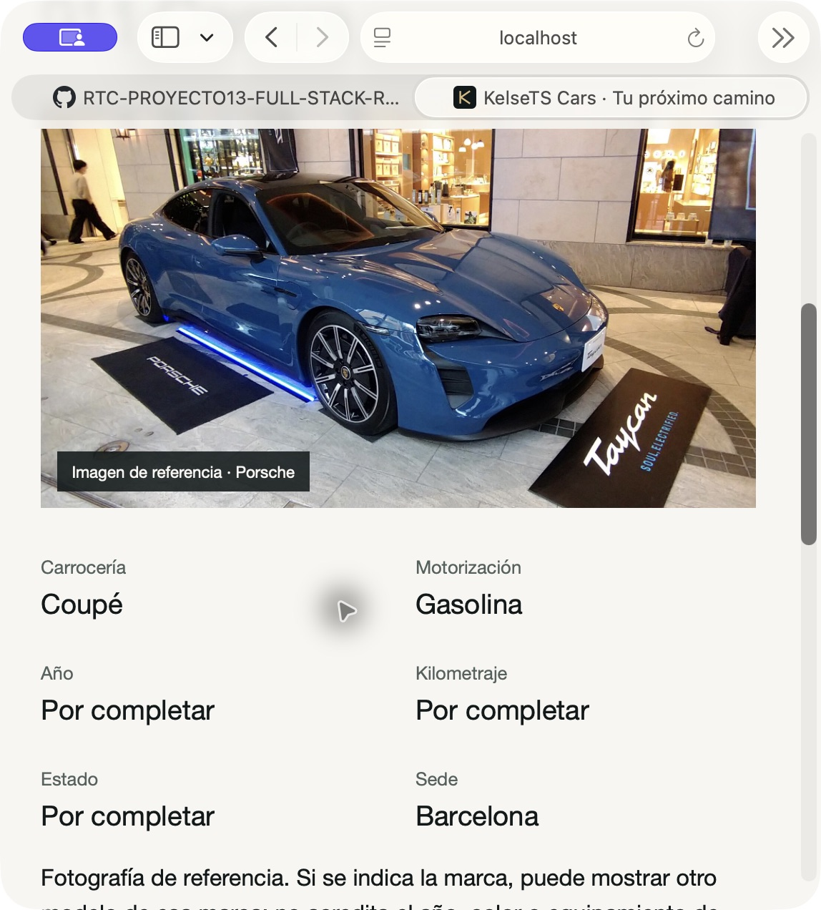

### Recorrido de mantenimiento

Las capturas muestran la solicitud del cliente, la confirmación desde Team, la asignación al taller y el cierre comunicado al cliente. La cita de demostración se cerró anticipadamente para revisar el flujo; no acredita un mantenimiento real.

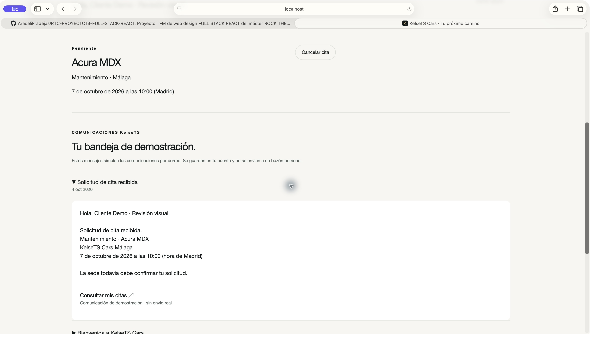

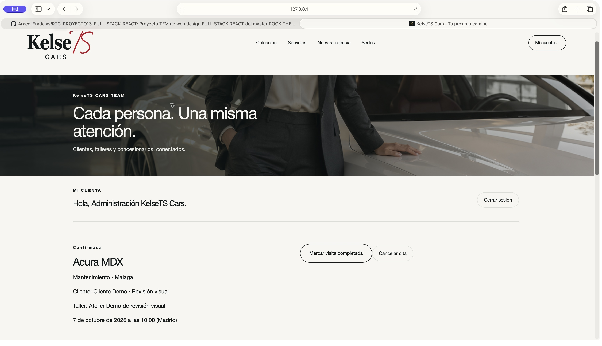

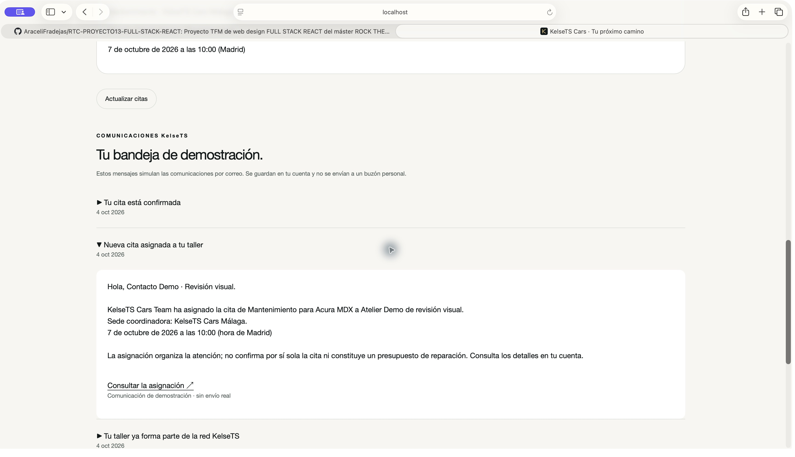

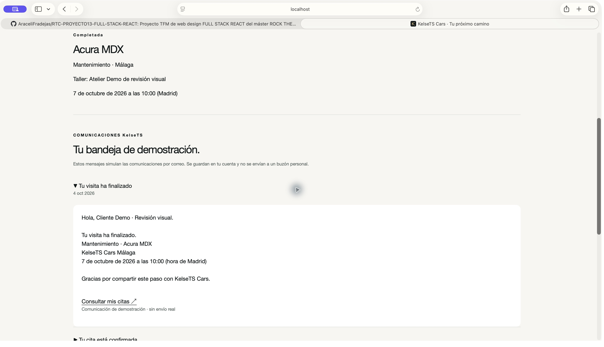

## 13. Evolución posterior

Después de entregar Rock The Code se abordarán la app, el configurador y otros módulos de BigSchool. El control remoto de un vehículo requeriría integraciones y permisos reales del fabricante; no se simulará como una función operativa.

## 14. Aprendizaje y próximos pasos

La decisión inicial es separar la lógica compartida de la plataforma. Atlas y el Excel relacionado ya permiten cargar el inventario inicial. Los siguientes pasos son completar la revisión móvil de Cloudinary, la versión bilingüe y las pruebas de entrega y completar los recorridos de las aplicaciones publicadas.

## Desarrollo de las secciones editoriales

La portada incorpora servicios, conducción, movilidad eléctrica, historias de marca, acceso al área personal y preguntas frecuentes. Servicios explica los pasos para solicitar una visita y Nuestra esencia desarrolla la identidad. Se reutilizan los componentes de panel editorial, servicios, historias y preguntas. La sección eléctrica enlaza al filtro de motorización del catálogo.

Las imágenes aportadas sirven como referencias de dirección visual. Las secciones utilizan nuevas escenas conceptuales creadas sin textos incorporados. La [organización de referencias](docs/SECCIONES.md) recoge el destino de cada imagen y los módulos reservados para BigSchool. No se presentan app, financiación, configurador o reseñas reales como funcionalidades terminadas.

## Red de talleres y acceso Team · 4 de octubre de 2026

He añadido KelseTS Cars Team como acceso interno. Las cuentas no se registran públicamente y los permisos se comprueban en el backend. La red parte de cuatro talleres ficticios próximos a las cuatro sedes, cargados desde un nuevo CSV y visibles en el mapa con un color distinto. Cada taller inicial referencia su concesionario, y la cita puede relacionar a cliente, vehículo, sede y taller mediante `Appointment.workshop`. Los talleres registrados solo consultan sus asignaciones, sin acceso a la agenda general. Los talleres de demostración no tienen credenciales ni cuenta de usuario. La documentación distingue coordinación de citas de la futura gestión de reparaciones.

### Identidad visual de las muestras de correo

He mantenido el mismo logotipo de la web en los correos, exportándolo desde el SVG para conservar la corona y el trazo TS. El footer reúne el lema de KelseTS Cars, las cuatro ciudades y los accesos a la web. He preparado diez imágenes conceptuales exclusivas, una para cada comunicación, sin repetir las fotografías de las secciones. Una confirmación presenta la bienvenida en la sede; una asignación muestra la coordinación del cuidado del vehículo; una cancelación deja una escena tranquila, sin transmitir urgencia. El contenido sigue adaptándose al destinatario y al estado de su solicitud o cita. En Mailtrap las imágenes se adjuntan al mensaje, de forma que la vista previa no depende de mi servidor local. Esta prueba revisa muestras; los eventos de la aplicación siguen registrando comunicaciones en su bandeja privada.

### Comprobación de las comunicaciones en Mailtrap

El 4 de octubre he enviado las diez muestras al Sandbox y he comprobado su recepción consultando la API. He guardado el HTML y el texto recibidos, la fecha y el identificador de cada mensaje. El texto coincide con la plantilla actual y los cinco enlaces de cada HTML apuntan a la web configurada. La versión de texto incluye también el footer, para conservar la información cuando no se muestran imágenes.

Las [evidencias](docs/evidencias/README.md) distinguen las vistas locales de los mensajes descargados del Sandbox. He revisado en Safari el encabezado, la fotografía, el botón y el footer de los diez tipos en el preset Phone de Mailtrap, con capturas de cada uno. El mensaje largo de asignación al taller tiene también una captura del contenido. Falta probar clientes de correo y dispositivos reales. El análisis de Mailtrap señala estilos que algunos clientes pueden interpretar de otra forma; no lo considero una prueba de compatibilidad universal. Estas muestras no envían correo a buzones personales ni demuestran un envío automático desde un evento de la aplicación.

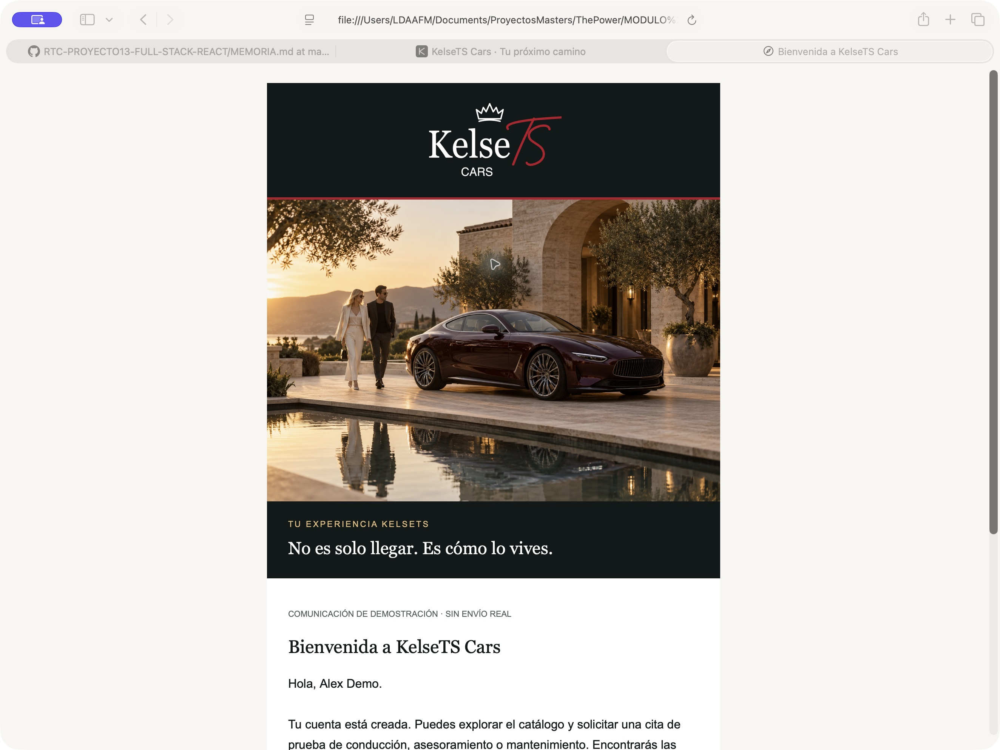

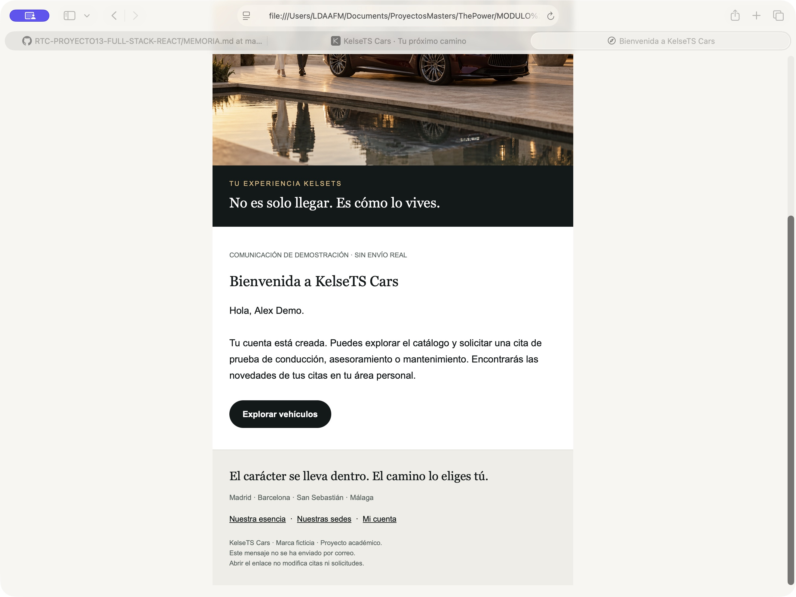

## Gestión de fotografías · 4 de octubre

He incorporado la subida de imágenes desde el frontend porque permite que el equipo mantenga el catálogo sin editar archivos del proyecto. La gestión parte de la ficha de cada unidad, donde ya se identifican el modelo y la sede. Antes de guardar aparece una vista previa y se puede descartar la selección. He mantenido los colores, los botones redondeados y un título contenido, con una columna en pantallas pequeñas.

La operación usa `FormData`, Multer y el SDK de Cloudinary en Node. Solo una cuenta administradora puede realizarla; ocultar el formulario al resto de perfiles no sustituye al control del backend. También se comprueba el contenido del archivo y se limita su tamaño a 5 MB. La clave privada no llega a React. Esta implementación sigue la [documentación del SDK de Node](https://cloudinary.com/documentation/node_image_and_video_upload).

La prueba de integración utiliza una base temporal y dos imágenes de prueba que se eliminan al terminar. Comprueba sesión, permisos de cliente, taller y personal, archivo ausente, imagen falsa, exceso de tamaño, campo incorrecto, persistencia de la URL y sustitución. Después he completado el recorrido desde Safari con una unidad del catálogo: Porsche 911 Carrera de Barcelona. Se ha conservado su fotografía de referencia y su atribución. La gestión no migra toda la biblioteca ni cambia la semilla del Excel.

Las [evidencias](docs/evidencias/cloudinary/README.md) distinguen la prueba automática de la revisión en navegador. He revisado el formulario vacío a 320, 390, 768 y 1440 px en un marco de Safari que carga la ficha real. A 320 y 390 px se muestra una columna; a 768 y 1440 px, dos. Las capturas están guardadas. Esta revisión de distribución no sustituye a probar la selección de archivos, los errores y la subida en un teléfono real, que siguen pendientes.

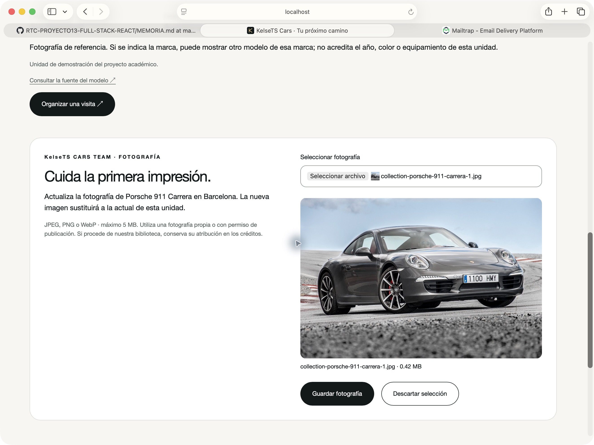

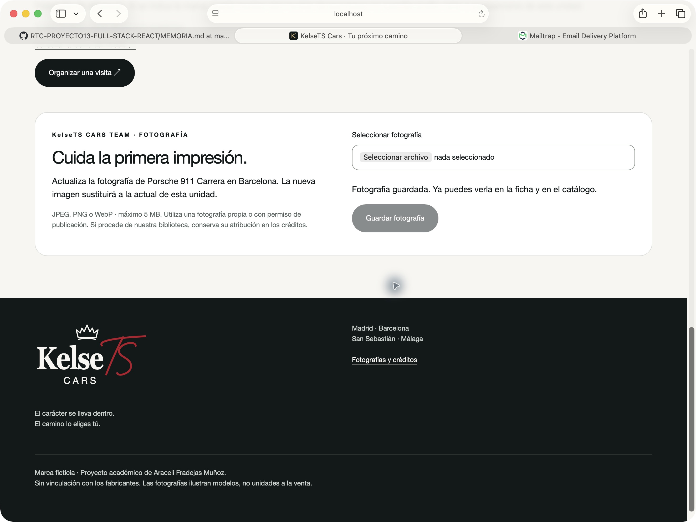

El formulario vacío también se revisó a 390 px dentro de un marco de Safari. Esta captura muestra la distribución, no una subida desde un teléfono.

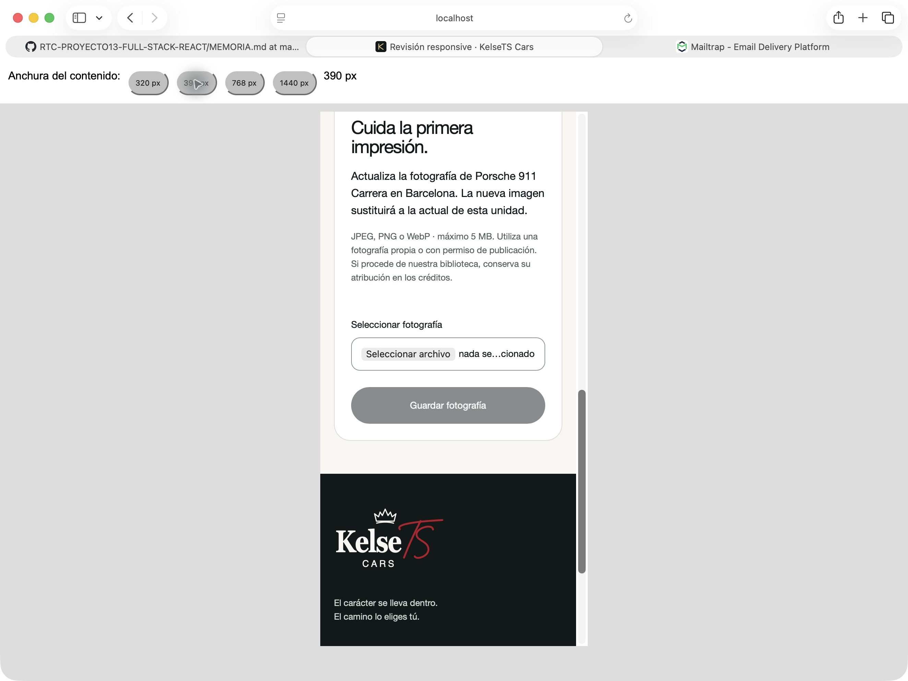

## Fotografías del entorno de las sedes · 4 de octubre

He añadido una fotografía diferente a cada uno de los cuatro concesionarios y los cuatro talleres. Quería que se entendiera mejor el entorno elegido para la red: Salamanca, Pedralbes, Miraconcha y La Caleta. Las imágenes muestran calles, arquitectura y patrimonio de esos barrios; las instalaciones y las direcciones de KelseTS Cars siguen siendo ficticias, y las tarjetas lo indican.

Las ocho fotografías proceden de Wikimedia Commons. He guardado sus autores, fuentes y licencias en `data/media/neighborhoods.json` y he añadido las atribuciones a la página de créditos, accesibles desde cada tarjeta. Se conservan copias locales de 1280 px, con carga diferida y encuadre adaptable. No se repiten entre las ocho tarjetas.

El enlace a Street View utiliza las coordenadas aproximadas del centro, sin enviar la ubicación del visitante. He elegido los [enlaces de Google Maps](https://developers.google.com/maps/documentation/urls/get-started), que no necesitan clave API. La panorámica disponible depende de Google y no representa nuestras instalaciones. Las fotografías tampoco se presentan como imágenes actuales de la calle.

En Safari he comprobado que aparecen las ocho imágenes y sus enlaces, y que el acceso a los créditos llega a la atribución seleccionada. He guardado una captura de las tarjetas en una ventana estrecha. La compilación y las 24 pruebas locales pasan; queda ampliar la revisión a teléfonos reales. Las evidencias están en [Sedes](docs/evidencias/sedes/README.md).

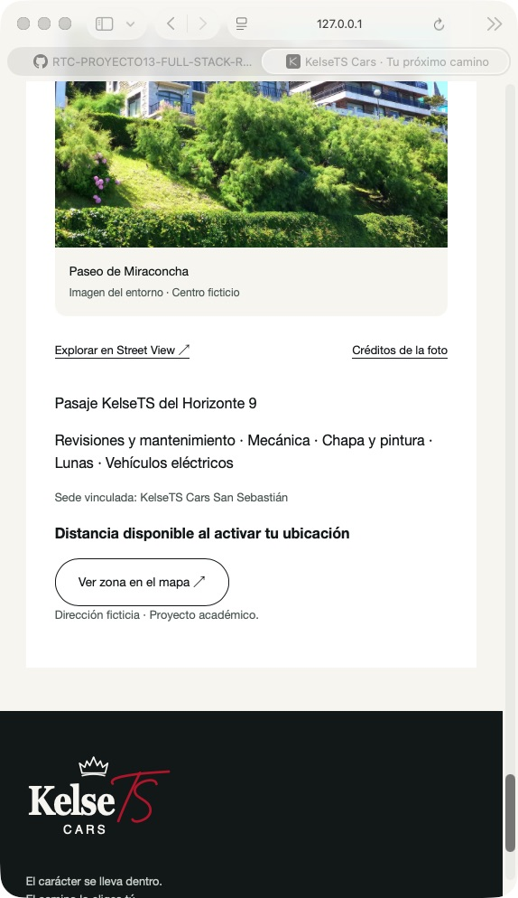

## Preparación del despliegue · 10 de octubre

He ajustado el límite de las fotografías a 4 MB, compartido entre React y Multer. Las pruebas anteriores utilizaron el límite inicial de 5 MB; Vercel limita el cuerpo completo de las peticiones a 4,5 MB, por lo que he dejado margen para el formulario multipart. El formulario y sus mensajes muestran el nuevo límite.

La API utiliza la detección nativa de Express en Vercel, exportando la aplicación desde `src/app.js`. La web se conectará a través de `/api` en su propio dominio mediante una reescritura hacia el backend. Los proyectos necesitan los paquetes compartidos que están fuera de sus carpetas raíz.

## Primera revisión del despliegue · 10 de octubre

He publicado la [web](https://kelsets-cars.vercel.app) y la [API](https://kelsets-cars-api.vercel.app/api/v1/health) como dos proyectos de Vercel conectados al mismo repositorio. La API utiliza Atlas y la web conserva las peticiones bajo `/api/v1` en su propio dominio. Las variables privadas se guardan como sensibles en el backend.

He comprobado las consultas de los 148 vehículos, cuatro sedes y cuatro talleres, los recursos públicos y la apertura directa de páginas interiores. Con una cuenta ficticia autorizada para esta revisión he probado registro, acceso, sesión y cierre. Safari conserva la sesión al recargar y muestra la comunicación de bienvenida. Las peticiones sin sesión y desde un origen ajeno se rechazan.

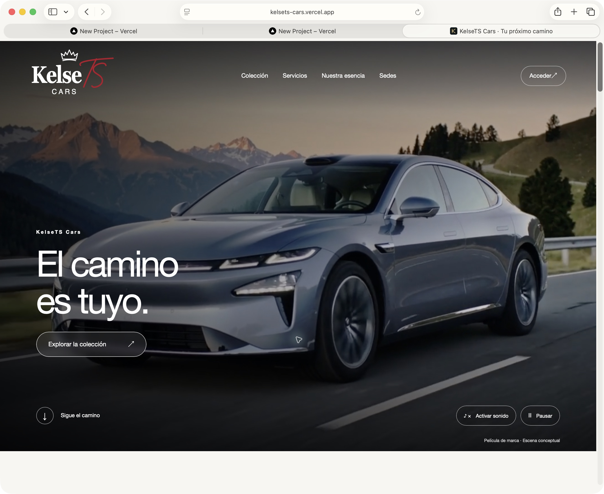

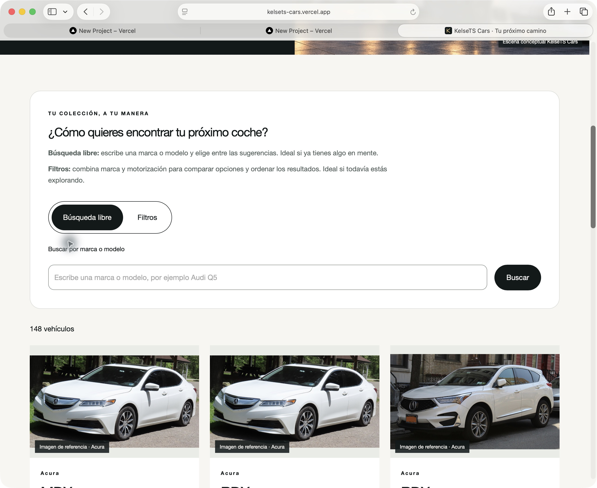

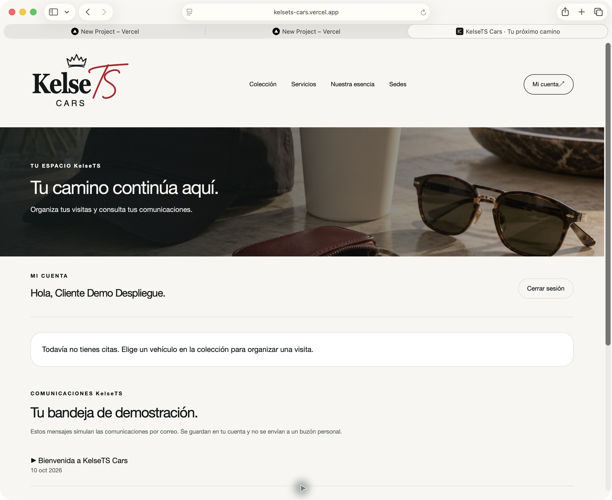

El [informe de despliegue](docs/evidencias/despliegue/README.md) recoge el alcance. No acredita todavía el recorrido completo de citas y talleres en producción ni la subida a Cloudinary desde Vercel. La nueva prueba local de subida encontró un corte HTTPS con Cloudinary; se mantienen las evidencias correctas del 4 de octubre y queda la comprobación desde el servidor publicado.

## Selector y traducciones · 10 de octubre

He añadido un contexto de idioma con un hook compartido y un archivo para los textos ingleses. El selector ES/EN conserva la elección al recargar y cambia las etiquetas accesibles, el idioma del documento y el título. Si el navegador bloquea el almacenamiento, la web sigue funcionando y conserva la elección durante esa sesión.

La traducción afecta a la presentación: los valores de motorización, servicios y estados enviados al backend no cambian. He comprobado en Safari que Electric sigue enviando `Eléctrico` y devuelve los diez vehículos Tesla esperados. También he accedido con la cuenta ficticia de despliegue y cambiado a castellano manteniendo la sesión. La interfaz privada incorpora traducciones, pero las comunicaciones guardadas mantienen todavía su asunto y cuerpo originales.

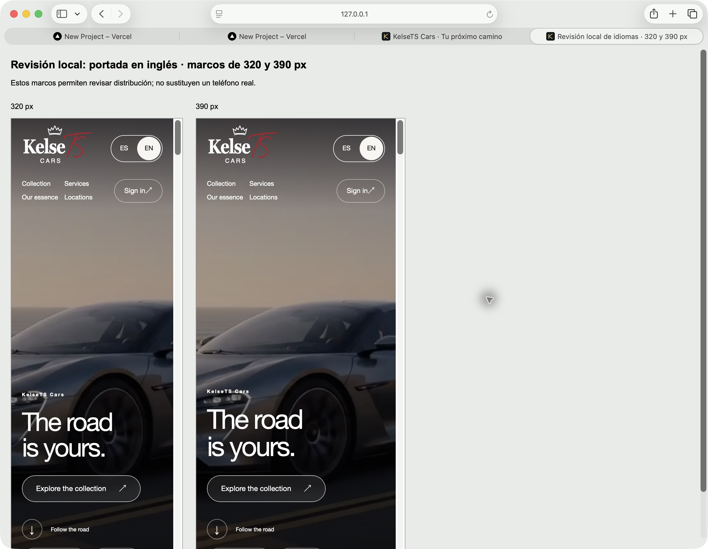

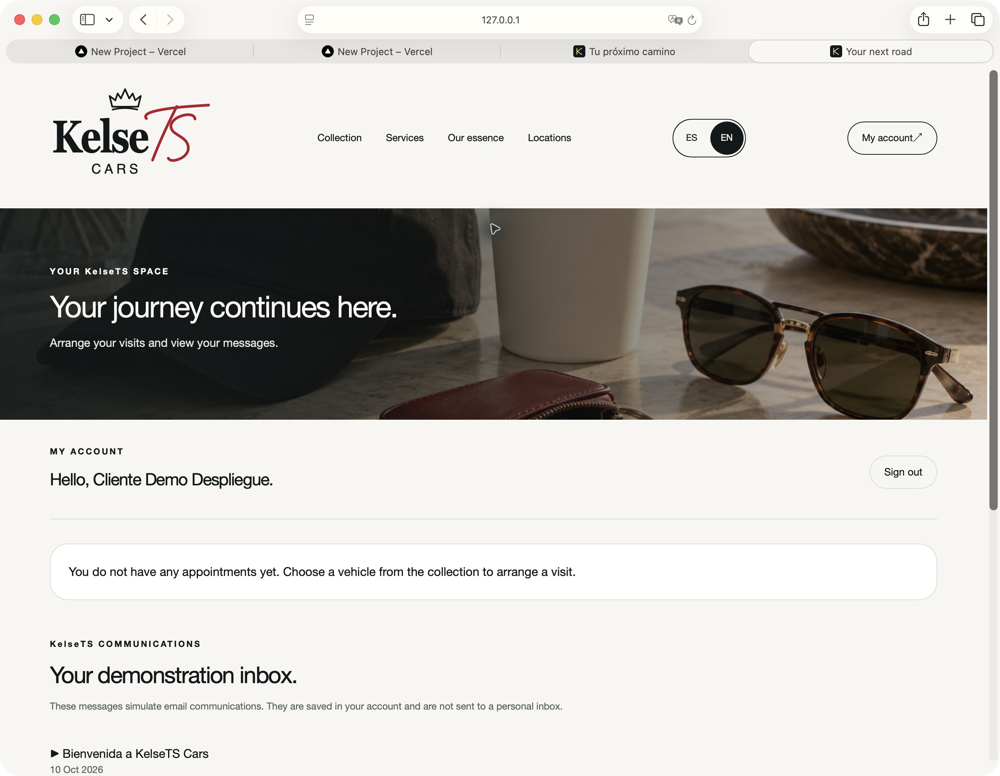

El [informe de idiomas](docs/evidencias/idiomas/README.md) distingue estas revisiones de la prueba completa de dispositivos, permisos y formularios. Pasan once pruebas del frontend y la compilación. La segunda fase podrá reutilizar las traducciones y la lógica de idioma; el almacenamiento y el selector de una app nativa necesitarán su propia adaptación.

La portada inglesa también se ha comprobado en el dominio de Vercel después de publicar el commit `6d2f9b3`. La [captura de producción](docs/evidencias/idiomas/04-home-en-vercel-safari.png) se conserva separada de las pruebas locales.

## Comunicaciones en ambos idiomas · 10 de octubre

Las diez comunicaciones tienen ahora versión inglesa, incluido el footer. He conservado el logo aprobado y una imagen distinta para cada tipo de mensaje. Al crear una comunicación se guardan los dos idiomas dentro de la misma operación de base de datos: una cita posterior o un cambio de nombre no alteran ese contenido histórico.

La bandeja solicita el idioma seleccionado y sigue mostrando solo los mensajes del usuario conectado. Para el historial anterior, compruebo que se puede reproducir exactamente la plantilla castellana antes de ofrecer su traducción. Si hay información distinta o ambigua, mantengo el original. No traduzco nombres, direcciones ni motivos introducidos por usuarios.

Pasan las pruebas automáticas y la integración de registros, talleres y citas en una base temporal de Atlas, eliminada al terminar. He revisado la bienvenida inglesa y su footer en Safari. Son vistas previas locales, no nuevos envíos a Mailtrap ni una comprobación de todos los clientes de correo.

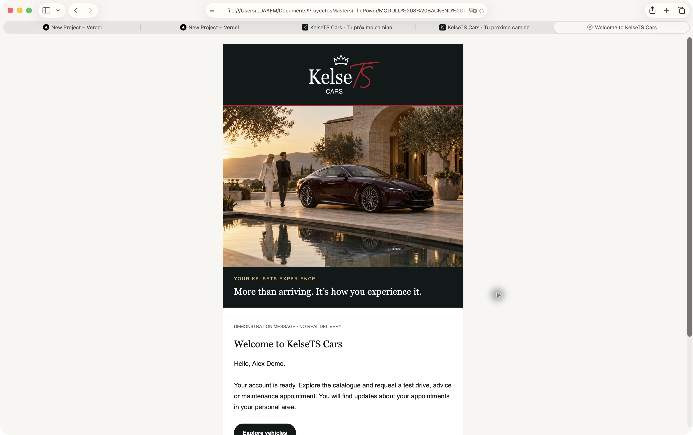

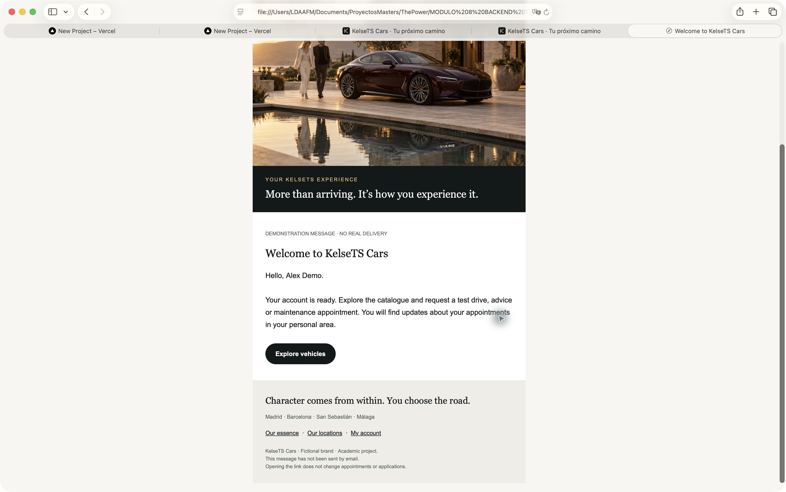
