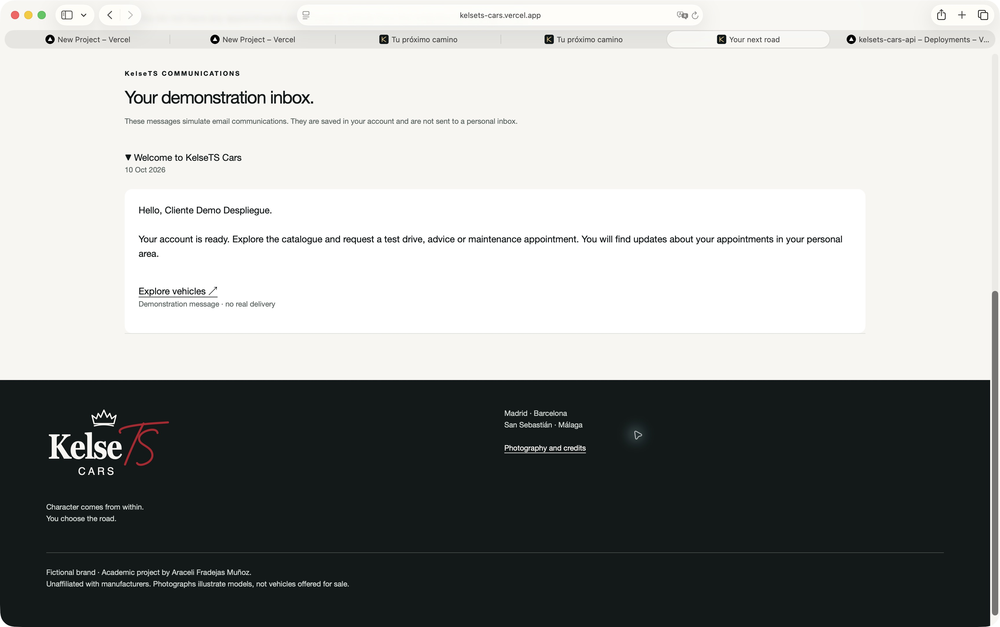

# KelseTS Cars

[Versión en castellano](#versión-en-castellano) · [English version](#english-version)

## Versión en castellano

Proyecto full stack del máster **Rock The Code · The Power Tech School**.

> **El carácter se lleva dentro. El camino lo eliges tú.**

KelseTS Cars es una red ficticia de concesionarios de vehículos de lujo. En la web puedes consultar el catálogo, conocer nuestras cuatro sedes y solicitar una cita para una prueba de conducción, asesoramiento o mantenimiento.

## Contenido

- [Una historia personal](#una-historia-personal)
- [Estado actual](#estado-actual)
- [Capturas del proyecto](#capturas-del-proyecto)
- [Dos etapas](#dos-etapas)
- [Estructura](#estructura)
- [Instalación local](#instalación-local)
- [Datos y fotografías](#datos-y-fotografías)
- [Documentación](#documentación)

## Una historia personal

KelseTS Cars es un nuevo proyecto dentro de la marca KelseTS, después de KelseTS Lifestyle, KelseTS Store, KelseTS Business School y KelseTS Talks. La música, el deporte y el universo swiftie siguen siendo parte de la inspiración, esta vez en una web dedicada a los coches de lujo.

Para este último trabajo de Rock The Code he querido crear una web que tenga una identidad propia y una utilidad clara. Está pensada para personas que quieren conocer distintos modelos, comparar opciones y organizar una visita al concesionario con tiempo.

He mantenido los colores y el estilo de KelseTS, con imágenes aspiracionales y una atención especial al diseño. Además de cuidar la parte visual, el proyecto me permite poner en práctica lo aprendido sobre React, Node.js y bases de datos.

## Estado actual

**El proyecto sigue en desarrollo y todavía no está listo para la entrega final.**

La conexión con MongoDB Atlas está configurada. Ya se han cargado 148 vehículos, cuatro concesionarios y cuatro talleres desde los CSV, y se ha comprobado que repetir la carga no duplica los registros.

La web incluye:

- Portada con vídeo, controles de sonido y pausa.
- Catálogo con búsqueda libre, sugerencias de marcas y modelos mientras escribes, filtros y fichas de vehículos.
- Página de sedes con cuatro concesionarios, cuatro talleres colaboradores, mapa y cálculo de distancias desde una ubicación automática o elegida manualmente. Cada tarjeta tiene una fotografía distinta del barrio, sus créditos y un enlace a Street View.
- Páginas de Servicios y Nuestra esencia con imágenes propias.
- Formularios de acceso y páginas para solicitar y consultar citas.
- Accesos para clientes, talleres y KelseTS Cars Team, con revisión de solicitudes y asignación de citas de mantenimiento por una administradora.
- Bandeja privada de comunicaciones de demostración para altas, solicitudes y cambios de cita, sin envío de correos reales.

El diseño se ha ajustado para móvil, tableta y escritorio. Las tarjetas de historias de la portada enlazan con sus apartados en Nuestra esencia. Las imágenes del catálogo tienen sus créditos y las escenas de marca representan personas y espacios ficticios.

La compilación y las 24 pruebas locales han pasado. También he probado registro, acceso, aprobación de talleres y asignación de citas en una base temporal de Atlas, que se elimina al terminar. En Safari he completado el recorrido de mantenimiento entre cliente, Team y taller, hasta el cierre y sus comunicaciones. Las capturas están en [evidencias](docs/evidencias/README.md). Quedan el registro y la revisión de talleres en navegador, la revisión móvil completa y el recorrido completo de citas y talleres en producción. La subida de fotografías a Cloudinary ya está conectada desde Team y comprobada en Safari.

El [Excel de datos](outputs/kelsets-tfm/KelseTS-datos.xlsx) contiene 100 vehículos del ejemplo del curso y 48 registros de demostración de doce modelos de gama alta, cuatro sedes y cuatro talleres relacionados. He comprobado su exportación a CSV y la carga de la semilla en Atlas. El selector ES/EN y las traducciones de la interfaz están incorporados. Las diez comunicaciones tienen versiones en castellano e inglés. Falta cerrar la revisión y las pruebas de entrega.

## Capturas del proyecto

Capturas de la aplicación y sus comunicaciones tomadas durante las pruebas locales del 4 de octubre de 2026. Las capturas del despliegue del 10 de octubre aparecen en su propio apartado.

### Catálogo y búsqueda

La búsqueda permite escribir una marca o un modelo y consultar las sugerencias. Los filtros ofrecen otra forma de acotar la selección.


### Ficha de un vehículo

Las unidades añadidas amplían la propuesta de gama alta. Las fotografías son de referencia y los datos no comprobados quedan pendientes.


### Clientes, Team y talleres

He recorrido una cita de mantenimiento desde su solicitud hasta el cierre. Cada perfil consulta la información que le corresponde.


### Comunicaciones en Mailtrap

Las diez muestras utilizan el logo de la web, una imagen exclusiva para cada contenido y un footer común. Se reciben en el Sandbox; los eventos de la aplicación guardan sus mensajes en la bandeja privada de demostración.


### Fotografías desde Team

La administradora revisa la imagen antes de guardarla en Cloudinary. La confirmación aparece en la ficha sin recargar la página.


### El entorno de nuestras sedes

Cada concesionario y taller tiene una fotografía distinta del barrio, un enlace a Street View y sus créditos. La captura corresponde a una ventana estrecha de Safari, no a un teléfono real.


El [índice de evidencias](docs/evidencias/README.md) reúne las capturas, los informes y el alcance de cada comprobación.

## Dos etapas

Primero voy a completar la entrega de **Rock The Code**: backend con Node.js, frontend con React, datos preparados en Excel y cargados desde CSV con `fs`, usuarios, colecciones relacionadas, rutas protegidas y despliegue de la web y la API.

Después continuaré el proyecto para el TFM de **BigSchool**, con una app y nuevas funcionalidades. La estructura ya separa el código de la web de las validaciones y las peticiones a la API que podrán aprovecharse más adelante. La carpeta `apps/mobile/` está reservada para esa segunda etapa; la app aún no está desarrollada.

Los requisitos y las tareas pendientes están en la [revisión de entrega](docs/REVISION-ENTREGA.md).

## Estructura

```text
backend/src/
  modules/
    auth/          # Usuarios y acceso
    catalog/       # Vehículos, sedes y fotografías
    appointments/  # Citas y permisos sobre la agenda
  config/          # Entorno y conexión a MongoDB
  middlewares/     # Sesión y comprobación de origen
  routes/          # Rutas de la API
  seeds/           # Lectura, validación y carga de CSV
  utils/           # Errores y reglas comunes
frontend/src/
  app/             # Rutas de la web
  features/        # Marca, catálogo, acceso y citas
  shared/          # Componentes, hooks y conexión HTTP
  styles/          # Variables, base y componentes
packages/
  contracts/       # Validaciones compartidas
  api-client/      # Cliente de la API reutilizable
apps/mobile/       # Carpeta reservada para la futura app
data/
  csv/             # Datos que puede leer la semilla
  media/           # Fotografías, fuentes y créditos
docs/              # Arquitectura, diseño y seguimiento
```

## Tecnologías

**Frontend:** React, React Router, Vite, Leaflet y CSS.

**Backend:** Node.js, Express, Mongoose, JWT, bcrypt, Zod, Multer y Cloudinary.

**Datos:** MongoDB Atlas y lectura de CSV con `node:fs/promises`.
**Pruebas:** `node:test`, Supertest y Vitest.

Utilizo Zod para validar los datos en la web y en la API. Los permisos se comprueban en el backend: una persona que se registra no puede asignarse el rol de administradora desde el formulario.

## Instalación local

Requisito: Node.js 22 o posterior.

```bash
npm install
cp backend/.env.example backend/.env
cp frontend/.env.example frontend/.env
npm run dev
```

Configura `MONGODB_URI` y un `JWT_SECRET` de al menos 32 caracteres antes de arrancar el servidor. La web utiliza `http://localhost:5173` y la API `http://localhost:3000/api/v1`.

Para ver las páginas de presentación sin arrancar el backend:

```bash
npm run dev -w frontend
```

Con este comando puedes ver la portada, Nuestra esencia, Servicios, la selección de modelos y los créditos. Para consultar el catálogo y utilizar la cuenta o las citas necesitas tener también el backend en marcha.

## Variables de entorno

| Variable | Uso |
| --- | --- |
| `MONGODB_URI` | Conexión privada a MongoDB Atlas |
| `JWT_SECRET` | Firma de la sesión |
| `FRONTEND_URL` | Orígenes permitidos, separados por comas |
| `CLOUDINARY_CLOUD_NAME` | Espacio de imágenes |
| `CLOUDINARY_API_KEY` | Clave de la API de Cloudinary |
| `CLOUDINARY_API_SECRET` | Secreto de Cloudinary |
| `ADMIN_EMAIL` / `ADMIN_PASSWORD` | Creación opcional de una cuenta administradora mediante semilla |
| `VITE_API_URL` | Dirección de la API; por defecto `/api/v1` |

Los archivos `.env` y la carpeta `DocBase/` están excluidos de Git.

## Scripts

```bash
npm run dev          # web y API
npm run build        # compilación de la web
npm test             # comprobaciones locales
npm run data:check   # compara Excel y CSV sin escribir
npm run data:export  # exporta y valida las tres hojas de datos
npm run seed:check   # CSV y relaciones, sin conectar a Atlas
npm run seed         # inserción en la base de datos configurada
```

La semilla carga los datos de los CSV en MongoDB. Cada registro tiene una clave para evitar duplicados. Al repetirla, se añaden los vehículos que faltan y se actualizan los datos de las sedes; los vehículos ya guardados y sus imágenes se conservan. Por eso, cambiar un vehículo en el CSV no modifica automáticamente su ficha en la base de datos.

## Datos y fotografías

El proceso Excel → CSV → fs → MongoDB se explica en la [guía de datos](docs/DATOS-EXCEL.md). El libro permite revisar y editar las tres colecciones iniciales; la semilla transforma sus claves de relación en referencias de MongoDB.

El CSV inicial contiene datos de ejemplo: VIN, precios, kilometrajes, colores y fechas. Son datos para trabajar en el proyecto, no vehículos reales puestos a la venta. Los precios se conservan tal como aparecen en el archivo, sin asumir una moneda ni presentarlos como precios comprobados. Los VIN del ejemplo no se muestran en la API.

He ampliado el catálogo para que los ejemplos también respondan a la propuesta de KelseTS Cars: una red ficticia de concesionarios centrada en vehículos de gama alta. Mantengo los 100 registros iniciales del curso y añado 48 registros de demostración, correspondientes a doce modelos de Porsche, Ferrari, Mercedes-Benz, Audi y Tesla. Cada modelo aparece en las cuatro sedes, por lo que el inventario suma 148 vehículos. Esto permite explorar la temática del proyecto desde el catálogo, los filtros, las fichas y la solicitud de visitas, además de la selección de la portada.

Los modelos existen y su carrocería y motorización se han contrastado con fuentes oficiales, enlazadas desde sus fichas. Su presencia en las sedes y su disponibilidad son ejemplos ficticios. No he inventado precios, VIN, años, kilometrajes ni fechas de adquisición para las unidades añadidas: esos campos quedan pendientes. Las fotografías son referencias de la marca y pueden mostrar otro modelo. La ampliación se incorpora al mismo Excel y sigue el proceso de exportación a CSV y carga con `fs`, conservando las relaciones con los concesionarios.

He añadido fotografías de Tesla Model S, Audi Q5 y Mercedes Clase S, además de Porsche Taycan y Ferrari Roma para la selección de la portada y el catálogo ampliado. Algunas fotos pueden mostrar otra generación o acabado del modelo. Cuando no hay una imagen específica, utilizo una fotografía de la misma marca y la identifico como imagen de referencia. Cada vehículo muestra la misma foto en la tarjeta y en su ficha.

Las imágenes de los concesionarios, los profesionales y las historias de KelseTS son escenas ficticias creadas para el proyecto. El vídeo del hero es propio y su música está creada con Suno. Los recursos utilizados se recogen en la documentación.

La biblioteca reúne 80 fotografías diferentes: he añadido 38 imágenes para los doce modelos de gama alta, con variantes de 640 px para pantallas pequeñas. La asignación da prioridad al mismo modelo y alterna las fotos disponibles entre sus registros. La [galería documentada](docs/GALERIA-VEHICULOS.md) recoge las nuevas fuentes, autores y licencias.

Fuentes y licencias en [Recursos](docs/RECURSOS.md) y en la página `/creditos`.

## API

La dirección base de la API es `/api/v1`.

| Método | Ruta | Acceso |
| --- | --- | --- |
| GET | `/health` | Público |
| POST | `/auth/register`, `/auth/login`, `/auth/logout` | Origen permitido |
| GET | `/auth/me` | Sesión |
| GET | `/vehicles`, `/vehicles/search-options`, `/vehicles/:id`, `/dealerships` | Público |
| POST | `/vehicles/:id/image` | Administradora |
| GET / POST | `/appointments` | Sesión |
| PATCH | `/appointments/:id` | Propietario para cancelar; personal autorizado para gestionar |

La API devuelve `{ success, data }` cuando la petición funciona y `{ success: false, error }` si hay un error. La sesión se guarda en una cookie `HttpOnly`. Para crear o modificar datos se comprueba el origen de la petición; en Insomnia hay que incluir un `Origin` permitido. Solo puede haber una cita activa en una misma sede y franja horaria.

## Documentación

- [Memoria del proyecto](MEMORIA.md).
- [Arquitectura y evolución hacia la app](docs/ARQUITECTURA.md).
- [Dirección visual](docs/DISENO.md).
- [Logo e identidad de marca](docs/MARCA.md).
- [Revisión del enunciado](docs/REVISION-ENTREGA.md).
- [Fotografías y recursos](docs/RECURSOS.md).
- [Registro de talleres y comunicaciones](docs/COMUNICACIONES-Y-TALLERES.md), siguiendo el planteamiento de KelseTS Talks.

## Despliegue

La web y el backend están publicados en Vercel desde el 10 de octubre de 2026:

- [Abrir KelseTS Cars](https://kelsets-cars.vercel.app).
- [Comprobar la salud de la API](https://kelsets-cars-api.vercel.app/api/v1/health).

He comprobado el catálogo con 148 vehículos, las cuatro sedes, los cuatro talleres, los recursos públicos y las rutas directas. Una cuenta ficticia de demostración permite verificar registro, acceso, consulta de sesión y cierre. En Safari la sesión se conserva al recargar y aparece la bienvenida en la bandeja privada.


La [guía de despliegue](docs/DESPLIEGUE.md) explica las variables y la conexión entre los dos proyectos. Las [evidencias publicadas](docs/evidencias/despliegue/README.md) distinguen lo comprobado de lo pendiente. Falta el recorrido completo de citas y talleres en producción, la subida desde Vercel, la revisión bilingüe completa y los dispositivos reales. La nueva prueba local de Cloudinary del 10 de octubre encontró un corte de conexión; no sustituye a la integración correcta documentada del 4 de octubre.

## Aviso académico y autora

KelseTS Cars es una marca ficticia para fines educativos y de portfolio. No existe afiliación ni patrocinio de los fabricantes. No se ofrecen ventas, reservas comerciales ni servicios reales de mantenimiento.

**Araceli Fradejas Muñoz** · Rock The Code · The Power Tech School.

[GitHub](https://github.com/AraceliFradejas) · [LinkedIn](https://www.linkedin.com/in/araceli-fradejas-munoz-transformaciondigital/)

La [guía de secciones](docs/SECCIONES.md) recoge lo previsto para esta entrega y las ideas que desarrollaré después para BigSchool.

Para revisar el backend sin usar la web, he incluido una [colección de pruebas de Insomnia y su guía](docs/INSOMNIA.md). Las credenciales se configuran en un entorno privado; el archivo del repositorio contiene solo datos ficticios.

Las [diez comunicaciones](docs/MAILTRAP.md) ya se han recibido en Mailtrap Sandbox con datos ficticios, HTML y texto. Cada una tiene una imagen exclusiva según su contenido, el mismo logo de la web y un footer común editable. He guardado los mensajes recibidos y su verificación en [evidencias](docs/evidencias/README.md). Los eventos de la aplicación siguen dejando mensajes en la bandeja privada de demostración. Los diez tipos tienen capturas del preset móvil de Mailtrap revisadas en Safari. Quedan pendientes las pruebas en clientes de correo reales.

Las muestras de correo y el registro de pruebas se pueden consultar en [las evidencias locales](docs/evidencias/README.md).

## Fotografías desde KelseTS Cars Team

Una cuenta administradora puede entrar en **Gestionar fotografías**, buscar un vehículo y abrir su ficha. Allí selecciona una imagen, comprueba la vista previa y la guarda. Se admiten JPEG, PNG y WebP de hasta 4 MB. La ficha se actualiza al terminar y muestra la confirmación sin recargar la página.

React envía el archivo con `FormData` al backend. Node comprueba la sesión, el rol, el tamaño y la firma del archivo antes de subirlo a Cloudinary. Las credenciales permanecen en el backend; Atlas guarda la URL HTTPS y el identificador de la imagen. Al sustituir una foto se elimina la anterior si pertenece a nuestra carpeta de Cloudinary.

He probado la subida y la sustitución con datos temporales de Atlas, junto con los rechazos por permisos y archivos incorrectos. También he subido desde Safari la fotografía ya asignada al Porsche 911 Carrera de Barcelona, conservando sus créditos. El resto de la biblioteca sigue sirviéndose como hasta ahora. Las capturas y el informe están en [las evidencias de Cloudinary](docs/evidencias/cloudinary/README.md).

---


### Revisión de idiomas

He incorporado el selector ES/EN y las traducciones de la interfaz. La selección se mantiene al recargar; los filtros traducen sus etiquetas y conservan los valores que espera la API. He revisado el acceso de la cuenta ficticia y la cabecera de la portada a 320 y 390 px en marcos de Safari. La revisión posterior incorpora también las diez comunicaciones en inglés; el historial no reconocido conserva el original.


El [informe de idiomas](docs/evidencias/idiomas/README.md) incluye el catálogo, el área de cliente y el alcance pendiente.

## English version

Full stack final project for **Rock The Code · The Power Tech School**.

> **Character comes from within. You choose the road.**

KelseTS Cars is a fictional luxury dealership network. Visitors can browse the catalogue, discover its four locations and request an appointment for a test drive, advice or maintenance.

### Contents

- [A personal story](#a-personal-story)
- [Current status](#current-status)
- [Project screenshots](#project-screenshots)
- [Two stages](#two-stages)
- [Architecture and technologies](#architecture-and-technologies)
- [Local setup](#local-setup)
- [Environment variables](#environment-variables)
- [Scripts and data](#scripts-and-data)
- [Photographs and uploads](#photographs-and-uploads)
- [API and access](#api-and-access)
- [Communications and validation](#communications-and-validation)
- [Documentation and deployment](#documentation-and-deployment)
- [Academic notice and author](#academic-notice-and-author)

### A personal story

KelseTS Cars continues the fictional KelseTS brand after KelseTS Lifestyle, KelseTS Store, KelseTS Business School and KelseTS Talks. Music, sport and the Swiftie universe remain part of its inspiration, now applied to luxury cars.

For my final Rock The Code project, I wanted a website with its own identity and a clear purpose. It is intended for people who want to explore models, compare options and plan a dealership visit. The visual design also gives me an opportunity to apply what I have learned about React, Node.js and databases.

### Current status

**The project is still in development and is not ready for final submission.**

MongoDB Atlas is connected. The CSV seeds have loaded 148 vehicles, four dealerships and four workshops; repeating the seed does not create duplicate records.

The website includes:

- A video homepage with sound and pause controls.
- A catalogue with free text search, brand and model suggestions, filters and vehicle details.
- Four dealerships and four partner workshops on a map, with approximate distances from an automatic or manually selected location. Each card includes a different neighbourhood photo, credits and a Street View link.
- Services and Our essence pages with dedicated brand imagery.
- Account access, appointment requests and appointment management.
- Customer, workshop and KelseTS Cars Team areas, with workshop applications reviewed by an administrator and maintenance appointments assigned to approved workshops.
- A private demonstration inbox for registrations, applications and appointment updates.
- Administrator photo uploads to Cloudinary from vehicle details.

The build and 24 local tests pass. API integration has also been checked in a temporary Atlas database. The maintenance journey between customer, Team and workshop has been completed in Safari, including completion and its messages. Workshop registration and review in the browser, full mobile checks and the complete production appointment journey remain pending.

**This README is available in Spanish and English. The website now includes an ES/EN selector and interface translations; the ten communications also have Spanish and English versions. The complete bilingual review is still pending.**

### Project screenshots

These screenshots were captured during local checks on 4 October 2026. They do not show a deployed production application.

**Catalogue search:** suggestions help visitors find a brand or model while typing.


**Vehicle details:** the expanded catalogue adds examples that fit the luxury theme. Images are illustrative and unverified details remain unset.


**Customer, Team and workshop:** a maintenance request is reviewed and assigned to a partner workshop, which only sees its own appointments.


**Email identity:** samples use the website logo, a dedicated image for each message and a shared footer.


**Cloudinary:** administrators preview a selected image and save it from the vehicle page.


**Neighbourhoods:** the cards show real surroundings, while the centres and addresses remain fictional. This is a narrow desktop Safari window, not a physical phone test.


The [evidence index](docs/evidencias/README.md) explains the scope of each check and links to the remaining screenshots and reports. The application and the screenshots currently use Spanish text.

### Two stages

The first stage covers the **Rock The Code** requirements: Node.js backend, React frontend, related collections, users, protected routes, Excel data exported to CSV and read with `fs`, and deployment of both applications.

After that submission, I will continue the project for **BigSchool**, including a mobile app and additional modules. `apps/mobile/` reserves space for that stage; the app has not been developed. The [delivery review](docs/REVISION-ENTREGA.md) tracks the requirements and remaining tasks.

### Architecture and technologies

The backend groups models and controllers into domain modules. The frontend separates brand, catalogue, authentication and appointment features. Shared packages contain validation contracts and an API client that can be reused by the future app.

```text
backend/src/
  modules/          # Authentication, catalogue, appointments and partner modules
  config/           # Environment and database connection
  middlewares/      # Session and request origin checks
  routes/           # API routes
  seeds/            # CSV reading, validation and loading
  utils/            # Shared backend rules
frontend/src/
  app/              # Website routes
  features/         # Brand, catalogue, authentication and appointments
  shared/           # Components, hooks and HTTP connection
  styles/           # Variables and reusable styles
packages/
  contracts/        # Shared validation schemas
  api-client/       # Reusable API client
apps/mobile/        # Reserved for the future app
data/
  csv/              # Seed input
  media/            # Photo sources and credits
docs/               # Architecture, design and evidence
```

**Frontend:** React, React Router, Vite, Leaflet and CSS. **Backend:** Node.js, Express, Mongoose, JWT, bcrypt, Zod, Multer and Cloudinary. **Data:** MongoDB Atlas and `node:fs/promises`. **Tests:** `node:test`, Supertest and Vitest.

Zod validates input on both sides. Permissions are checked in the backend; public registration cannot grant an administrator role. `useResource` combines `useReducer`, request cancellation and retry, and the authentication context shares session state across pages.

### Local setup

Node.js 22 or later is required.

```bash
npm install
cp backend/.env.example backend/.env
cp frontend/.env.example frontend/.env
npm run dev
```

Configure `MONGODB_URI` and a `JWT_SECRET` of at least 32 characters before starting the server. The website runs at `http://localhost:5173` and the API at `http://localhost:3000/api/v1`.

To view the editorial pages without the backend:

```bash
npm run dev -w frontend
```

The homepage, Our essence, Services, model selection and credits can be viewed this way. The inventory, accounts and appointments also need the backend.

### Environment variables

| Variable | Purpose |
| --- | --- |
| `MONGODB_URI` | Private MongoDB Atlas connection |
| `JWT_SECRET` | Session signing secret |
| `FRONTEND_URL` | Allowed origins, separated by commas |
| `CLOUDINARY_CLOUD_NAME` | Cloudinary image space |
| `CLOUDINARY_API_KEY` | Cloudinary API key |
| `CLOUDINARY_API_SECRET` | Cloudinary secret |
| `ADMIN_EMAIL` / `ADMIN_PASSWORD` | Optional administrator account created by the seed |
| `VITE_API_URL` | API URL; defaults to `/api/v1` |

`.env` files and `DocBase/` are excluded from Git. Additional mail sample configuration is explained in the [Mailtrap guide](docs/MAILTRAP.md).

### Scripts and data

```bash
npm run dev          # Start website and API
npm run build        # Build the frontend
npm test             # Run local checks
npm run data:check   # Compare Excel and CSV without writing
npm run data:export  # Export and validate the three data sheets
npm run seed:check   # Validate CSV and relationships without Atlas
npm run seed         # Load the configured database
```

The [Excel workbook](outputs/kelsets-tfm/KelseTS-datos.xlsx) contains the course's initial 100 vehicles plus 48 demonstration records for twelve luxury models, four dealerships and four workshops. Each additional model appears at all four dealerships. The data remains part of the same Excel → CSV → `fs` → MongoDB process, described in the [data guide](docs/DATOS-EXCEL.md).

The additional models are real and their body types and powertrains were checked against official sources linked from their pages. Their stock and location are fictional. I have left unverified prices, VINs, years, mileage and acquisition dates unset. The original course data is also demonstration data, not real vehicles for sale; its prices do not imply a verified currency. VINs are not exposed through the API.

Seed keys prevent duplicate records. Repeating the seed adds missing vehicles and updates dealership data, while keeping existing vehicles and uploaded images. Editing a vehicle CSV row does not automatically change its stored record.

### Photographs and uploads

The vehicle library contains 80 different photographs, including 38 additional images for the twelve luxury models and 640 px versions for smaller screens. Matching prioritises the model and alternates available photos. A vehicle keeps the same image on its card and detail page. Reference images may show another generation, trim or model of the same brand and are labelled accordingly.

The eight location cards use different neighbourhood photos from Wikimedia Commons. Authors, source links and licences are recorded in `data/media/neighborhoods.json` and the credits page. Street View links open Google Maps at each centre's approximate coordinates; they do not share the visitor's location.

Brand scenes represent fictional people and places. The homepage video was provided by the author and uses music created with Suno. Sources are listed in [Resources](docs/RECURSOS.md), the [vehicle gallery](docs/GALERIA-VEHICULOS.md) and `/creditos`.

From **Manage photographs** in Team, an administrator can find a vehicle, preview a JPEG, PNG or WebP file of up to 4 MB, discard it or save it. React sends `FormData`; Node checks the session, role, size and file signature before uploading to Cloudinary. Secrets stay in the backend. Atlas stores the HTTPS URL and image identifier. A replacement removes the previous image when it belongs to our Cloudinary folder.

Upload and replacement were tested through the API with temporary data and in Safari using the existing reference photo for the Barcelona Porsche 911 Carrera, retaining its credits. The rest of the image library has not been migrated. The [Cloudinary evidence](docs/evidencias/cloudinary/README.md) records the tests and responsive layout checks; mobile file selection and error states still need review.

### API and access

The base path is `/api/v1`.

| Method | Route | Access |
| --- | --- | --- |
| GET | `/health` | Public |
| POST | `/auth/register`, `/auth/login`, `/auth/logout` | Allowed origin |
| GET | `/auth/me` | Session |
| GET | `/vehicles`, `/vehicles/search-options`, `/vehicles/:id`, `/dealerships` | Public |
| POST | `/vehicles/:id/image` | Administrator |
| GET / POST | `/appointments` | Session |
| PATCH | `/appointments/:id` | Owner cancellation or authorised staff management |

Success responses use `{ success, data }`; errors use `{ success: false, error }`. Sessions use an `HttpOnly` cookie. Writes check the request origin, including requests from Insomnia. Only one active appointment can occupy the same dealership and time slot.

### Communications and validation

I adapted the communication approach from [KelseTS Talks](https://github.com/AraceliFradejas/RTC-PROYECTO10-FULL-STACK-JAVASCRIPT), another project in my portfolio. Cars stores event messages in each recipient's private demonstration inbox. Ten fictional HTML and plain text samples have also been received in Mailtrap Sandbox. Each uses the same logo as the website, its own image and an editable common footer. This does not establish automatic email delivery from application events or delivery to personal inboxes.

The ten sample types have been reviewed in Mailtrap's Phone preset using Safari, with captures of their content and footer. Real email clients and devices remain to be tested. The [Mailtrap guide](docs/MAILTRAP.md) and [evidence index](docs/evidencias/README.md) distinguish local previews, received messages and browser checks.

The [Insomnia collection and guide](docs/INSOMNIA.md) support backend validation. The committed collection contains fictional data; credentials belong in a private environment. The build and 24 local tests pass. Temporary Atlas integration and the browser maintenance journey provide separate evidence; the full deployment journey remains pending.

### Documentation and deployment

The technical documentation currently uses Spanish:

- [Project report](MEMORIA.md).
- [Architecture and future app](docs/ARQUITECTURA.md).
- [Visual design](docs/DISENO.md) and [brand identity](docs/MARCA.md).
- [Delivery review](docs/REVISION-ENTREGA.md).
- [Resources](docs/RECURSOS.md).
- [Workshop registration and communications](docs/COMUNICACIONES-Y-TALLERES.md).
- [Section plan](docs/SECCIONES.md) and [validation](docs/VALIDACION.md).

The website and backend have been published on Vercel since 10 October 2026:

- [Open KelseTS Cars](https://kelsets-cars.vercel.app).
- [Check API health](https://kelsets-cars-api.vercel.app/api/v1/health).

Checks cover the catalogue's 148 vehicles, four dealerships, four workshops, public assets and direct page URLs. Registration, login, session lookup and logout were tested with an authorised fictional demonstration account. In Safari, the session survives a reload and the welcome message appears in the private inbox.


The [deployment guide](docs/DESPLIEGUE.md) explains the configuration. The [deployment evidence](docs/evidencias/despliegue/README.md) records the scope of validation. The complete appointment and workshop journey in production, uploads from Vercel, the complete bilingual review and real devices remain to be checked. A new local Cloudinary test on 10 October encountered a network connection reset; the successful integration evidence from 4 October is retained.

### Academic notice and author

KelseTS Cars is a fictional educational and portfolio brand. It is not affiliated with or sponsored by the manufacturers. It does not offer real vehicle sales, commercial bookings or maintenance services.

**Araceli Fradejas Muñoz** · Rock The Code · The Power Tech School.

[GitHub](https://github.com/AraceliFradejas) · [LinkedIn](https://www.linkedin.com/in/araceli-fradejas-munoz-transformaciondigital/)

[Volver a la versión en castellano / Back to Spanish](#versión-en-castellano)


### Language review

The ES/EN selector remembers the choice after a reload. Filter labels are translated while API values stay unchanged. The fictional customer’s access and the home header at 320 and 390 px have been checked in Safari frames. Stored communications still retain their original texts.


The [language report](docs/evidencias/idiomas/README.md) includes the catalogue, customer area and pending checks.

### Comunicaciones bilingües / Bilingual communications

Cada comunicación nueva guarda los textos de ambos idiomas con los datos del momento en que se crea. La bandeja utiliza el idioma elegido. Los mensajes antiguos se traducen solo cuando coinciden con una plantilla reconocida; si no, se conserva el original. Los nombres y motivos escritos por usuarios no se traducen.

New messages store both languages using the event’s original data. The inbox follows the selected language. Older messages are translated only when their original template can be verified; otherwise the original is preserved. Names and user-written reasons remain unchanged.


Estas capturas son vistas previas locales de Safari, sin envío nuevo a Mailtrap. / These screenshots show local Safari previews; no new Mailtrap email was sent.

La bienvenida inglesa también se ha comprobado en la bandeja publicada con la cuenta ficticia de despliegue. El cambio a ES conserva la sesión y recupera el castellano. / The English welcome message was also checked in the published inbox using the fictional deployment account; switching to ES preserves the session and restores Spanish.


