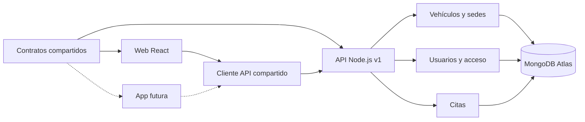

# Arquitectura y evolución

## Principio de trabajo

La primera entrega es una aplicación web full stack. La segunda añade interfaces y módulos sobre una base que ya tiene contratos y API separados de React. No se crean microservicios ni se instala una aplicación móvil antes de necesitarlos.

## Límites

| Lugar | Responsabilidad | Qué no debe incorporar |
| --- | --- | --- |
| `backend/src/modules` | Persistencia, autorización y reglas de cada dominio | Código de interfaz |
| `packages/contracts` | Validación de entradas y vocabulario compartido | Mongoose, React, secretos o almacenamiento |
| `packages/api-client` | Peticiones, errores y transporte inyectable | Hooks, DOM o acceso directo a almacenamiento |
| `frontend/src/features` | Pantallas y recorridos de la web | Reglas de autorización confiadas únicamente al cliente |
| `frontend/src/shared` | Componentes y hooks usados por varias funcionalidades | Pantallas específicas de un módulo |
| `apps/mobile` | Futura interfaz y capacidades nativas | Un segundo backend o copia de las reglas de negocio |

La API tiene versión `/api/v1`. Una futura incompatibilidad debe producir una nueva versión o una migración explícita, sin romper la web entregada.

## Idiomas del universo KelseTS

KelseTS Cars debe ofrecer versiones completas en castellano e inglés desde la entrega web de Rock The Code, como el resto de webs de la marca. Esta funcionalidad está pendiente de implementación.

Se utilizará un selector de idioma accesible y se conservará la elección del visitante. Las traducciones se organizarán por funcionalidad con claves estables, separadas de los componentes, para poder reutilizar el vocabulario en la futura app. El idioma del documento, los formatos de fechas y números, los formularios, los estados de carga, los errores y los textos accesibles deberán corresponder al idioma elegido. Cambiar de idioma conservará la pantalla y los filtros actuales.

Los identificadores y valores de negocio de la API permanecerán estables; sus etiquetas se traducirán en la interfaz. La revisión de entrega comprobará los recorridos completos en ambos idiomas, sin textos mezclados ni claves de traducción visibles.

## Incorporar un módulo

1. Definir el caso de uso y los permisos.
2. Añadir su carpeta a `backend/src/modules` y extraer servicios cuando la lógica requiera reutilización o transacciones.
3. Definir sus entradas compartidas en `packages/contracts`.
4. Componer sus rutas en el router principal y añadir sus operaciones al cliente de API.
5. Crear la funcionalidad web en `frontend/src/features` y, en la etapa correspondiente, sus pantallas nativas.
6. Comprobar reglas, permisos e integración antes de documentarlo como completado.

## App: decisiones pendientes

React Native con Expo es una opción por la continuidad con React, pero no se ha elegido ni instalado todavía. La reutilización actual comprende contratos y peticiones; HTML, CSS, React Router y componentes web no se trasladan directamente a una app nativa.

La sesión de la web usa cookies. Antes de publicar una app se decidirá un flujo de autenticación adecuado a móviles y su almacenamiento seguro. El parámetro `getHeaders` permite ampliar el cliente HTTP, pero no implica que el servidor acepte ya tokens de app.

Las fotografías incluidas hoy utilizan rutas del frontend. La app necesitará URLs absolutas de medios o la configuración de un origen público. No debe resolver esas rutas contra un directorio local del teléfono.

Los tokens visuales actuales viven en `style.css`, conforme al enunciado. Al diseñar la app se podrá extraer una fuente común y generar valores web y nativos, conservando este archivo en la entrega web.

## Módulos posteriores

| Módulo | Etapa | Dependencia principal |
| --- | --- | --- |
| Catálogo, acceso, sedes y citas | Rock The Code | Atlas y comprobaciones full stack |
| Subidas de fotografías | Mejora Rock The Code | Cloudinary y formulario de gestión |
| Configurador y preferencias | BigSchool | Opciones reales por modelo y reglas de compatibilidad |
| Mantenimiento y garaje personal | BigSchool | Relación usuario–vehículo y permisos |
| Notificaciones | BigSchool | Proveedor, consentimiento y registro de entregas |
| App | BigSchool | Plataforma y autenticación nativa |
| Integración remota del vehículo | Investigación BigSchool | API del fabricante y autorización del propietario |

No se necesita implementar las ampliaciones para justificar la primera entrega.
