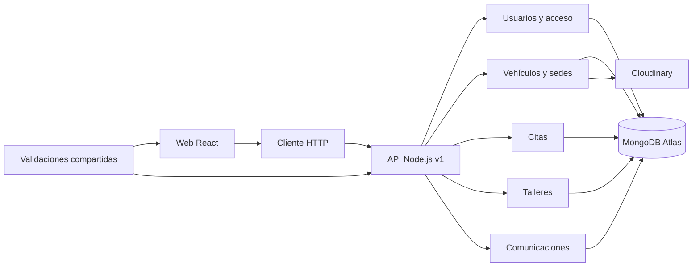

# Arquitectura de KelseTS Cars

## Organización

La web y la API están en el mismo repositorio y se despliegan como dos proyectos de Vercel. El backend reúne modelos, controladores y servicios por funcionalidad. React consulta la API a través de un cliente HTTP compartido; las validaciones comunes están separadas de los componentes.

## Responsabilidades

| Lugar | Responsabilidad |
| --- | --- |
| `backend/src/modules` | Persistencia, permisos y reglas de usuarios, catálogo, citas, talleres y comunicaciones |
| `packages/contracts` | Esquemas de validación y valores compartidos, sin dependencias de React o Mongoose |
| `packages/api-client` | Peticiones HTTP, errores y cancelación, sin hooks ni acceso al DOM |
| `frontend/src/features` | Páginas y componentes de cada funcionalidad |
| `frontend/src/shared` | Componentes, hooks, sesión e idioma utilizados por varias páginas |
| `frontend/src/styles` | Variables, estilos comunes y hojas por funcionalidad |

La API utiliza `/api/v1`. Los permisos se comprueban en el servidor, aunque la web oculte los controles que no corresponden a cada perfil. Las variables privadas permanecen en el backend.

## Componentes y hooks

El catálogo separa el hero, la barra de búsqueda, los filtros, las tarjetas y la paginación. Las citas utilizan `AppointmentRow` para mostrar datos y acciones según el estado. El registro separa la elección de perfil y los campos del taller. Las tarjetas de sedes comparten la presentación del barrio y sus enlaces.

`useResource` utiliza `useReducer` para carga, error y resultado. Cancela peticiones cuando cambia la consulta o se desmonta la pantalla. `useDealershipLocation` reúne geolocalización, selección manual y errores. Los contextos mantienen sesión e idioma sin duplicar ese estado en cada página.

## Castellano e inglés

El selector conserva el idioma al recargar. Los textos accesibles, formularios, estados y formatos se adaptan a la elección del visitante. Cambiar de idioma mantiene la pantalla, los filtros y la sesión.

Los valores de negocio que espera la API permanecen estables; la interfaz traduce sus etiquetas. Las comunicaciones guardan sus dos versiones al crearse. Los nombres y motivos escritos por usuarios conservan su contenido original.

## Incorporación de funcionalidades

Para añadir una funcionalidad, se definen primero su recorrido y sus permisos. El backend incorpora el módulo, sus modelos y sus servicios; las entradas compartidas se validan en `packages/contracts`. Después se añaden las operaciones al cliente HTTP y las pantallas a `frontend/src/features`.

Esta separación permite que la web crezca sin copiar las reglas de negocio. Las pruebas verifican el comportamiento y los permisos antes de documentar la funcionalidad.
