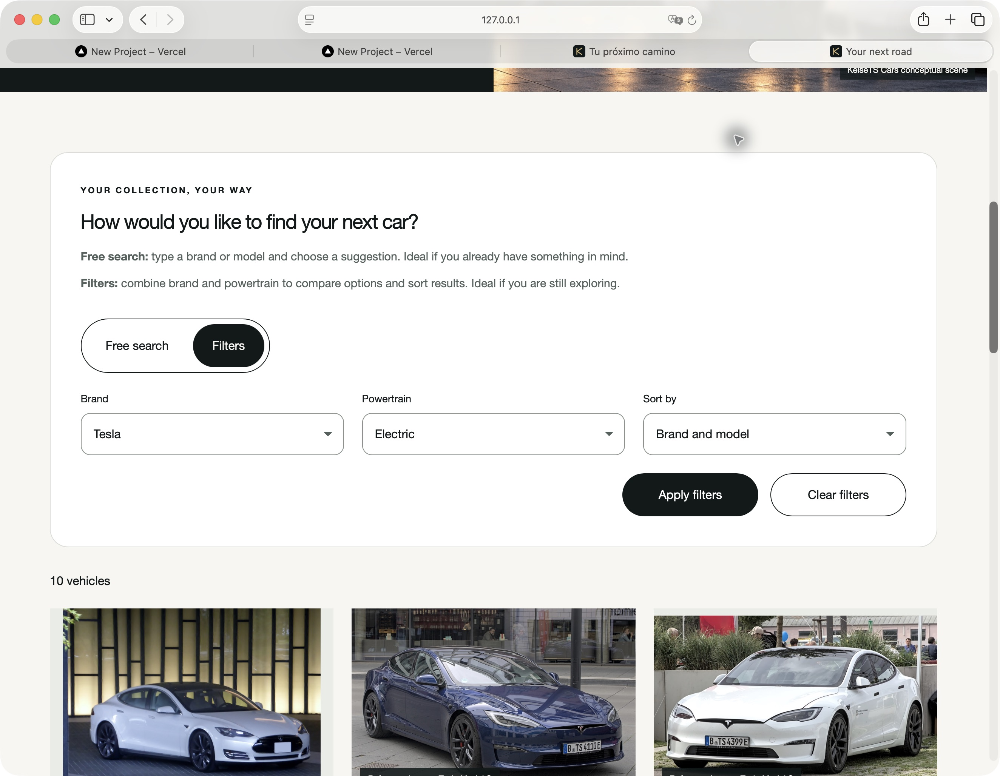
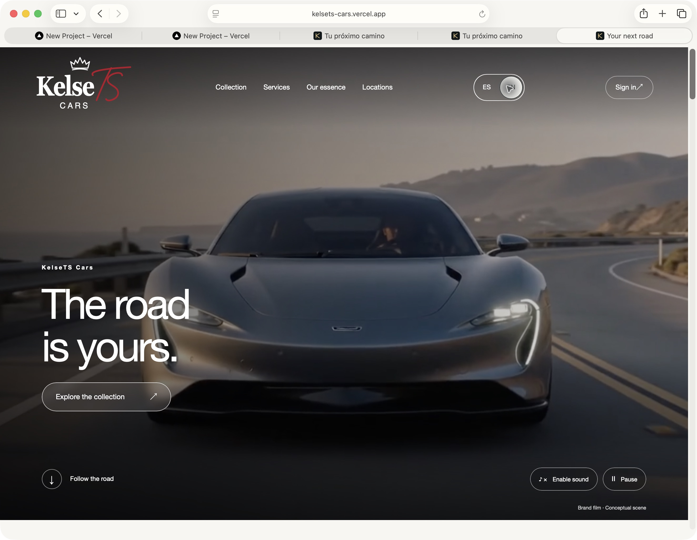
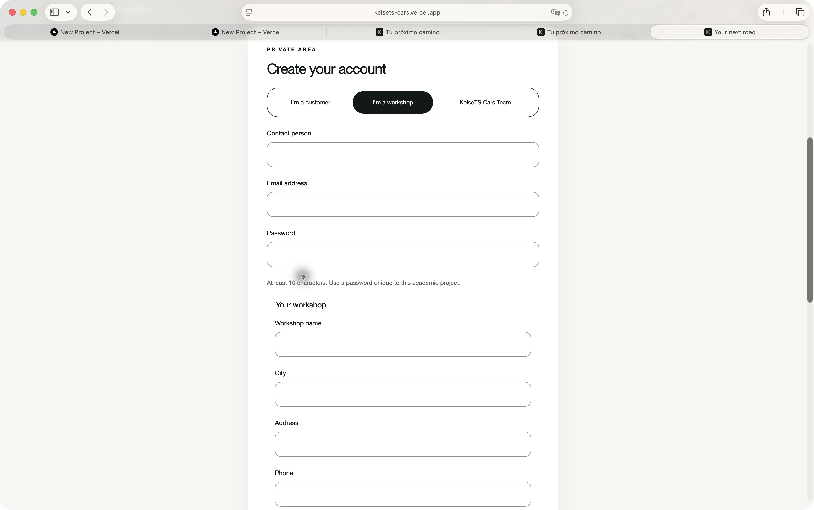

# Primera revisión de idiomas

He añadido el selector ES/EN a la cabecera. La elección se conserva en el navegador, se comparte entre pestañas y actualiza el idioma del documento y su título. Los textos ingleses están separados en un archivo de traducciones; no se modifican los datos de Atlas.

La interfaz incorpora traducciones en navegación, portada, Servicios, Nuestra esencia, catálogo, fichas, sedes, créditos, acceso, citas y paneles privados. Los nombres propios, las direcciones, las licencias y los valores enviados a la API conservan su contenido original. La primera captura de cliente es anterior a la incorporación de comunicaciones inglesas.

## Comprobaciones realizadas

- En Safari: cambio a inglés en la portada y navegación a Servicios y Nuestra esencia.
- En el catálogo: Tesla y Electric muestran diez vehículos. Al pulsar Apply filters la URL conserva `fuel=Eléctrico`, que es el valor esperado por la API.
- Al recargar se mantiene el inglés y la selección del filtro.
- Acceso con la cuenta ficticia Cliente Demo Despliegue y cambio a castellano sin perder la sesión. Se ha cerrado la sesión al terminar.
- Portada inglesa en marcos de Safari de 320 y 390 px: cabecera, navegación, selector y llamada a la colección. No sustituye una prueba en teléfonos reales.
- Once pruebas del frontend y compilación correctas. Cinco pruebas comprueban preferencia, almacenamiento bloqueado, nombres propios y conservación del valor de motorización al traducir su etiqueta.

## Entornos de las capturas

Las tres primeras capturas corresponden a la revisión local contra Atlas. La captura siguiente muestra la web publicada. Las vistas de Team y talleres en ambos idiomas están en el [informe responsive](../movil/README.md).

## Comprobación en producción

Vercel ha publicado el commit `6d2f9b3` con estado Ready. En Safari he abierto [kelsets-cars.vercel.app](https://kelsets-cars.vercel.app), pulsado EN y comprobado la navegación inglesa y el hero The road is yours. El recorrido de producción se documenta en su informe específico.

## Comunicaciones bilingües

Las diez plantillas tienen versión inglesa. Los mensajes nuevos guardan ambas versiones; el historial anterior se traduce solo tras verificar su plantilla original. Nombres y motivos personales se conservan. La integración en Atlas temporal comprueba almacenamiento, selección de idioma y ausencia de metadatos privados en la respuesta. La base temporal se elimina al terminar.

Las siguientes capturas muestran la bienvenida inglesa generada localmente, sin nuevos envíos a Mailtrap. El logo y las diez imágenes exclusivas se mantienen. No sustituyen la revisión en Outlook, Gmail o dispositivos físicos.

## Bandeja inglesa publicada

Vercel ha publicado la API del commit `0f31073` con estado Ready. En Safari, la cuenta ficticia Cliente Demo Despliegue muestra el asunto, el cuerpo y el enlace de bienvenida en inglés. Al seleccionar ES se recupera el castellano y se mantiene la sesión. Se ha cerrado la sesión al terminar. La [verificación HTTP](verificacion-comunicaciones.json) confirma ambos idiomas, identidad del mensaje y exclusión de metadatos privados.

También se ha revisado el formulario de solicitud de talleres en inglés, sin enviarlo ni crear otra cuenta. Esta captura no acredita todavía el registro completo en navegador.

