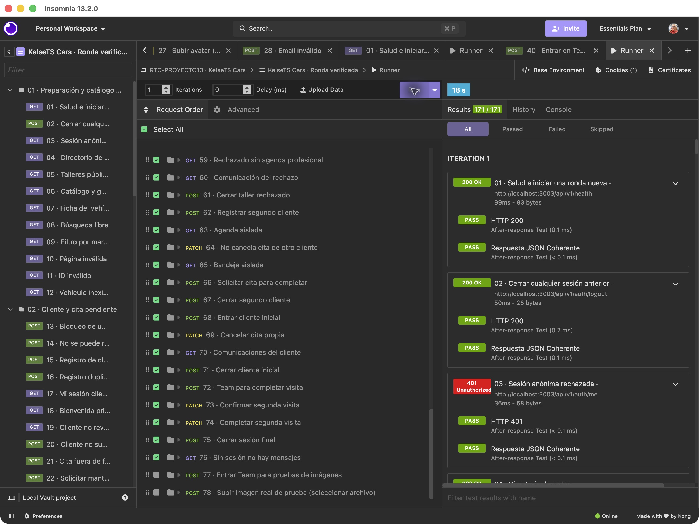
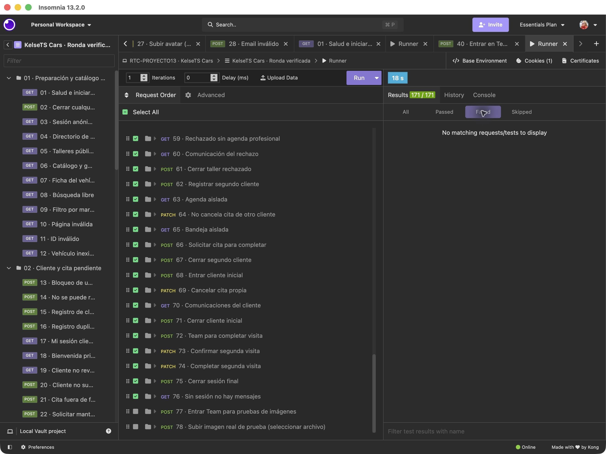
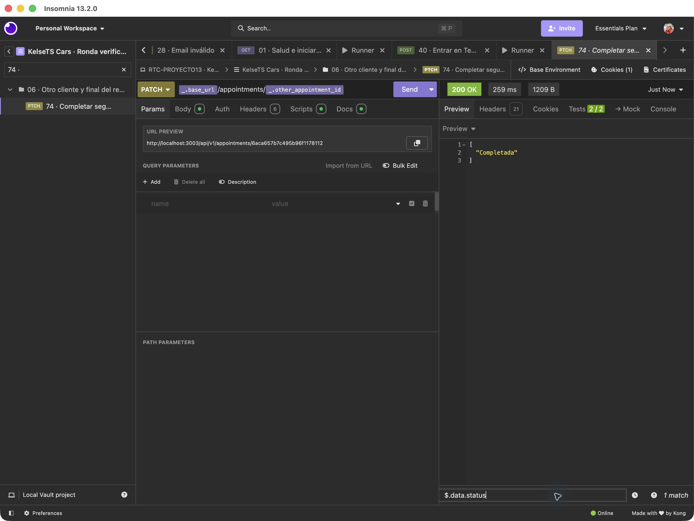
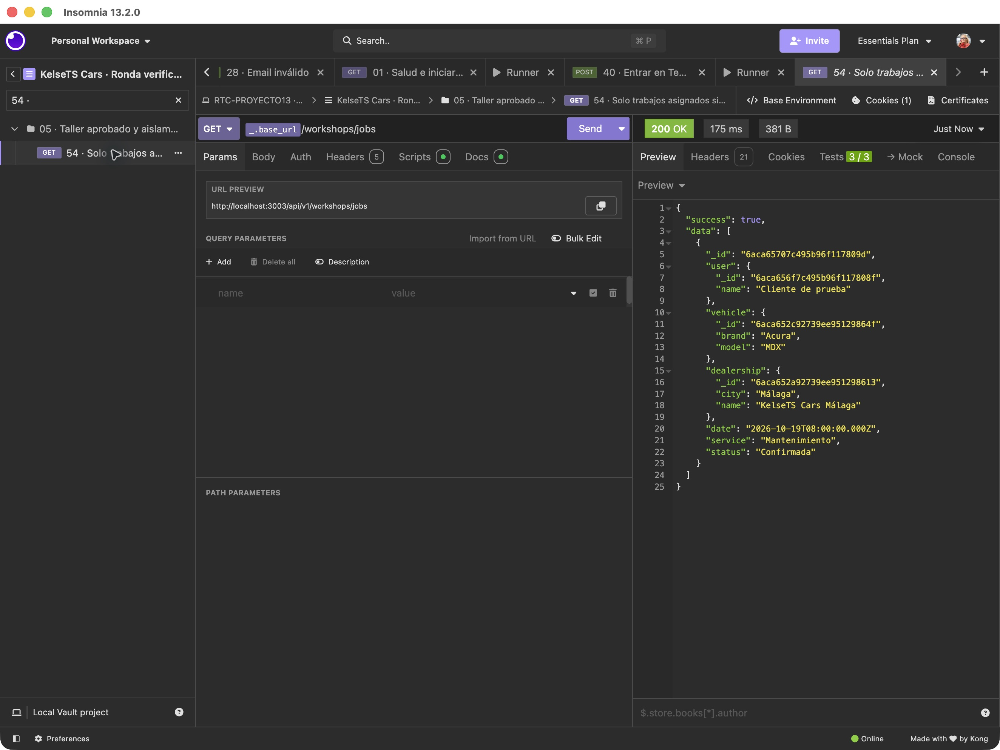
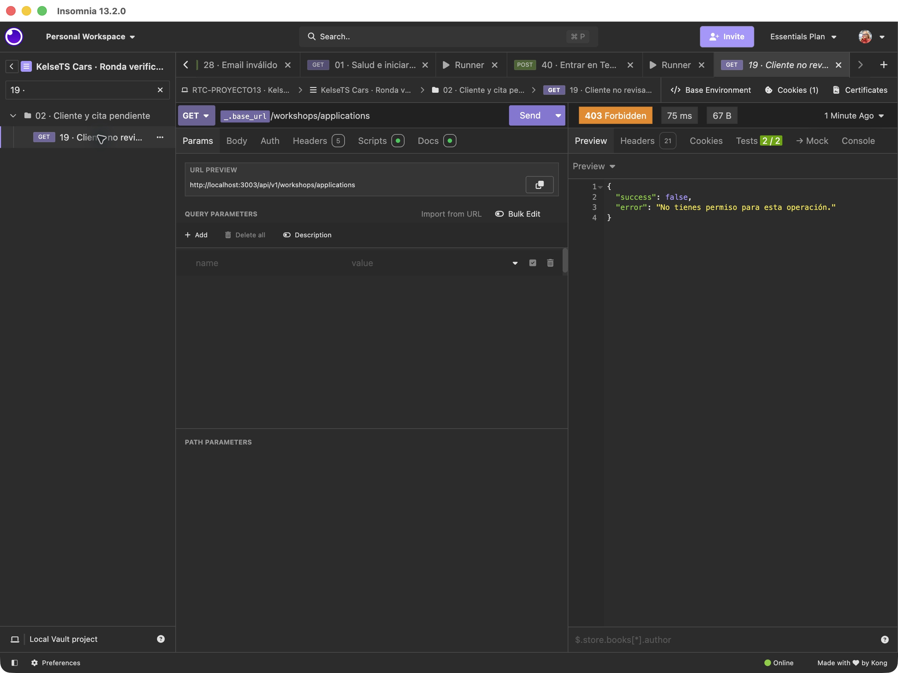
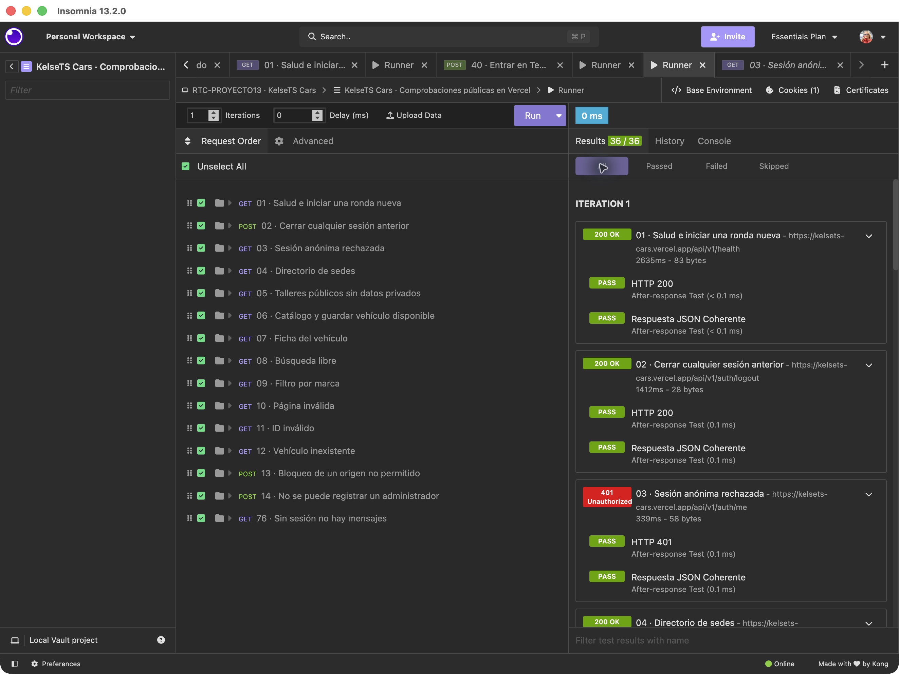
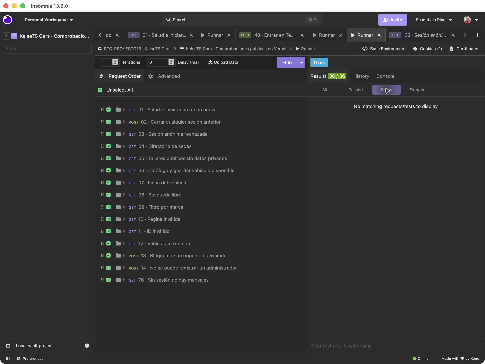
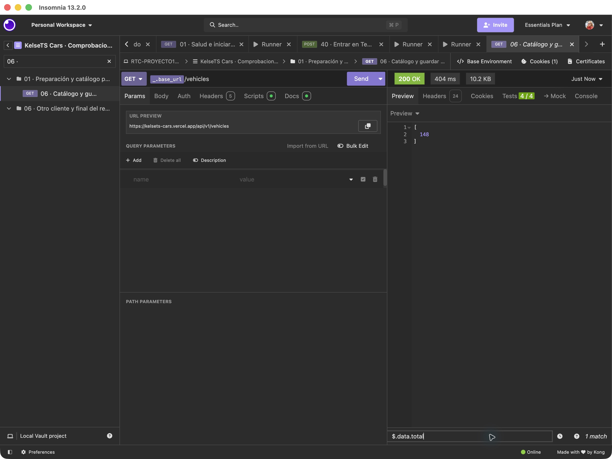
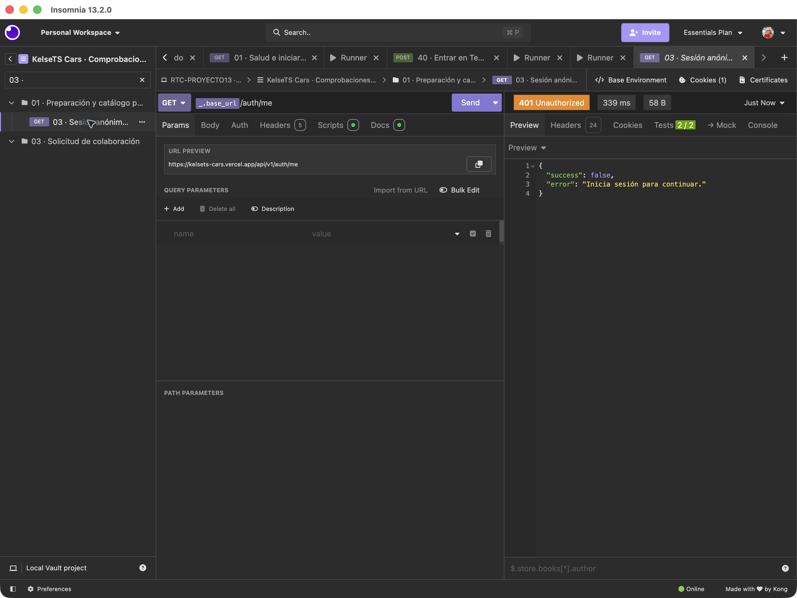

# Pruebas de Insomnia

Las colecciones se han importado y ejecutado en **Insomnia 13.2.0 para macOS**, en el proyecto local `RTC-PROYECTO13 · KelseTS Cars`. Estas capturas corresponden a la aplicación, no al adaptador de pruebas utilizado anteriormente.

| Ronda | Entorno | Peticiones | Comprobaciones correctas |
| --- | --- | --- | --- |
| Recorrido principal | Backend local, puerto 3003, con una base temporal independiente en Atlas | 76 | 171 / 171 |
| Recursos públicos y casos negativos | API publicada, mediante `https://kelsets-cars.vercel.app/api/v1` | 15 | 36 / 36 |

## Recorrido completo

La base temporal se cargó desde los CSV: 148 vehículos, cuatro sedes y cuatro talleres. Se crearon cuentas ficticias para comprobar el registro, duplicados, sesiones, permisos, aprobación y rechazo de talleres, asignación de mantenimiento, agenda profesional, aislamiento entre dos clientes, comunicaciones, cancelación y finalización. La base se eliminó al terminar; no se añadieron registros a producción en esta ronda.

El filtro de resultados fallidos queda vacío:

La petición 74 devuelve `200` y el estado `Completada`. En esta captura se ha aplicado el filtro JSONPath `$.data.status` para que el resultado se lea claramente:

El taller recibe únicamente su trabajo asignado y el nombre del cliente, sin su correo:

El cliente no puede revisar solicitudes de talleres. El `403` es el resultado correcto del caso negativo:

## Producción

La [colección pública](../../insomnia/KelseTS-Cars.public.insomnia.json) permite repetir los casos 01–14 y 76 en Vercel, sin credenciales. Incluye salud, cierre de una sesión previa, perfil anónimo, sedes, talleres públicos, catálogo, ficha, búsqueda, filtros, página incorrecta, identificadores, origen ajeno y rechazo del registro con rol administrativo. La última petición comprueba que no hay acceso anónimo a los mensajes. No crea cuentas ni citas.

El catálogo publicado devuelve 148 unidades. La captura utiliza `$.data.total`:

## Capturas adicionales del recorrido

Las capturas 10–23 muestran respuestas guardadas de la ronda principal, abiertas sin repetir peticiones después de eliminar la base temporal. La [memoria](../../../MEMORIA.md#recorrido-documentado-paso-a-paso) y el [anexo de validación](../../insomnia/VALIDACION-DETALLADA.md) incluyen objetivo, petición, resultado e interpretación.

| Caso | Evidencia | Filtro de vista |
| --- | --- | --- |
| 15 | [Registro de cliente](10-registro-cliente.png) | Respuesta completa, parte visible |
| 17 | [Sesión del cliente](11-sesion-cliente.png) | Respuesta completa, parte visible |
| 22 | [Solicitud de mantenimiento](12-solicitud-mantenimiento.png) | `$.data.status` |
| 23 | [Franja ya ocupada](13-franja-ocupada.png) | Respuesta completa, parte visible |
| 30 | [Taller pendiente](14-taller-pendiente.png) | Respuesta completa, parte visible |
| 42 | [Aprobación del taller](15-taller-aprobado.png) | Respuesta completa, parte visible |
| 45 | [Rechazo con motivo](16-taller-rechazado.png) | Respuesta completa, parte visible |
| 47 | [Asignación del mantenimiento](17-mantenimiento-asignado.png) | `$.data.workshop` |
| 49 | [Confirmación de la cita](18-cita-confirmada.png) | `$.data.status` |
| 56 | [Comunicaciones del taller](19-comunicaciones-taller.png) | `$.data[*].subject` |
| 69 | [Cancelación de la cita propia](20-cita-cancelada.png) | `$.data.status` |
| 70 | [Comunicaciones del cliente](21-comunicaciones-cliente.png) | `$.data[*].subject` |
| 65 | [Bandeja de otro cliente](22-bandeja-otro-cliente.png) | `$.data[*].subject` |
| 64 | [Cita ajena protegida](23-cita-ajena-protegida.png) | Respuesta completa, parte visible |

## Ajustes encontrados durante la ejecución

La primera importación detectó dos problemas de los scripts. `insomnia.response.status` devolvía el texto `OK`; la comprobación numérica debe utilizar `insomnia.response.code`, como muestra la [documentación de Kong](https://developer.konghq.com/how-to/set-a-value-from-a-response-as-an-environment-variable/). También se observó que el jar de cookies usado por los scripts podía recuperar la sesión anterior al login. La colección guarda en ese jar la cookie de la respuesta de registro o login y lo vacía después del logout, sin copiar el token al entorno ni exportarlo. Tras corregirlo se repitió el recorrido completo y pasó.

No se han modificado la autenticación ni los permisos del backend para obtener estos resultados. Las dos peticiones de subida manual, 77 y 78, se excluyeron del runner; la subida real desde Safari está documentada en [Cloudinary](../cloudinary/README.md). Las pruebas de producción del recorrido privado realizadas mediante HTTP se conservan en [su informe independiente](../produccion/README.md).

## English

Both collections were imported and run in the actual Insomnia 13.2.0 macOS app. The main workflow passed **171 assertions across 76 requests**, using a local backend and an isolated temporary Atlas database seeded with 148 vehicles, four dealerships and four workshops. The database was removed afterwards. The public production collection passed **36 assertions across 15 requests** without credentials or new accounts and appointments.

The screenshots show the runner results, no failed assertions, a completed visit, restricted workshop customer data, a forbidden customer action, the published catalogue count and anonymous access rejection. Two collection scripting issues were corrected before the successful final runs: numeric HTTP status checks and session cookie handling. The manual image upload requests were excluded; the actual upload from Safari is documented separately. No passwords or cookie values are shown in these screenshots.

The report now contains 23 screenshots. Fourteen additional captures show stored responses from the successful main run, without resending requests. The detailed report and academic memory explain each selected case and the JSONPath view filters.
