# Validación detallada de Insomnia

## Entorno y alcance

La ronda principal se ejecutó en Insomnia 13.2.0 contra `http://localhost:3003/api/v1`, con una base temporal independiente en Atlas: **76 peticiones, 171 comprobaciones correctas**. La base se eliminó al terminar. La colección pública de Vercel pasó **15 peticiones y 36 comprobaciones**. Las dos peticiones manuales de imágenes, 77–78, quedan fuera de estos resultados.

Las capturas adicionales muestran las respuestas que Insomnia conservó de esa ejecución. Se abrieron después de eliminar la base, sin repetir las peticiones. Los filtros JSONPath cambian la vista, no los datos. Las cuentas son ficticias y no se muestran contraseñas ni valores de cookies.

## Índice de los 76 casos ejecutados

Los códigos obtenidos coinciden con los esperados en la ronda correcta. «Runner» identifica un caso comprobado por la ejecución, sin captura individual en este anexo. Una captura acredita la parte visible de una respuesta; los scripts de la colección contienen las comprobaciones adicionales.

| Caso | Objetivo de la petición | Método y ruta | Esperado | Obtenido | Evidencia |
| --- | --- | --- | --- | --- | --- |
| 01 | Salud e iniciar una ronda nueva | `GET /health` | 200 | 200 | [Runner](../evidencias/insomnia/01-ronda-completa-171.png) |
| 02 | Cerrar cualquier sesión anterior | `POST /auth/logout` | 200 | 200 | [Runner](../evidencias/insomnia/01-ronda-completa-171.png) |
| 03 | Sesión anónima rechazada | `GET /auth/me` | 401 | 401 | [Captura](../evidencias/insomnia/09-vercel-sin-sesion.png) · Vercel |
| 04 | Directorio de sedes | `GET /dealerships` | 200 | 200 | [Runner](../evidencias/insomnia/01-ronda-completa-171.png) |
| 05 | Talleres públicos sin datos privados | `GET /workshops` | 200 | 200 | [Runner](../evidencias/insomnia/01-ronda-completa-171.png) |
| 06 | Catálogo y guardar vehículo disponible | `GET /vehicles` | 200 | 200 | [Runner](../evidencias/insomnia/01-ronda-completa-171.png) |
| 07 | Ficha del vehículo | `GET /vehicles/{{ _.vehicle_id }}` | 200 | 200 | [Runner](../evidencias/insomnia/01-ronda-completa-171.png) |
| 08 | Búsqueda libre | `GET /vehicles?q=Audi` | 200 | 200 | [Runner](../evidencias/insomnia/01-ronda-completa-171.png) |
| 09 | Filtro por marca | `GET /vehicles?brand=Porsche&page=1` | 200 | 200 | [Runner](../evidencias/insomnia/01-ronda-completa-171.png) |
| 10 | Página inválida | `GET /vehicles?page=0` | 400 | 400 | [Runner](../evidencias/insomnia/01-ronda-completa-171.png) |
| 11 | ID inválido | `GET /vehicles/no-es-un-id` | 400 | 400 | [Runner](../evidencias/insomnia/01-ronda-completa-171.png) |
| 12 | Vehículo inexistente | `GET /vehicles/000000000000000000000000` | 404 | 404 | [Runner](../evidencias/insomnia/01-ronda-completa-171.png) |
| 13 | Bloqueo de un origen no permitido | `POST /auth/login` | 403 | 403 | [Runner](../evidencias/insomnia/01-ronda-completa-171.png) |
| 14 | No se puede registrar un administrador | `POST /auth/register` | 400 | 400 | [Runner](../evidencias/insomnia/01-ronda-completa-171.png) |
| 15 | Registro de cliente | `POST /auth/register` | 201 | 201 | [Captura](../evidencias/insomnia/10-registro-cliente.png) |
| 16 | Registro duplicado | `POST /auth/register` | 409 | 409 | [Runner](../evidencias/insomnia/01-ronda-completa-171.png) |
| 17 | Mi sesión cliente | `GET /auth/me` | 200 | 200 | [Captura](../evidencias/insomnia/11-sesion-cliente.png) |
| 18 | Bienvenida privada simulada | `GET /messages` | 200 | 200 | [Runner](../evidencias/insomnia/01-ronda-completa-171.png) |
| 19 | Cliente no revisa talleres | `GET /workshops/applications` | 403 | 403 | [Captura](../evidencias/insomnia/05-cliente-permiso-denegado.png) |
| 20 | Cliente no sube imágenes | `POST /vehicles/{{ _.vehicle_id }}/image` | 403 | 403 | [Runner](../evidencias/insomnia/01-ronda-completa-171.png) |
| 21 | Cita fuera de fecha | `POST /appointments` | 400 | 400 | [Runner](../evidencias/insomnia/01-ronda-completa-171.png) |
| 22 | Solicitar mantenimiento | `POST /appointments` | 201 | 201 | [Captura](../evidencias/insomnia/12-solicitud-mantenimiento.png) |
| 23 | La misma franja está ocupada | `POST /appointments` | 409 | 409 | [Captura](../evidencias/insomnia/13-franja-ocupada.png) |
| 24 | Cliente no confirma la cita | `PATCH /appointments/{{ _.appointment_id }}` | 403 | 403 | [Runner](../evidencias/insomnia/01-ronda-completa-171.png) |
| 25 | Cliente no asigna talleres | `POST /appointments/{{ _.appointment_id }}/workshop` | 403 | 403 | [Runner](../evidencias/insomnia/01-ronda-completa-171.png) |
| 26 | Cerrar sesión cliente | `POST /auth/logout` | 200 | 200 | [Runner](../evidencias/insomnia/01-ronda-completa-171.png) |
| 27 | Contraseña incorrecta | `POST /auth/login` | 401 | 401 | [Runner](../evidencias/insomnia/01-ronda-completa-171.png) |
| 28 | Registro sin especialidades | `POST /auth/register` | 400 | 400 | [Runner](../evidencias/insomnia/01-ronda-completa-171.png) |
| 29 | Registro de taller | `POST /auth/register` | 201 | 201 | [Runner](../evidencias/insomnia/01-ronda-completa-171.png) |
| 30 | Guardar solicitud pendiente | `GET /workshops/me` | 200 | 200 | [Captura](../evidencias/insomnia/14-taller-pendiente.png) |
| 31 | Mensaje de recepción del taller | `GET /messages` | 200 | 200 | [Runner](../evidencias/insomnia/01-ronda-completa-171.png) |
| 32 | Taller pendiente no accede a trabajos | `GET /workshops/jobs` | 403 | 403 | [Runner](../evidencias/insomnia/01-ronda-completa-171.png) |
| 33 | Taller no accede a agenda general | `GET /appointments` | 403 | 403 | [Runner](../evidencias/insomnia/01-ronda-completa-171.png) |
| 34 | Taller no puede aprobarse | `PATCH /workshops/{{ _.workshop_id }}/review` | 403 | 403 | [Runner](../evidencias/insomnia/01-ronda-completa-171.png) |
| 35 | Cerrar sesión taller | `POST /auth/logout` | 200 | 200 | [Runner](../evidencias/insomnia/01-ronda-completa-171.png) |
| 36 | Alta de otra solicitud para rechazo | `POST /auth/register` | 201 | 201 | [Runner](../evidencias/insomnia/01-ronda-completa-171.png) |
| 37 | Guardar segunda solicitud | `GET /workshops/me` | 200 | 200 | [Runner](../evidencias/insomnia/01-ronda-completa-171.png) |
| 38 | Cerrar segunda solicitud | `POST /auth/logout` | 200 | 200 | [Runner](../evidencias/insomnia/01-ronda-completa-171.png) |
| 39 | Team no entra por portal cliente | `POST /auth/login` | 403 | 403 | [Runner](../evidencias/insomnia/01-ronda-completa-171.png) |
| 40 | Entrar en Team | `POST /auth/login` | 200 | 200 | [Runner](../evidencias/insomnia/01-ronda-completa-171.png) |
| 41 | Consultar solicitudes | `GET /workshops/applications` | 200 | 200 | [Runner](../evidencias/insomnia/01-ronda-completa-171.png) |
| 42 | Aprobar taller | `PATCH /workshops/{{ _.workshop_id }}/review` | 200 | 200 | [Captura](../evidencias/insomnia/15-taller-aprobado.png) |
| 43 | No aprobar dos veces | `PATCH /workshops/{{ _.workshop_id }}/review` | 409 | 409 | [Runner](../evidencias/insomnia/01-ronda-completa-171.png) |
| 44 | Rechazo exige motivo | `PATCH /workshops/{{ _.rejected_workshop_id }}/review` | 400 | 400 | [Runner](../evidencias/insomnia/01-ronda-completa-171.png) |
| 45 | Rechazar con motivo | `PATCH /workshops/{{ _.rejected_workshop_id }}/review` | 200 | 200 | [Captura](../evidencias/insomnia/16-taller-rechazado.png) |
| 46 | Talleres asignables | `GET /workshops/assignable` | 200 | 200 | [Runner](../evidencias/insomnia/01-ronda-completa-171.png) |
| 47 | Asignar mantenimiento al taller aprobado | `POST /appointments/{{ _.appointment_id }}/workshop` | 200 | 200 | [Captura](../evidencias/insomnia/17-mantenimiento-asignado.png) |
| 48 | No asignar dos veces | `POST /appointments/{{ _.appointment_id }}/workshop` | 409 | 409 | [Runner](../evidencias/insomnia/01-ronda-completa-171.png) |
| 49 | Confirmar cita | `PATCH /appointments/{{ _.appointment_id }}` | 200 | 200 | [Captura](../evidencias/insomnia/18-cita-confirmada.png) |
| 50 | Agenda de Team | `GET /appointments` | 200 | 200 | [Runner](../evidencias/insomnia/01-ronda-completa-171.png) |
| 51 | Imagen ausente rechazada sin llamar Cloudinary | `POST /vehicles/{{ _.vehicle_id }}/image` | 400 | 400 | [Runner](../evidencias/insomnia/01-ronda-completa-171.png) |
| 52 | Cerrar Team | `POST /auth/logout` | 200 | 200 | [Runner](../evidencias/insomnia/01-ronda-completa-171.png) |
| 53 | Entrar taller aprobado | `POST /auth/login` | 200 | 200 | [Runner](../evidencias/insomnia/01-ronda-completa-171.png) |
| 54 | Solo trabajos asignados sin email del cliente | `GET /workshops/jobs` | 200 | 200 | [Captura](../evidencias/insomnia/04-agenda-taller-privacidad.png) |
| 55 | Taller aprobado tampoco ve agenda general | `GET /appointments` | 403 | 403 | [Runner](../evidencias/insomnia/01-ronda-completa-171.png) |
| 56 | Comunicaciones del taller | `GET /messages` | 200 | 200 | [Captura](../evidencias/insomnia/19-comunicaciones-taller.png) |
| 57 | Cerrar taller aprobado | `POST /auth/logout` | 200 | 200 | [Runner](../evidencias/insomnia/01-ronda-completa-171.png) |
| 58 | Entrar taller rechazado | `POST /auth/login` | 200 | 200 | [Runner](../evidencias/insomnia/01-ronda-completa-171.png) |
| 59 | Rechazado sin agenda profesional | `GET /workshops/jobs` | 403 | 403 | [Runner](../evidencias/insomnia/01-ronda-completa-171.png) |
| 60 | Comunicación del rechazo | `GET /messages` | 200 | 200 | [Runner](../evidencias/insomnia/01-ronda-completa-171.png) |
| 61 | Cerrar taller rechazado | `POST /auth/logout` | 200 | 200 | [Runner](../evidencias/insomnia/01-ronda-completa-171.png) |
| 62 | Registrar segundo cliente | `POST /auth/register` | 201 | 201 | [Runner](../evidencias/insomnia/01-ronda-completa-171.png) |
| 63 | Agenda aislada | `GET /appointments` | 200 | 200 | [Runner](../evidencias/insomnia/01-ronda-completa-171.png) |
| 64 | No cancela cita de otro cliente | `PATCH /appointments/{{ _.appointment_id }}` | 409 | 409 | [Captura](../evidencias/insomnia/23-cita-ajena-protegida.png) |
| 65 | Bandeja aislada | `GET /messages` | 200 | 200 | [Captura](../evidencias/insomnia/22-bandeja-otro-cliente.png) |
| 66 | Solicitar cita para completar | `POST /appointments` | 201 | 201 | [Runner](../evidencias/insomnia/01-ronda-completa-171.png) |
| 67 | Cerrar segundo cliente | `POST /auth/logout` | 200 | 200 | [Runner](../evidencias/insomnia/01-ronda-completa-171.png) |
| 68 | Entrar cliente inicial | `POST /auth/login` | 200 | 200 | [Runner](../evidencias/insomnia/01-ronda-completa-171.png) |
| 69 | Cancelar cita propia | `PATCH /appointments/{{ _.appointment_id }}` | 200 | 200 | [Captura](../evidencias/insomnia/20-cita-cancelada.png) |
| 70 | Comunicaciones del cliente | `GET /messages` | 200 | 200 | [Captura](../evidencias/insomnia/21-comunicaciones-cliente.png) |
| 71 | Cerrar cliente inicial | `POST /auth/logout` | 200 | 200 | [Runner](../evidencias/insomnia/01-ronda-completa-171.png) |
| 72 | Team para completar visita | `POST /auth/login` | 200 | 200 | [Runner](../evidencias/insomnia/01-ronda-completa-171.png) |
| 73 | Confirmar segunda visita | `PATCH /appointments/{{ _.other_appointment_id }}` | 200 | 200 | [Runner](../evidencias/insomnia/01-ronda-completa-171.png) |
| 74 | Completar segunda visita | `PATCH /appointments/{{ _.other_appointment_id }}` | 200 | 200 | [Captura](../evidencias/insomnia/03-visita-completada.png) |
| 75 | Cerrar sesión final | `POST /auth/logout` | 200 | 200 | [Runner](../evidencias/insomnia/01-ronda-completa-171.png) |
| 76 | Sin sesión no hay mensajes | `GET /messages` | 401 | 401 | [Runner](../evidencias/insomnia/01-ronda-completa-171.png) |

## Recorrido documentado paso a paso

Para que se pueda seguir la prueba sin ejecutar la colección, he ampliado las evidencias con los pasos de cliente, taller y Team. Mantengo el esquema de objetivo, petición, resultado e interpretación que utilicé en KelseTS Talks.

Estas 14 capturas adicionales se han obtenido al abrir las respuestas guardadas de la ronda correcta en Insomnia. No son una segunda ejecución: la base temporal ya estaba eliminada y no se pulsó Send. Se conserva el código HTTP, el contador de comprobaciones y el resultado original. En las respuestas largas he aplicado el filtro JSONPath indicado para que se lea el dato relevante, sin modificar la respuesta. Los identificadores permiten relacionar las etapas; no son credenciales.

### Caso 15 · Registro de cliente

**Objetivo:** Comprobar el alta de una cuenta de cliente.

**Petición:** `POST /auth/register`, sobre `/api/v1`, con la sesión del perfil que realiza el paso.

**Resultado obtenido:** 201; 3/3 comprobaciones. La respuesta contiene el perfil client y no devuelve la contraseña.

**Interpretación:** El servidor asigna un perfil de cliente y devuelve los datos necesarios para el área privada. No se muestran la cookie ni las credenciales.

<a href="../evidencias/insomnia/10-registro-cliente.png">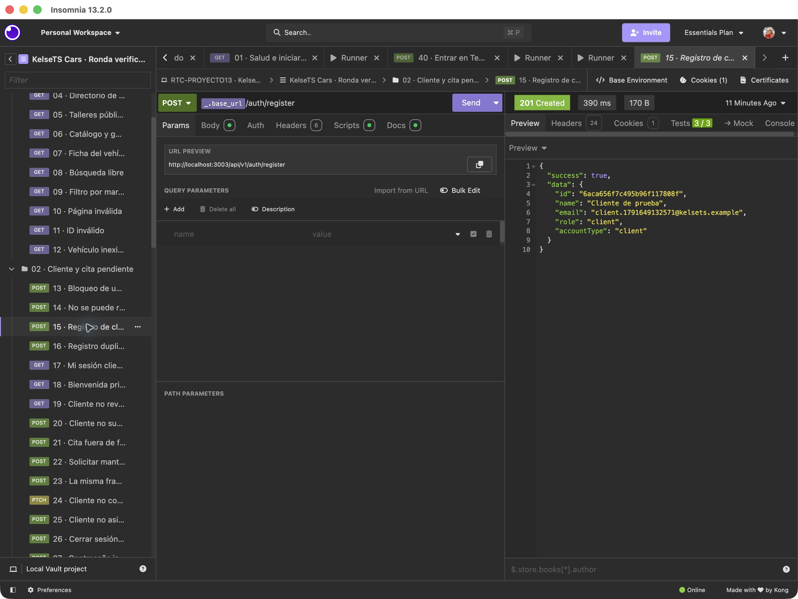</a>

### Caso 17 · Sesión del cliente

**Objetivo:** Comprobar que la sesión creada permite consultar el perfil.

**Petición:** `GET /auth/me`, sobre `/api/v1`, con la sesión del perfil que realiza el paso.

**Resultado obtenido:** 200; 2/2 comprobaciones. Se recupera el mismo identificador del registro.

**Interpretación:** El registro y la consulta de sesión corresponden a la misma cuenta. La cookie se conserva en Insomnia; su valor no se incluye en la evidencia.

<a href="../evidencias/insomnia/11-sesion-cliente.png">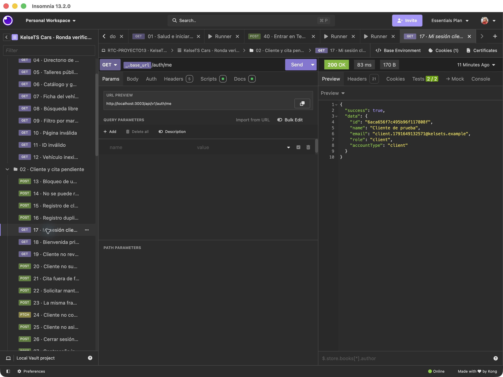</a>

### Caso 22 · Solicitud de mantenimiento

**Objetivo:** Solicitar un mantenimiento como cliente autenticado.

**Petición:** `POST /appointments`, sobre `/api/v1`, con la sesión del perfil que realiza el paso.

**Resultado obtenido:** 201; 3/3 comprobaciones. La cita comienza en Pendiente.

**Interpretación:** Solicitar una visita no implica que esté confirmada. La respuesta crea la relación entre cliente, vehículo y sede. La captura destaca el estado inicial.

**Vista de la captura:** filtro JSONPath `$.data.status`.

<a href="../evidencias/insomnia/12-solicitud-mantenimiento.png">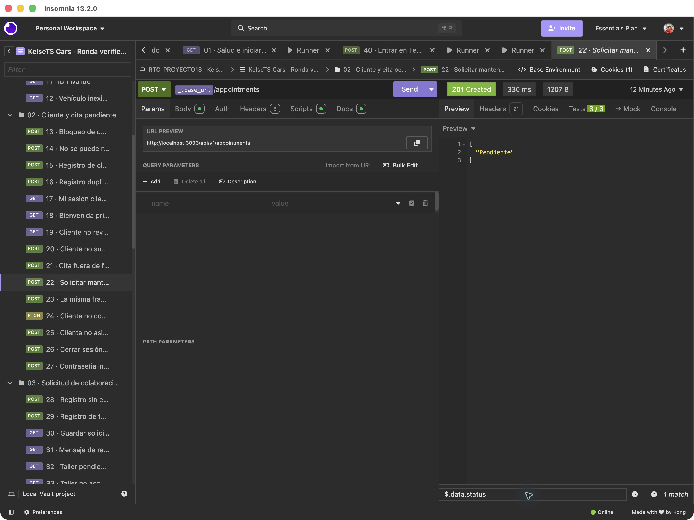</a>

### Caso 23 · Franja ya ocupada

**Objetivo:** Intentar crear otra cita en la sede y hora ya ocupadas.

**Petición:** `POST /appointments`, sobre `/api/v1`, con la sesión del perfil que realiza el paso.

**Resultado obtenido:** 409; 2/2 comprobaciones. La API rechaza la misma franja.

**Interpretación:** El conflicto es el resultado esperado. Evita reservar dos citas activas en la misma sede y franja.

<a href="../evidencias/insomnia/13-franja-ocupada.png">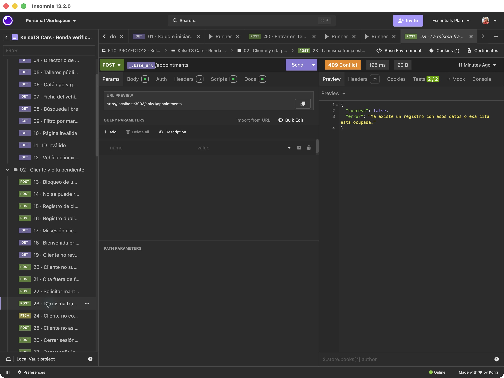</a>

### Caso 30 · Taller pendiente

**Objetivo:** Consultar la solicitud después del registro del taller.

**Petición:** `GET /workshops/me`, sobre `/api/v1`, con la sesión del perfil que realiza el paso.

**Resultado obtenido:** 200; 3/3 comprobaciones. El perfil muestra status: pending y public: false.

**Interpretación:** La solicitud queda pendiente de revisión. El registro no aprueba al taller automáticamente ni lo publica en el directorio. El nombre y los datos de contacto son ficticios.

<a href="../evidencias/insomnia/14-taller-pendiente.png">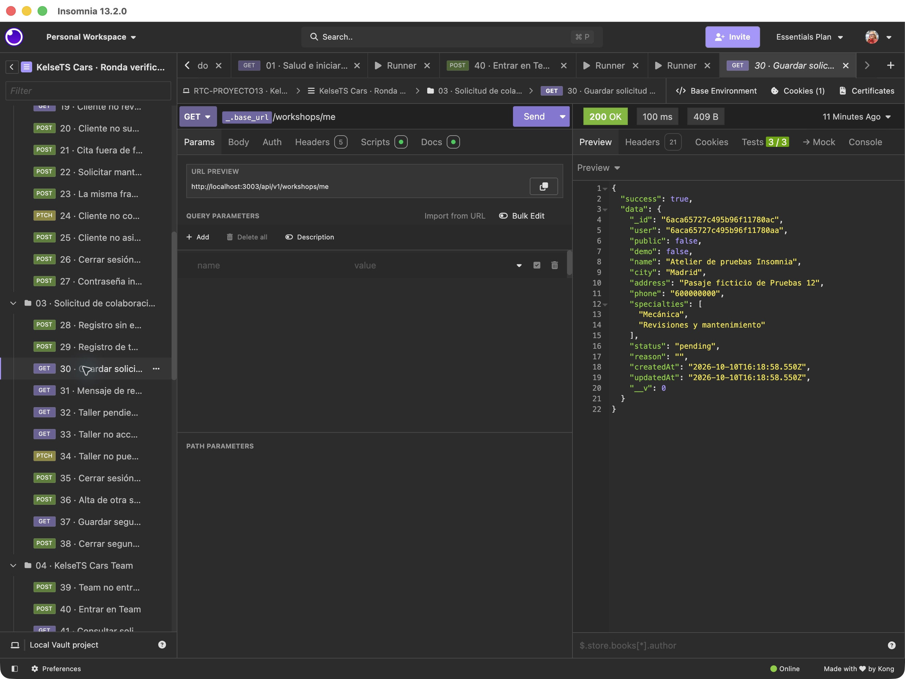</a>

### Caso 42 · Aprobación del taller

**Objetivo:** Aprobar la colaboración desde una sesión de Team.

**Petición:** `PATCH /workshops/:id/review`, sobre `/api/v1`, con la sesión del perfil que realiza el paso.

**Resultado obtenido:** 200; 2/2 comprobaciones. El mismo taller pasa a approved.

**Interpretación:** El identificador coincide con la solicitud pendiente. Se guardan la fecha y la cuenta que revisó el alta. El taller continúa oculto porque esta prueba no cambia public.

<a href="../evidencias/insomnia/15-taller-aprobado.png">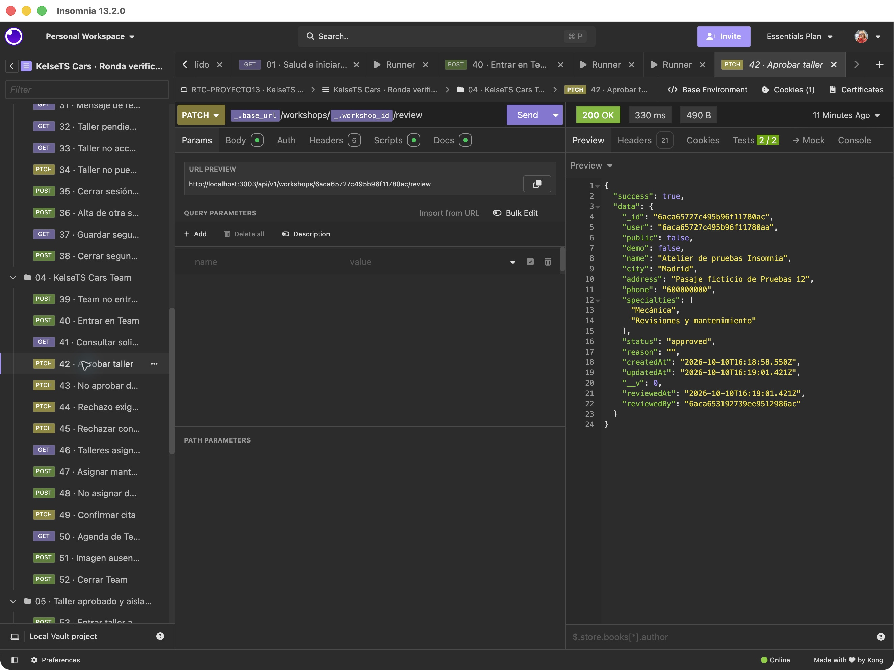</a>

### Caso 45 · Rechazo con motivo

**Objetivo:** Rechazar otra solicitud explicando la decisión.

**Petición:** `PATCH /workshops/:id/review`, sobre `/api/v1`, con la sesión del perfil que realiza el paso.

**Resultado obtenido:** 200; 2/2 comprobaciones. La segunda solicitud pasa a rejected con un motivo.

**Interpretación:** La respuesta conserva el motivo «Faltan datos para revisar la colaboración.». Es una solicitud distinta de la aprobada. El caso 44 comprueba además que no se admite el rechazo sin motivo.

<a href="../evidencias/insomnia/16-taller-rechazado.png">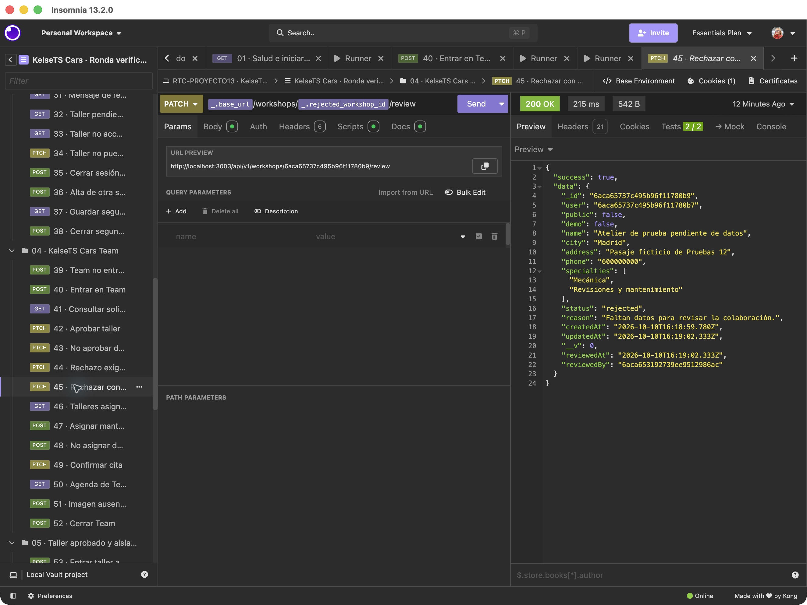</a>

### Caso 47 · Asignación del mantenimiento

**Objetivo:** Asignar desde Team el mantenimiento al taller revisado.

**Petición:** `POST /appointments/:id/workshop`, sobre `/api/v1`, con la sesión del perfil que realiza el paso.

**Resultado obtenido:** 200; 2/2 comprobaciones. La cita recibe la referencia del taller aprobado.

**Interpretación:** La referencia 6aca65727c495b96f11780ac coincide con el taller de las capturas de solicitud y aprobación. Esta relación enlaza la cita con el profesional que la atenderá; asignar no equivale a confirmar.

**Vista de la captura:** filtro JSONPath `$.data.workshop`.

<a href="../evidencias/insomnia/17-mantenimiento-asignado.png">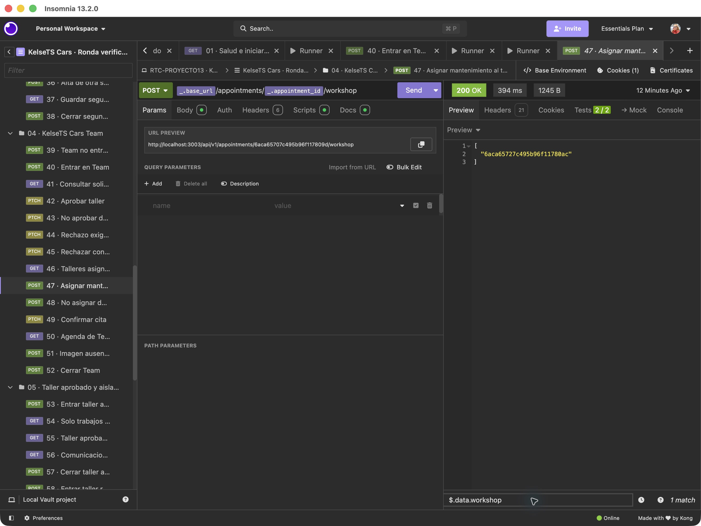</a>

### Caso 49 · Confirmación de la cita

**Objetivo:** Confirmar desde Team la cita previamente asignada.

**Petición:** `PATCH /appointments/:id`, sobre `/api/v1`, con la sesión del perfil que realiza el paso.

**Resultado obtenido:** 200; 2/2 comprobaciones. El estado pasa a Confirmada.

**Interpretación:** La ruta conserva el identificador de la solicitud inicial. El cambio de estado se hace con permisos administrativos, después de la asignación.

**Vista de la captura:** filtro JSONPath `$.data.status`.

<a href="../evidencias/insomnia/18-cita-confirmada.png">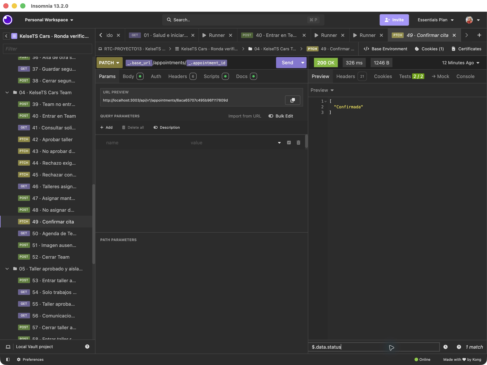</a>

### Caso 56 · Comunicaciones del taller

**Objetivo:** Consultar los avisos desde el perfil del taller aprobado.

**Petición:** `GET /messages`, sobre `/api/v1`, con la sesión del perfil que realiza el paso.

**Resultado obtenido:** 200; 3/3 comprobaciones. Aparecen cuatro asuntos de recepción, aprobación, asignación y confirmación.

**Interpretación:** El contenido acompaña las etapas de colaboración y atención. En esta ronda delivery es simulated: acredita mensajes guardados en el área privada, no entrega de correos a Mailtrap ni a buzones personales.

**Vista de la captura:** filtro JSONPath `$.data[*].subject`.

<a href="../evidencias/insomnia/19-comunicaciones-taller.png">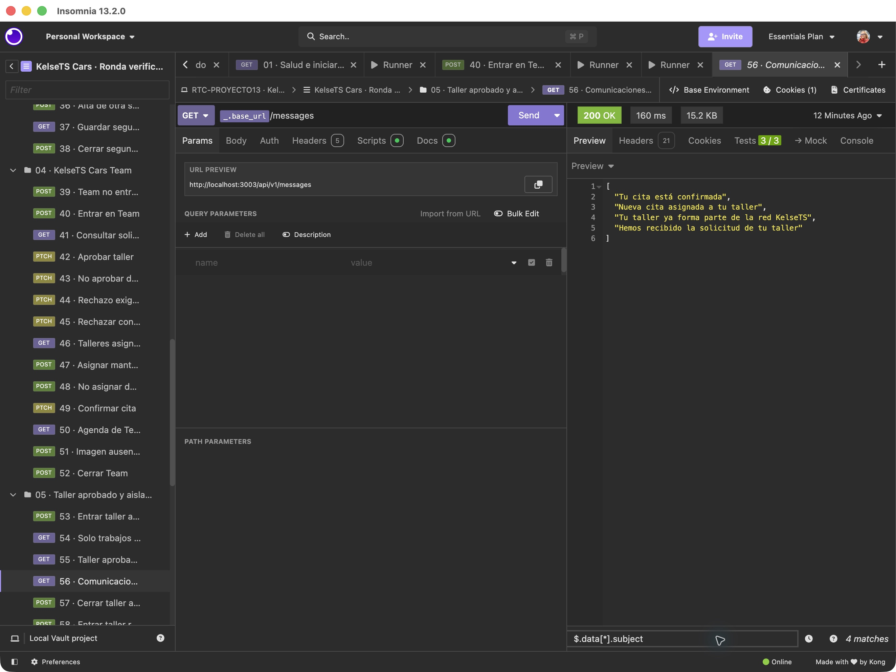</a>

### Caso 69 · Cancelación de la cita propia

**Objetivo:** Cancelar la primera cita desde el cliente que la solicitó.

**Petición:** `PATCH /appointments/:id`, sobre `/api/v1`, con la sesión del perfil que realiza el paso.

**Resultado obtenido:** 200; 2/2 comprobaciones. La cita pasa a Cancelada.

**Interpretación:** La respuesta completa marca active: false. La captura destaca Cancelada. Se cancela la primera cita; la visita completada de la captura 03 corresponde a la segunda cuenta y a otra cita.

**Vista de la captura:** filtro JSONPath `$.data.status`.

<a href="../evidencias/insomnia/20-cita-cancelada.png">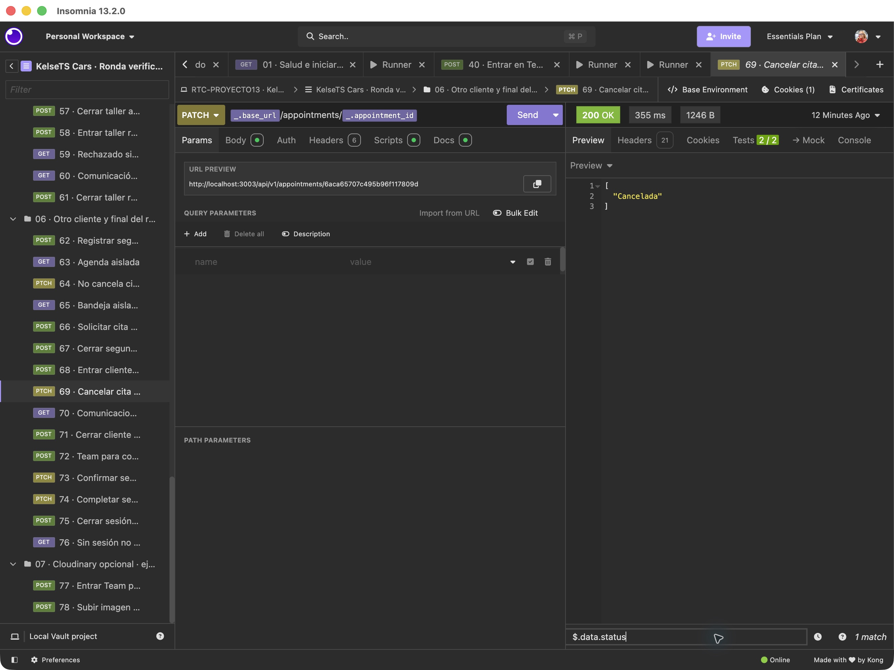</a>

### Caso 70 · Comunicaciones del cliente

**Objetivo:** Consultar los avisos del cliente después de cancelar.

**Petición:** `GET /messages`, sobre `/api/v1`, con la sesión del perfil que realiza el paso.

**Resultado obtenido:** 200; 3/3 comprobaciones. Se observan cinco asuntos: bienvenida, solicitud, asignación, confirmación y cancelación.

**Interpretación:** La bandeja conserva el recorrido de su cita y utiliza textos dirigidos al cliente. Se diferencia del aviso de nueva asignación que recibe el taller. Los mensajes son simulados.

**Vista de la captura:** filtro JSONPath `$.data[*].subject`.

<a href="../evidencias/insomnia/21-comunicaciones-cliente.png">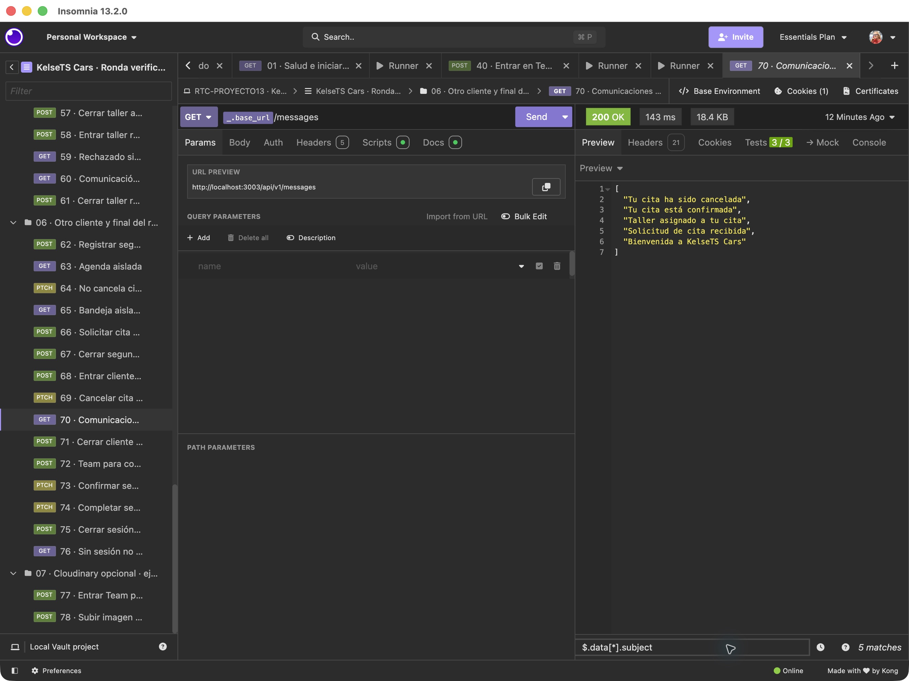</a>

### Caso 65 · Bandeja de otro cliente

**Objetivo:** Consultar los mensajes después de registrar a un segundo cliente.

**Petición:** `GET /messages`, sobre `/api/v1`, con la sesión del perfil que realiza el paso.

**Resultado obtenido:** 200; 3/3 comprobaciones. La segunda cuenta recibe solo su bienvenida en ese momento.

**Interpretación:** Esta petición se ejecutó antes de que la segunda cuenta solicitara su visita. No aparecen los avisos de la primera cita. La comparación con las bandejas anteriores documenta el aislamiento de esta prueba; no pretende demostrar todos los escenarios posibles de privacidad.

**Vista de la captura:** filtro JSONPath `$.data[*].subject`.

<a href="../evidencias/insomnia/22-bandeja-otro-cliente.png">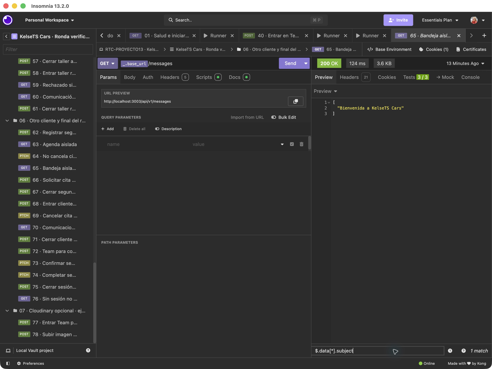</a>

### Caso 64 · Cita ajena protegida

**Objetivo:** Intentar cancelar la primera cita desde la segunda cuenta.

**Petición:** `PATCH /appointments/:id`, sobre `/api/v1`, con la sesión del perfil que realiza el paso.

**Resultado obtenido:** 409; 2/2 comprobaciones. La API rechaza el cambio de una cita de otro cliente.

**Interpretación:** El servidor responde «La cita ya tiene ese estado o no puedes modificarla.». El 409 es el código utilizado en esta operación; no debe confundirse con el 403 de las rutas reservadas a Team.

<a href="../evidencias/insomnia/23-cita-ajena-protegida.png">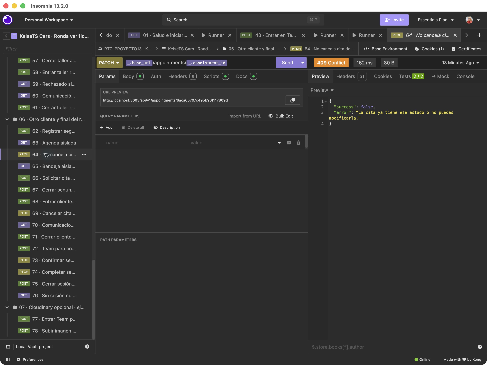</a>

## Cómo interpretar los resultados

Una respuesta 400, 401, 403, 404 o 409 puede ser un resultado correcto cuando se prueba una entrada inválida, falta de sesión, permiso insuficiente, recurso inexistente o conflicto. No son fallos del runner si coinciden con lo previsto.

Esta ronda muestra mensajes privados con `delivery: simulated`. Las muestras de Mailtrap se documentan en [su informe](../evidencias/README.md); la subida real desde Safari tiene [evidencias propias de Cloudinary](../evidencias/cloudinary/README.md). La ronda privada en producción mediante HTTP se recoge [por separado](../evidencias/produccion/README.md).

## English

The actual Insomnia app passed 171 assertions across 76 requests against an isolated temporary Atlas database. That database was removed afterwards. The public Vercel collection passed 36 assertions across 15 requests. These are separate runs with some overlapping cases.

Fourteen additional screenshots were captured from the successful run's stored responses, without resending requests. Each selected case explains its objective, request, observed result and meaning. JSONPath filters display relevant values without modifying the original response. The evidence covers client registration and session, workshop review, appointment assignment, confirmation and cancellation, duplicate rejection, simulated messages and separation between two clients. Manual image requests are excluded; Cloudinary and Mailtrap evidence is documented separately.
